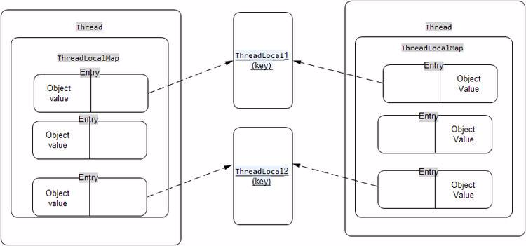

# 简介

ThreadLocal的作用是，提供线程内的局部变量，不同的线程之间不会相互干扰，这种变量在线程的生命周期内起作用，减少同一个线程内多个函数或组件之间一些公共变量传递的复杂度。

1. 线程并发：在多线程并发的场景下

2. 传递数据：我们可以通过ThreadLocal在同一线程，不同组件中传递公共变量
3. 线程隔离：每个线程的变量都是独立的，不会互相影响

## sychronized和ThreadLocal的区别

sychronized采用“以时间换空间”的方式，只提供了一份变量，让不同的线程排队访问，其侧重点是多个线程之间访问资源的同步。

ThreadLocal采用“以空间换时间”的方式，为每一个线程都提供了一份变量的副本，从而实现同时访问而互不干扰，其侧重点是在多线程中让每个线程之间的数据相互隔离。

# ThreadLocal为什么会内存泄漏

1、首先看一下ThreadLocal的原理图：

Thread、ThreadLocal、ThreadLocalMap、Entry之间的关系：

<div align="center">  </div><br>

上图中描述了：一个Thread中只有一个ThreadLocalMap，一个ThreadLocalMap中可以有多个ThreadLocal对象，其中一个ThreadLocal对象对应一个ThreadLocalMap中一个的Entry（也就是说：一个Thread可以依附有多个ThreadLocal对象）。

在ThreadLocal的生命周期中，都存在这些引用。看下图: **实线代表强引用，虚线代表弱引用。**

<div align="center">  </div><br>

2、ThreadLocal的实现是这样的：每个Thread 维护一个 `ThreadLocalMap` 映射表，这个映射表的 key 是 `ThreadLocal`实例本身，value 是真正需要存储的 Object。

3、也就是说 `ThreadLocal` 本身并不存储值，它只是作为一个 key 来让线程从 `ThreadLocalMap` 获取 value。值得注意的是图中的虚线，表示 `ThreadLocalMap` 是使用 `ThreadLocal` 的弱引用作为 Key 的，弱引用的对象在 GC 时会被回收。

4、ThreadLocalMap使用ThreadLocal的弱引用作为key，如果一个ThreadLocal没有外部强引用来引用它，那么系统 GC 的时候，这个ThreadLocal势必会被回收，这样一来，ThreadLocalMap中就会出现key为null的Entry，就没有办法访问这些key为null的Entry的value，如果当前线程再迟迟不结束的话，这些key为null的Entry的value就会一直存在一条强引用链：`Thread Ref -> Thread -> ThreaLocalMap -> Entry -> value`永远无法回收，造成内存泄漏。

5、总的来说就是，ThreadLocal里面使用了一个存在弱引用的map, map的类型是`ThreadLocal.ThreadLocalMap.` Map中的key为一个threadlocal实例。这个Map的确使用了**弱引用**，不过弱引用只是针对key。每个key都弱引用指向threadlocal。 当把threadlocal实例置为null以后，没有任何强引用指向threadlocal实例，所以threadlocal将会被gc回收。

但是，我们的value却不能回收，而这块value永远不会被访问到了，所以存在着内存泄露。因为存在一条从`current thread`连接过来的强引用。只有当前thread结束以后，`current thread`就不会存在栈中，强引用断开，Current Thread、Map value将全部被GC回收。最好的做法是将调用threadlocal的remove方法，这也是等会后边要说的。

6、其实，ThreadLocalMap的设计中已经考虑到这种情况，也加上了一些防护措施：**在ThreadLocal的`get(),set(),remove()`的时候都会清除线程ThreadLocalMap里所有key为null的value**。

7、但是这些被动的预防措施并不能保证不会内存泄漏：

```tex
（1）使用static的ThreadLocal，延长了ThreadLocal的生命周期，可能导致内存泄漏。
（2）分配使用了ThreadLocal又不再调用get(),set(),remove()方法，那么就会导致内存泄漏，因为这块内存一直存在。
```

## 为什么使用弱引用，OOM是否是弱引用的锅？

1、从表面上看内存泄漏的根源在于使用了弱引用。网上的文章大多着重分析ThreadLocal使用了弱引用会导致内存泄漏，但是另一个问题也同样值得思考：**为什么使用弱引用而不是强引用？**

我们先来看看官方文档的说法：

```
To help deal with very large and long-lived usages, the hash table entries use WeakReferences for keys.
为了应对非常大和长时间的用途，哈希表使用弱引用的 key。
```

下面我们分两种情况讨论：

**（1）key 使用强引用**：引用`ThreadLocal`的对象被回收了，但是`ThreadLocalMap`还持有`ThreadLocal`的强引用，如果没有手动删除，`ThreadLocal`不会被回收，导致Entry内存泄漏。

**（2）key 使用弱引用**：引用ThreadLocal的对象被回收了，由于`ThreadLocalMap`持有`ThreadLocal`的弱引用，即使没有手动删除，`ThreadLocal`也会被回收。`value`在下一次`ThreadLocalMap`调用`set、get、remove`的时候会被清除。

比较两种情况，我们可以发现：由于`ThreadLocalMap`的生命周期跟Thread一样长，如果都没有手动删除对应key，**都会**导致内存泄漏，但是**使用弱引用可以多一层保障**：**弱引用`ThreadLocal`不会内存泄漏，对应的value在下一次`ThreadLocalMap`调用`set、get、remove`的时候会被清除。**

因此，ThreadLocal内存泄漏的根源是：**由于ThreadLocalMap的生命周期跟Thread一样长，如果没有手动删除对应key就会导致内存泄漏，而不是因为弱引用。**

## ThreadLocal 最佳实践

1、综合上面的分析，我们可以理解ThreadLocal内存泄漏的前因后果，那么怎么避免内存泄漏呢？

**答案就是**：每次使用完ThreadLocal，都调用它的remove()方法，清除数据。

# 源码

```java
public class ThreadLocal<T> {
    /**
     * ThreadLocals rely on per-thread linear-probe hash maps attached
     * to each thread (Thread.threadLocals and
     * inheritableThreadLocals).  The ThreadLocal objects act as keys,
     * searched via threadLocalHashCode.  This is a custom hash code
     * (useful only within ThreadLocalMaps) that eliminates collisions
     * in the common case where consecutively constructed ThreadLocals
     * are used by the same threads, while remaining well-behaved in
     * less common cases.
     */
    private final int threadLocalHashCode = nextHashCode();

    /**
     * The next hash code to be given out. Updated atomically. Starts at
     * zero.
     */
    private static AtomicInteger nextHashCode =
        new AtomicInteger();

    /**
     * The difference between successively generated hash codes - turns
     * implicit sequential thread-local IDs into near-optimally spread
     * multiplicative hash values for power-of-two-sized tables.
     *
     * HASH_INCREMENT=1640531527
     */
    private static final int HASH_INCREMENT = 0x61c88647;

    /**
     * Returns the next hash code.
     */
    private static int nextHashCode() {
        return nextHashCode.getAndAdd(HASH_INCREMENT);
    }

    /**
     * Returns the current thread's "initial value" for this
     * thread-local variable.  This method will be invoked the first
     * time a thread accesses the variable with the {@link #get}
     * method, unless the thread previously invoked the {@link #set}
     * method, in which case the {@code initialValue} method will not
     * be invoked for the thread.  Normally, this method is invoked at
     * most once per thread, but it may be invoked again in case of
     * subsequent invocations of {@link #remove} followed by {@link #get}.
     *
     * <p>This implementation simply returns {@code null}; if the
     * programmer desires thread-local variables to have an initial
     * value other than {@code null}, {@code ThreadLocal} must be
     * subclassed, and this method overridden.  Typically, an
     * anonymous inner class will be used.
     *
     * @return the initial value for this thread-local
     */
    protected T initialValue() {
        return null;
    }

    /**
     * Creates a thread local variable. The initial value of the variable is
     * determined by invoking the {@code get} method on the {@code Supplier}.
     *
     * @param <S> the type of the thread local's value
     * @param supplier the supplier to be used to determine the initial value
     * @return a new thread local variable
     * @throws NullPointerException if the specified supplier is null
     * @since 1.8
     */
    public static <S> ThreadLocal<S> withInitial(Supplier<? extends S> supplier) {
        return new SuppliedThreadLocal<>(supplier);
    }

    /**
     * Creates a thread local variable.
     * @see #withInitial(java.util.function.Supplier)
     */
    public ThreadLocal() {
    }

    /**
     * Returns the value in the current thread's copy of this
     * thread-local variable.  If the variable has no value for the
     * current thread, it is first initialized to the value returned
     * by an invocation of the {@link #initialValue} method.
     *
     * @return the current thread's value of this thread-local
     */
    public T get() {
        Thread t = Thread.currentThread();
        ThreadLocalMap map = getMap(t);
        if (map != null) {
            ThreadLocalMap.Entry e = map.getEntry(this);
            if (e != null) {
                @SuppressWarnings("unchecked")
                T result = (T)e.value;
                return result;
            }
        }
        return setInitialValue();
    }

    /**
     * Variant of set() to establish initialValue. Used instead
     * of set() in case user has overridden the set() method.
     *
     * @return the initial value
     */
    private T setInitialValue() {
        T value = initialValue();
        Thread t = Thread.currentThread();
        ThreadLocalMap map = getMap(t);
        if (map != null)
            map.set(this, value);
        else
            createMap(t, value);
        return value;
    }

    /**
     * Sets the current thread's copy of this thread-local variable
     * to the specified value.  Most subclasses will have no need to
     * override this method, relying solely on the {@link #initialValue}
     * method to set the values of thread-locals.
     *
     * @param value the value to be stored in the current thread's copy of
     *        this thread-local.
     */
    public void set(T value) {
        Thread t = Thread.currentThread();
        ThreadLocalMap map = getMap(t);
        if (map != null)
            map.set(this, value);
        else
            createMap(t, value);
    }

    /**
     * Removes the current thread's value for this thread-local
     * variable.  If this thread-local variable is subsequently
     * {@linkplain #get read} by the current thread, its value will be
     * reinitialized by invoking its {@link #initialValue} method,
     * unless its value is {@linkplain #set set} by the current thread
     * in the interim.  This may result in multiple invocations of the
     * {@code initialValue} method in the current thread.
     *
     * @since 1.5
     */
     public void remove() {
         ThreadLocalMap m = getMap(Thread.currentThread());
         if (m != null)
             m.remove(this);
     }

    /**
     * Get the map associated with a ThreadLocal. Overridden in
     * InheritableThreadLocal.
     *
     * @param  t the current thread
     * @return the map
     */
    ThreadLocalMap getMap(Thread t) {
        return t.threadLocals;
    }

    /**
     * Create the map associated with a ThreadLocal. Overridden in
     * InheritableThreadLocal.
     *
     * @param t the current thread
     * @param firstValue value for the initial entry of the map
     */
    void createMap(Thread t, T firstValue) {
        t.threadLocals = new ThreadLocalMap(this, firstValue);
    }

    /**
     * Factory method to create map of inherited thread locals.
     * Designed to be called only from Thread constructor.
     *
     * @param  parentMap the map associated with parent thread
     * @return a map containing the parent's inheritable bindings
     */
    static ThreadLocalMap createInheritedMap(ThreadLocalMap parentMap) {
        return new ThreadLocalMap(parentMap);
    }

    /**
     * Method childValue is visibly defined in subclass
     * InheritableThreadLocal, but is internally defined here for the
     * sake of providing createInheritedMap factory method without
     * needing to subclass the map class in InheritableThreadLocal.
     * This technique is preferable to the alternative of embedding
     * instanceof tests in methods.
     */
    T childValue(T parentValue) {
        throw new UnsupportedOperationException();
    }

    /**
     * An extension of ThreadLocal that obtains its initial value from
     * the specified {@code Supplier}.
     */
    static final class SuppliedThreadLocal<T> extends ThreadLocal<T> {

        private final Supplier<? extends T> supplier;

        SuppliedThreadLocal(Supplier<? extends T> supplier) {
            this.supplier = Objects.requireNonNull(supplier);
        }

        @Override
        protected T initialValue() {
            return supplier.get();
        }
    }

    /**
     * ThreadLocalMap is a customized hash map suitable only for
     * maintaining thread local values. No operations are exported
     * outside of the ThreadLocal class. The class is package private to
     * allow declaration of fields in class Thread.  To help deal with
     * very large and long-lived usages, the hash table entries use
     * WeakReferences for keys. However, since reference queues are not
     * used, stale entries are guaranteed to be removed only when
     * the table starts running out of space.
     */
    static class ThreadLocalMap {

        /**
         * The entries in this hash map extend WeakReference, using
         * its main ref field as the key (which is always a
         * ThreadLocal object).  Note that null keys (i.e. entry.get()
         * == null) mean that the key is no longer referenced, so the
         * entry can be expunged from table.  Such entries are referred to
         * as "stale entries" in the code that follows.
         */
        static class Entry extends WeakReference<ThreadLocal<?>> {
            /** The value associated with this ThreadLocal. */
            Object value;

            Entry(ThreadLocal<?> k, Object v) {
                super(k);
                value = v;
            }
        }

        /**
         * 初始容量，必须为 2 的幂
         */
        private static final int INITIAL_CAPACITY = 16;

        /**
         * 存储 ThreadLocal 的键值对实体数组，长度必须为 2 的幂
         */
        private Entry[] table;

        /**
         * ThreadLocalMap 元素数量
         */
        private int size = 0;

        /**
         * 扩容的阈值，默认是数组大小的三分之二
         */
        private int threshold; // Default to 0

        /**
         * 设置扩容阈值为数组大小的三分之二
         */
        private void setThreshold(int len) {
            threshold = len * 2 / 3;
        }

        /**
         * 哈希值发生冲突时，计算下一个哈希值，此处使用线性探测寻址，只是简单地将索引加 1
         */
        private static int nextIndex(int i, int len) {
            return ((i + 1 < len) ? i + 1 : 0);
        }

        /**
         * 线性探测，向前遍历
         */
        private static int prevIndex(int i, int len) {
            return ((i - 1 >= 0) ? i - 1 : len - 1);
        }

        /**
         * 初始化 ThreadLocalMap，并存储键值对 <firstKey, firstValue>
         *
         * @param firstKey
         * @param firstValue
         */
        ThreadLocalMap(ThreadLocal<?> firstKey, Object firstValue) {
            table = new Entry[INITIAL_CAPACITY];
            int i = firstKey.threadLocalHashCode & (INITIAL_CAPACITY - 1);
            table[i] = new Entry(firstKey, firstValue);
            size = 1;
            setThreshold(INITIAL_CAPACITY);
        }

        /**
         * Construct a new map including all Inheritable ThreadLocals
         * from given parent map. Called only by createInheritedMap.
         *
         * @param parentMap the map associated with parent thread.
         */
        private ThreadLocalMap(ThreadLocalMap parentMap) {
            Entry[] parentTable = parentMap.table;
            int len = parentTable.length;
            setThreshold(len);
            table = new Entry[len];

            for (int j = 0; j < len; j++) {
                Entry e = parentTable[j];
                if (e != null) {
                    @SuppressWarnings("unchecked")
                    ThreadLocal<Object> key = (ThreadLocal<Object>) e.get();
                    if (key != null) {
                        Object value = key.childValue(e.value);
                        Entry c = new Entry(key, value);
                        int h = key.threadLocalHashCode & (len - 1);
                        // table[h]!=null说明发生冲突，线性探测，寻找下一个位置
                        while (table[h] != null)
                            h = nextIndex(h, len);
                        table[h] = c;
                        size++;
                    }
                }
            }
        }

        /**
         * Get the entry associated with key.  This method
         * itself handles only the fast path: a direct hit of existing
         * key. It otherwise relays to getEntryAfterMiss.  This is
         * designed to maximize performance for direct hits, in part
         * by making this method readily inlinable.
         *
         * @param  key the thread local object
         * @return the entry associated with key, or null if no such
         */
        private Entry getEntry(ThreadLocal<?> key) {
            int i = key.threadLocalHashCode & (table.length - 1);
            Entry e = table[i];
            if (e != null && e.get() == key)
                return e;
            else
                // 走到这，说明之前有冲突，key存储在别的位置了，往后寻找
                return getEntryAfterMiss(key, i, e);
        }

        /**
         * 从 i 开始向后遍历找到键值对实体
         *
         * @param  key the thread local object
         * @param  i the table index for key's hash code
         * @param  e the entry at table[i]
         * @return the entry associated with key, or null if no such
         */
        private Entry getEntryAfterMiss(ThreadLocal<?> key, int i, Entry e) {
            Entry[] tab = table;
            int len = tab.length;

            while (e != null) {
                ThreadLocal<?> k = e.get();
                if (k == key)
                    return e;
                if (k == null)
                    expungeStaleEntry(i);
                else
                    i = nextIndex(i, len);
                e = tab[i];
            }
            return null;
        }

        /**
         * Set the value associated with key.
         *
         * @param key the thread local object
         * @param value the value to be set
         */
        private void set(ThreadLocal<?> key, Object value) {

            // We don't use a fast path as with get() because it is at
            // least as common to use set() to create new entries as
            // it is to replace existing ones, in which case, a fast
            // path would fail more often than not.

            Entry[] tab = table;
            int len = tab.length;
            int i = key.threadLocalHashCode & (len-1);

            for (Entry e = tab[i];
                 e != null;
                 e = tab[i = nextIndex(i, len)]) {
                ThreadLocal<?> k = e.get();
                // 更新值
                if (k == key) {
                    e.value = value;
                    return;
                }
                // 若 key 是 null，说明 ThreadLocal 被清理了，直接替换掉
                if (k == null) {
                    replaceStaleEntry(key, value, i);
                    return;
                }
            }
            // 直到遇见了空槽也没找到匹配的ThreadLocal对象，那么在此空槽处安排ThreadLocal对象和缓存的value
            tab[i] = new Entry(key, value);
            int sz = ++size;
            // 如果没有元素被清理，那么就要检查当前元素数量是否超过了容量阙值(数组大小的三分之二)，以便决定是否扩容
            if (!cleanSomeSlots(i, sz) && sz >= threshold)
                // 扩容的过程也是对所有的 key 重新哈希的过程
                rehash();
        }

        /**
         * 从 map 中清理 key 关联的键值对
         */
        private void remove(ThreadLocal<?> key) {
            Entry[] tab = table;
            int len = tab.length;
            int i = key.threadLocalHashCode & (len-1);
            for (Entry e = tab[i];
                 e != null;
                 e = tab[i = nextIndex(i, len)]) {
                if (e.get() == key) {
                    e.clear();
                    // 从索引 i 开始，遍历一段连续的元素，清理其中的垃圾值，并使各元素排序更紧凑
                    expungeStaleEntry(i);
                    return;
                }
            }
        }

        /**
         * 替换掉过期的entry
         * @param  key the key
         * @param  value the value to be associated with key
         * @param  staleSlot index of the first stale entry encountered while
         *         searching for key.
         */
        private void replaceStaleEntry(ThreadLocal<?> key, Object value,
                                       int staleSlot) {
            Entry[] tab = table;
            int len = tab.length;
            Entry e;

            // Back up to check for prior stale entry in current run.
            // We clean out whole runs at a time to avoid continual
            // incremental rehashing due to garbage collector freeing
            // up refs in bunches (i.e., whenever the collector runs).
            int slotToExpunge = staleSlot;
            for (int i = prevIndex(staleSlot, len);
                 (e = tab[i]) != null;
                 i = prevIndex(i, len))
                if (e.get() == null)
                    slotToExpunge = i;

            // Find either the key or trailing null slot of run, whichever
            // occurs first
            for (int i = nextIndex(staleSlot, len);
                 (e = tab[i]) != null;
                 i = nextIndex(i, len)) {
                ThreadLocal<?> k = e.get();

                // If we find key, then we need to swap it
                // with the stale entry to maintain hash table order.
                // The newly stale slot, or any other stale slot
                // encountered above it, can then be sent to expungeStaleEntry
                // to remove or rehash all of the other entries in run.
                if (k == key) {
                    e.value = value;

                    tab[i] = tab[staleSlot];
                    tab[staleSlot] = e;

                    // Start expunge at preceding stale entry if it exists
                    if (slotToExpunge == staleSlot)
                        slotToExpunge = i;
                    cleanSomeSlots(expungeStaleEntry(slotToExpunge), len);
                    return;
                }

                // If we didn't find stale entry on backward scan, the
                // first stale entry seen while scanning for key is the
                // first still present in the run.
                if (k == null && slotToExpunge == staleSlot)
                    slotToExpunge = i;
            }

            // If key not found, put new entry in stale slot
            tab[staleSlot].value = null;
            tab[staleSlot] = new Entry(key, value);

            // If there are any other stale entries in run, expunge them
            if (slotToExpunge != staleSlot)
                cleanSomeSlots(expungeStaleEntry(slotToExpunge), len);
        }

        /**
         * Expunge a stale entry by rehashing any possibly colliding entries
         * lying between staleSlot and the next null slot.  This also expunges
         * any other stale entries encountered before the trailing null.  See
         * Knuth, Section 6.4
         * 清除过期的entry，重哈希在staleSlot索引到下一个null值索引之间可能存在hash冲突的entry
         * @param staleSlot index of slot known to have null key
         * @return the index of the next null slot after staleSlot
         * (all between staleSlot and this slot will have been checked
         * for expunging).
         */
        private int expungeStaleEntry(int staleSlot) {
            Entry[] tab = table;
            int len = tab.length;

            // expunge entry at staleSlot
            tab[staleSlot].value = null;
            tab[staleSlot] = null;
            size--;

            // Rehash until we encounter null
            Entry e;
            int i;
            for (i = nextIndex(staleSlot, len);
                 (e = tab[i]) != null;
                 i = nextIndex(i, len)) {
                ThreadLocal<?> k = e.get();
                // k=null说明这个entry失效了，清除掉
                if (k == null) {
                    e.value = null;
                    tab[i] = null;
                    size--;
                } else {
                    int h = k.threadLocalHashCode & (len - 1);
                    // h != i说明这个key是由于存在hash冲突才存储到i位置的，现在尝试把他归位
                    if (h != i) {
                        tab[i] = null;

                        // Unlike Knuth 6.4 Algorithm R, we must scan until
                        // null because multiple entries could have been stale.
                        while (tab[h] != null)
                            h = nextIndex(h, len);
                        tab[h] = e;
                    }
                }
            }
            return i;
        }

        /**
         * 从i的下一个索引开始扫描，key=null就清除掉，扫描logn次
         * @return true if any stale entries have been removed.
         */
        private boolean cleanSomeSlots(int i, int n) {
            boolean removed = false;
            Entry[] tab = table;
            int len = tab.length;
            do {
                i = nextIndex(i, len);
                Entry e = tab[i];
                if (e != null && e.get() == null) {
                    n = len;
                    removed = true;
                    i = expungeStaleEntry(i);
                }
            } while ( (n >>>= 1) != 0);
            return removed;
        }

        /**
         * Re-pack and/or re-size the table. First scan the entire
         * table removing stale entries. If this doesn't sufficiently
         * shrink the size of the table, double the table size.
         */
        private void rehash() {
            // 先清除一波，再扩容
            expungeStaleEntries();

            // Use lower threshold for doubling to avoid hysteresis
            if (size >= threshold - threshold / 4)
                resize();
        }

        /**
         * 扩容扩大为原来的2倍
         */
        private void resize() {
            Entry[] oldTab = table;
            int oldLen = oldTab.length;
            int newLen = oldLen * 2;
            Entry[] newTab = new Entry[newLen];
            int count = 0;

            for (int j = 0; j < oldLen; ++j) {
                Entry e = oldTab[j];
                if (e != null) {
                    ThreadLocal<?> k = e.get();
                    if (k == null) {
                        e.value = null; // Help the GC
                    } else {
                        int h = k.threadLocalHashCode & (newLen - 1);
                        while (newTab[h] != null)
                            h = nextIndex(h, newLen);
                        newTab[h] = e;
                        count++;
                    }
                }
            }

            setThreshold(newLen);
            size = count;
            table = newTab;
        }

        /**
         * 清除数组中所有过时的entry
         *
         */
        private void expungeStaleEntries() {
            Entry[] tab = table;
            int len = tab.length;
            for (int j = 0; j < len; j++) {
                Entry e = tab[j];
                if (e != null && e.get() == null)
                    expungeStaleEntry(j);
            }
        }
    }
}
```

