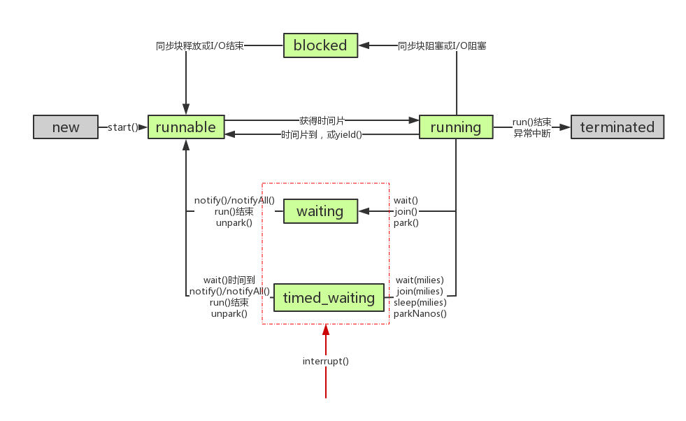

# 简介

每个线程都有一个优先级，优先级高的先执行，优先级低的后执行。每个线程都可以创建一个新的线程，新的线程优先级默认跟创建它的线程一致。只有守护线程可以创建守护线程。

## 守护线程

Java程序入口就是由JVM启动`main`线程，`main`线程又可以启动其他线程。当所有线程都运行结束时，JVM退出，进程结束。

如果有一个线程没有退出，JVM进程就不会退出。所以，必须保证所有线程都能及时结束。

但是有一种线程的目的就是无限循环，例如，一个定时触发任务的线程：

```java
class TimerThread extends Thread {
    @Override
    public void run() {
        while (true) {
            System.out.println(LocalTime.now());
            try {
                Thread.sleep(1000);
            } catch (InterruptedException e) {
                break;
            }
        }
    }
}
```

如果这个线程不结束，JVM进程就无法结束。问题是，由谁负责结束这个线程？

然而这类线程经常没有负责人来负责结束它们。但是，当其他线程结束时，JVM进程又必须要结束，怎么办？

答案是使用守护线程（Daemon Thread）。

守护线程是指为其他线程服务的线程。在JVM中，所有非守护线程都执行完毕后，无论有没有守护线程，虚拟机都会自动退出。

因此，JVM退出时，不必关心守护线程是否已结束。

如何创建守护线程呢？方法和普通线程一样，只是在调用`start()`方法前，调用`setDaemon(true)`把该线程标记为守护线程：

```java
Thread t = new MyThread();
t.setDaemon(true);
t.start();
```

在守护线程中，编写代码要注意：守护线程不能持有任何需要关闭的资源，例如打开文件等，因为虚拟机退出时，守护线程没有任何机会来关闭文件，这会导致数据丢失。

### 小总结

* 守护线程是为其他线程服务的线程；

* 所有非守护线程都执行完毕后，虚拟机退出；

* 守护线程不能持有需要关闭的资源（如打开文件等）。

## 线程的状态

Thread的状态有6中，它把就绪状态和运行状态都归为RUNNABLE了，下面状态图细分了一下

<div align="center">  </div><br>

>注意：
>
>调用obj.wait()的线程需要先获取obj的monitor，wait()会释放obj的monitor并进入等待态。所以wait()/notify()都要与synchronized联用。

## 阻塞与等待的区别

阻塞：当一个线程试图获取对象锁（非java.util.concurrent库中的锁，即synchronized），而该锁被其他线程持有，则该线程进入阻塞状态。它的特点是**使用简单，由JVM调度器来决定唤醒自己，而不需要由另一个线程来显式唤醒自己，不响应中断**。
等待：当一个线程等待另一个线程通知调度器一个条件时，该线程进入等待状态。它的特点是**需要等待另一个线程显式地唤醒自己，实现灵活，语义更丰富，可响应中断**。例如调用：Object.wait()、Thread.join()以及等待Lock或Condition。

　　需要强调的是虽然synchronized和JUC里的Lock都实现锁的功能，但线程进入的状态是不一样的。**synchronized会让线程进入阻塞态，而JUC里的Lock是用LockSupport.park()/unpark()来实现阻塞/唤醒的，会让线程进入等待态**。但话又说回来，虽然等锁时进入的状态不一样，但被唤醒后又都进入runnable态，从行为效果来看又是一样的。

# 源码

源码也不是很复杂，native方法比较多

## start()

新启一个线程执行其run()方法，一个线程只能start一次。主要是通过调用native start0()来实现。

```java
 /** 该方法可以创建一个新的线程出来，返回的仍然是主线程
 * 启动线程，线程状态从 NEW 进入 RUNNABLE
 *
 * @exception  IllegalThreadStateException  if the thread was already
 *               started.
 * @see        #run()
 * @see        #stop()
 */
public synchronized void start() {
    /**
     * This method is not invoked for the main method thread or "system"
     * group threads created/set up by the VM. Any new functionality added
     * to this method in the future may have to also be added to the VM.
     *
     * A zero status value corresponds to state "NEW".
     */
    if (threadStatus != 0)
        throw new IllegalThreadStateException();

    /* Notify the group that this thread is about to be started
     * so that it can be added to the group's list of threads
     * and the group's unstarted count can be decremented. */
    // 将当前线程加入到所在的线程组，记录为活跃线程
    group.add(this);

    boolean started = false;
    try {
        // 这里会创建一个新的线程，执行完成之后，新的线程已经在运行了，既 target 的内容已经在运行了
        start0();
        started = true;
    } finally {
        try {
            // 如果失败，把线程从线程组中删除
            if (!started) {
                group.threadStartFailed(this);
            }
        } catch (Throwable ignore) {
            /* do nothing. If start0 threw a Throwable then
              it will be passed up the call stack */
        }
    }
}

private native void start0();
```

## run()

run()方法是不需要用户来调用的，当通过start方法启动一个线程之后，当该线程获得了CPU执行时间，便进入run方法体去执行具体的任务。注意，继承Thread类必须重写run方法，在run方法中定义具体要执行的任务。

## sleep()

sleep方法有两个重载版本：

```java
sleep(long millis)     //参数为毫秒

sleep(long millis,int nanoseconds)    //第一参数为毫秒，第二个参数为纳秒
```

sleep相当于让线程睡眠，交出CPU，让CPU去执行其他的任务。

但是有一点要非常注意，**sleep方法不会释放锁**，也就是说如果当前线程持有对某个对象的锁，则即使调用sleep方法，其他线程也无法访问这个对象。

## yield()

调用yield方法会让当前线程交出CPU权限，让CPU重新调度，也有可能重新选中自己。**它跟sleep方法类似，同样不会释放锁**。但是yield不能控制具体的交出CPU的时间，另外，yield方法只能让拥有相同优先级的线程有获取CPU执行时间的机会。

注意，调用yield方法并不会让线程进入阻塞状态，而是让线程重回就绪状态，它只需要等待重新获取CPU执行时间，这一点是和sleep方法不一样的。

## join()

join方法有三个重载版本：

```java
// 等待线程运行完
public final void join() throws InterruptedException {
    join(0);
}
// 使该方法的调用者所在的线程进入 WAITING 或 TIMED_WAITING 状态，直到当前线程死亡，或者等待超时之后，再去执行上述调用者线程
join(long millis)     //参数为毫秒
join(long millis,int nanoseconds)    //第一参数为毫秒，第二个参数为纳秒
```

join()实际是利用了wait()，只不过它不用等待notify()/notifyAll()，且不受其影响。它结束的条件是：1）等待时间到；2）目标线程已经run完（通过isAlive()来判断）。

```java
    public final synchronized void join(long millis)
    throws InterruptedException {
        long base = System.currentTimeMillis();
        long now = 0;

        if (millis < 0) {
            throw new IllegalArgumentException("timeout value is negative");
        }
		//0则需要一直等到目标线程run完
        if (millis == 0) {
            while (isAlive()) {
                wait(0);
            }
        } else {
            // 如果目标线程未run完且阻塞时间未到，那么调用线程会一直等待。
            while (isAlive()) {
                long delay = millis - now;
                if (delay <= 0) {
                    break;
                }
                wait(delay);
                now = System.currentTimeMillis() - base;
            }
        }
    }
```

## interrupt()

```java
    public void interrupt() {
        if (this != Thread.currentThread())
            checkAccess();

        synchronized (blockerLock) {
            Interruptible b = blocker;
            if (b != null) {
                interrupt0();           // Just to set the interrupt flag
                b.interrupt(this);
                return;
            }
        }
        interrupt0();
    }
```

此操作会将中断线程，并重置中断标志位，至于线程作何动作那要看线程了。

- 如果线程sleep()、wait()、join()等处于等待状态，那么线程会定时检查中断状态位如果发现中断状态位为true，则会在这些阻塞方法调用处抛出InterruptedException异常，并且在抛出异常后立即将线程的中断状态位清除，即重新设置为false。抛出异常是为了线程从等待状态醒过来，并在结束线程前让程序员有足够的时间来处理中断请求。
- 如果线程正在运行、争用synchronized、lock()等，那么是不可中断的，他们会忽略。

可以通过以下三种方式来判断中断：

1)isInterrupted()

此方法只会读取线程的中断标志位，并不会重置。

```java
    public boolean isInterrupted() {
        return isInterrupted(false);
    }
```

2)interrupted()

返回线程是否被中断过，会重置中断标志位

```java
    public static boolean interrupted() {
        return currentThread().isInterrupted(true);
    }
```

此方法读取线程的中断标志位，并会重置。

3)throw InterruptException

抛出该异常的同时，会重置中断标志位。

## 其他注释

可以不看

```java
package java.lang;

import java.lang.ref.Reference;
import java.lang.ref.ReferenceQueue;
import java.lang.ref.WeakReference;
import java.security.AccessController;
import java.security.AccessControlContext;
import java.security.PrivilegedAction;
import java.util.Map;
import java.util.HashMap;
import java.util.concurrent.ConcurrentHashMap;
import java.util.concurrent.ConcurrentMap;
import java.util.concurrent.locks.LockSupport;
import sun.nio.ch.Interruptible;
import sun.reflect.CallerSensitive;
import sun.reflect.Reflection;
import sun.security.util.SecurityConstants;


/**
 * A <i>thread</i> is a thread of execution in a program. The Java
 * Virtual Machine allows an application to have multiple threads of
 * execution running concurrently.
 * <p>
 * Every thread has a priority. Threads with higher priority are
 * executed in preference to threads with lower priority. Each thread
 * may or may not also be marked as a daemon. When code running in
 * some thread creates a new <code>Thread</code> object, the new
 * thread has its priority initially set equal to the priority of the
 * creating thread, and is a daemon thread if and only if the
 * creating thread is a daemon.
 * <p>
 * When a Java Virtual Machine starts up, there is usually a single
 * non-daemon thread (which typically calls the method named
 * <code>main</code> of some designated class). The Java Virtual
 * Machine continues to execute threads until either of the following
 * occurs:
 * <ul>
 * <li>The <code>exit</code> method of class <code>Runtime</code> has been
 *     called and the security manager has permitted the exit operation
 *     to take place.
 * <li>All threads that are not daemon threads have died, either by
 *     returning from the call to the <code>run</code> method or by
 *     throwing an exception that propagates beyond the <code>run</code>
 *     method.
 * </ul>
 * <p>
 * There are two ways to create a new thread of execution. One is to
 * declare a class to be a subclass of <code>Thread</code>. This
 * subclass should override the <code>run</code> method of class
 * <code>Thread</code>. An instance of the subclass can then be
 * allocated and started. For example, a thread that computes primes
 * larger than a stated value could be written as follows:
 * <hr><blockquote><pre>
 *     class PrimeThread extends Thread {
 *         long minPrime;
 *         PrimeThread(long minPrime) {
 *             this.minPrime = minPrime;
 *         }
 *
 *         public void run() {
 *             // compute primes larger than minPrime
 *             &nbsp;.&nbsp;.&nbsp;.
 *         }
 *     }
 * </pre></blockquote><hr>
 * <p>
 * The following code would then create a thread and start it running:
 * <blockquote><pre>
 *     PrimeThread p = new PrimeThread(143);
 *     p.start();
 * </pre></blockquote>
 * <p>
 * The other way to create a thread is to declare a class that
 * implements the <code>Runnable</code> interface. That class then
 * implements the <code>run</code> method. An instance of the class can
 * then be allocated, passed as an argument when creating
 * <code>Thread</code>, and started. The same example in this other
 * style looks like the following:
 * <hr><blockquote><pre>
 *     class PrimeRun implements Runnable {
 *         long minPrime;
 *         PrimeRun(long minPrime) {
 *             this.minPrime = minPrime;
 *         }
 *
 *         public void run() {
 *             // compute primes larger than minPrime
 *             &nbsp;.&nbsp;.&nbsp;.
 *         }
 *     }
 * </pre></blockquote><hr>
 * <p>
 * The following code would then create a thread and start it running:
 * <blockquote><pre>
 *     PrimeRun p = new PrimeRun(143);
 *     new Thread(p).start();
 * </pre></blockquote>
 * <p>
 * Every thread has a name for identification purposes. More than
 * one thread may have the same name. If a name is not specified when
 * a thread is created, a new name is generated for it.
 * <p>
 * Unless otherwise noted, passing a {@code null} argument to a constructor
 * or method in this class will cause a {@link NullPointerException} to be
 * thrown.
 *
 * @author  unascribed
 * @see     Runnable
 * @see     Runtime#exit(int)
 * @see     #run()
 * @see     #stop()
 * @since   JDK1.0
 */
public
class Thread implements Runnable {
    /* Make sure registerNatives is the first thing <clinit> does. */
    private static native void registerNatives();
    static {
        registerNatives();
    }
    /**
     * 线程名称
     */
    private volatile String name;
    /**
     * 优先级
     */
    private int            priority;
    private Thread         threadQ;
    private long           eetop;

    /* Whether or not to single_step this thread. */
    private boolean     single_step;

    /* Whether or not the thread is a daemon thread. */
    /**
     * 是否是守护线程，true 是守护线程。如果是守护线程的话，是不能够阻止 JVM 的退出的，级别很低
     */
    private boolean     daemon = false;

    /* JVM state */
    private boolean     stillborn = false;

    /**
     * 实际被执行的对象
     */
    private Runnable target;

    /**
     * 该线程的线程组
     */
    private ThreadGroup group;

    /* The context ClassLoader for this thread */
    private ClassLoader contextClassLoader;

    /* The inherited AccessControlContext of this thread */
    private AccessControlContext inheritedAccessControlContext;

    /* For autonumbering anonymous threads. */
    /**
     * 给线程自动生成名称所用
     */
    private static int threadInitNumber;
    /**
     * 同一时刻只会有一个线程修改 threadInitNumber 的值，线程安全
     *
     * @return
     */
    private static synchronized int nextThreadNum() {
        return threadInitNumber++;
    }

    /**
     * ThreadLocal 的 ThreadLocalMap 是线程的一个属性，所以在多线程环境下 threadLocals 是线程安全的
     */
    ThreadLocal.ThreadLocalMap threadLocals = null;

    /**
     * 当创建子线程时，子线程可以得到父线程的 inheritableThreadLocals
     */
    ThreadLocal.ThreadLocalMap inheritableThreadLocals = null;

    /**
     * 此线程请求的堆栈大小
     */
    private long stackSize;

    /*
     * JVM-private state that persists after native thread termination.
     */
    private long nativeParkEventPointer;

    /*
     * Thread ID
     */
    private long tid;

    /* For generating thread ID */
    private static long threadSeqNumber;

    /* Java thread status for tools,
     * initialized to indicate thread 'not yet started'
     */

    private volatile int threadStatus = 0;


    private static synchronized long nextThreadID() {
        return ++threadSeqNumber;
    }

    /**
     * The argument supplied to the current call to
     * java.util.concurrent.locks.LockSupport.park.
     * Set by (private) java.util.concurrent.locks.LockSupport.setBlocker
     * Accessed using java.util.concurrent.locks.LockSupport.getBlocker
     *  此对象不为null时说明线程进入了park（阻塞）状态，参见 LockSupport
     */
    volatile Object parkBlocker;

    /* The object in which this thread is blocked in an interruptible I/O
     * operation, if any.  The blocker's interrupt method should be invoked
     * after setting this thread's interrupt status.
     * 线程中断回调标记，设置此标记后，可在线程被中断时调用标记对象的回调方法
     */
    private volatile Interruptible blocker;
    private final Object blockerLock = new Object();

    /* Set the blocker field; invoked via sun.misc.SharedSecrets from java.nio code
    为当前线程设置一个线程中断回调标记，以便在线程被中断时调用该标记的回调方法
     */
    void blockedOn(Interruptible b) {
        synchronized (blockerLock) {
            blocker = b;
        }
    }

    /**
     * The minimum priority that a thread can have.
     * 最低优先级
     */
    public final static int MIN_PRIORITY = 1;

   /**
     * The default priority that is assigned to a thread.
    * 默认优先级
     */
    public final static int NORM_PRIORITY = 5;

    /**
     * The maximum priority that a thread can have.
     * 最高优先级
     */
    public final static int MAX_PRIORITY = 10;

    /**
     * Returns a reference to the currently executing thread object.
     * 返回当前正在执行的线程对象的引用
     * @return  the currently executing thread.
     */
    public static native Thread currentThread();

    /**
     * A hint to the scheduler that the current thread is willing to yield
     * its current use of a processor. The scheduler is free to ignore this
     * hint.
     *
     * <p> Yield is a heuristic attempt to improve relative progression
     * between threads that would otherwise over-utilise a CPU. Its use
     * should be combined with detailed profiling and benchmarking to
     * ensure that it actually has the desired effect.
     *
     * <p> It is rarely appropriate to use this method. It may be useful
     * for debugging or testing purposes, where it may help to reproduce
     * bugs due to race conditions. It may also be useful when designing
     * concurrency control constructs such as the ones in the
     * {@link java.util.concurrent.locks} package.
     * 返回当前正在执行的线程对象的引用
     * 让步不是不执行，也有可能重新选中自己
     * 当前线程让出 cpu 时间片，重新抢占执行权
     */
    public static native void yield();

    /**
     * Causes the currently executing thread to sleep (temporarily cease
     * execution) for the specified number of milliseconds, subject to
     * the precision and accuracy of system timers and schedulers. The thread
     * does not lose ownership of any monitors.
     * 沉睡，锁不会释放，在 millis 毫秒之后会自己醒来
     * 使线程进入 TIMED_WAITING 状态，millis毫秒后自己醒来（不释放锁）
     *
     * @param  millis
     *         the length of time to sleep in milliseconds
     *
     * @throws  IllegalArgumentException
     *          if the value of {@code millis} is negative
     *
     * @throws  InterruptedException
     *          if any thread has interrupted the current thread. The
     *          <i>interrupted status</i> of the current thread is
     *          cleared when this exception is thrown.
     */
    public static native void sleep(long millis) throws InterruptedException;

    /**
     * Causes the currently executing thread to sleep (temporarily cease
     * execution) for the specified number of milliseconds plus the specified
     * number of nanoseconds, subject to the precision and accuracy of system
     * timers and schedulers. The thread does not lose ownership of any
     * monitors.
     * 使线程进入TIMED_WAITING状态
     * 至少等待millis毫秒，nanos是一个纳秒级的附加时间，用来微调millis参数（不释放锁）
     * @param  millis
     *         the length of time to sleep in milliseconds
     *
     * @param  nanos
     *         {@code 0-999999} additional nanoseconds to sleep
     *
     * @throws  IllegalArgumentException
     *          if the value of {@code millis} is negative, or the value of
     *          {@code nanos} is not in the range {@code 0-999999}
     *
     * @throws  InterruptedException
     *          if any thread has interrupted the current thread. The
     *          <i>interrupted status</i> of the current thread is
     *          cleared when this exception is thrown.
     */
    public static void sleep(long millis, int nanos)
    throws InterruptedException {
        if (millis < 0) {
            throw new IllegalArgumentException("timeout value is negative");
        }

        if (nanos < 0 || nanos > 999999) {
            throw new IllegalArgumentException(
                                "nanosecond timeout value out of range");
        }

        if (nanos >= 500000 || (nanos != 0 && millis == 0)) {
            millis++;
        }

        sleep(millis);
    }

    /**
     * Initializes a Thread with the current AccessControlContext.
     * @see #init(ThreadGroup,Runnable,String,long,AccessControlContext,boolean)
     */
    private void init(ThreadGroup g, Runnable target, String name,
                      long stackSize) {
        init(g, target, name, stackSize, null, true);
    }

    /**
     * Initializes a Thread.
     * 初始化一个线程
     * @param g the Thread group
     * @param target the object whose run() method gets called
     * @param name the name of the new Thread
     * @param stackSize the desired stack size for the new thread, or
     *        zero to indicate that this parameter is to be ignored.
     * @param acc the AccessControlContext to inherit, or
     *            AccessController.getContext() if null
     * @param inheritThreadLocals if {@code true}, inherit initial values for
     *            inheritable thread-locals from the constructing thread
     */
    private void init(ThreadGroup g, Runnable target, String name,
                      long stackSize, AccessControlContext acc,
                      boolean inheritThreadLocals) {
        if (name == null) {
            throw new NullPointerException("name cannot be null");
        }

        this.name = name;

        Thread parent = currentThread();
        SecurityManager security = System.getSecurityManager();
        if (g == null) {
            /* Determine if it's an applet or not */

            /* If there is a security manager, ask the security manager
               what to do. */
            if (security != null) {
                g = security.getThreadGroup();
            }

            /* If the security doesn't have a strong opinion of the matter
               use the parent thread group. */
            if (g == null) {
                g = parent.getThreadGroup();
            }
        }

        /* checkAccess regardless of whether or not threadgroup is
           explicitly passed in. */
        g.checkAccess();

        /*
         * Do we have the required permissions?
         */
        if (security != null) {
            if (isCCLOverridden(getClass())) {
                security.checkPermission(SUBCLASS_IMPLEMENTATION_PERMISSION);
            }
        }

        g.addUnstarted();

        this.group = g;
        this.daemon = parent.isDaemon();
        this.priority = parent.getPriority();
        if (security == null || isCCLOverridden(parent.getClass()))
            this.contextClassLoader = parent.getContextClassLoader();
        else
            this.contextClassLoader = parent.contextClassLoader;
        // 当父线程的 inheritableThreadLocals 的值不为空时
        // 会把 inheritableThreadLocals 里面的值全部传递给子线程
        this.inheritedAccessControlContext =
                acc != null ? acc : AccessController.getContext();
        this.target = target;
        setPriority(priority);
        if (inheritThreadLocals && parent.inheritableThreadLocals != null)
            this.inheritableThreadLocals =
                ThreadLocal.createInheritedMap(parent.inheritableThreadLocals);
        /* Stash the specified stack size in case the VM cares */
        this.stackSize = stackSize;

        /* Set thread ID */
        tid = nextThreadID();
    }

    /**
     * Throws CloneNotSupportedException as a Thread can not be meaningfully
     * cloned. Construct a new Thread instead.
     *
     * @throws  CloneNotSupportedException
     *          always
     */
    @Override
    protected Object clone() throws CloneNotSupportedException {
        throw new CloneNotSupportedException();
    }

    /**
     * Allocates a new {@code Thread} object. This constructor has the same
     * effect as {@linkplain #Thread(ThreadGroup,Runnable,String) Thread}
     * {@code (null, null, gname)}, where {@code gname} is a newly generated
     * name. Automatically generated names are of the form
     * {@code "Thread-"+}<i>n</i>, where <i>n</i> is an integer.
     */
    public Thread() {
        init(null, null, "Thread-" + nextThreadNum(), 0);
    }

    /**
     * Allocates a new {@code Thread} object. This constructor has the same
     * effect as {@linkplain #Thread(ThreadGroup,Runnable,String) Thread}
     * {@code (null, target, gname)}, where {@code gname} is a newly generated
     * name. Automatically generated names are of the form
     * {@code "Thread-"+}<i>n</i>, where <i>n</i> is an integer.
     *
     * @param  target
     *         the object whose {@code run} method is invoked when this thread
     *         is started. If {@code null}, this classes {@code run} method does
     *         nothing.
     */
    public Thread(Runnable target) {
        init(null, target, "Thread-" + nextThreadNum(), 0);
    }

    /**
     * Creates a new Thread that inherits the given AccessControlContext.
     * This is not a public constructor.
     */
    Thread(Runnable target, AccessControlContext acc) {
        init(null, target, "Thread-" + nextThreadNum(), 0, acc, false);
    }

    /**
     * Allocates a new {@code Thread} object. This constructor has the same
     * effect as {@linkplain #Thread(ThreadGroup,Runnable,String) Thread}
     * {@code (group, target, gname)} ,where {@code gname} is a newly generated
     * name. Automatically generated names are of the form
     * {@code "Thread-"+}<i>n</i>, where <i>n</i> is an integer.
     *
     * @param  group
     *         the thread group. If {@code null} and there is a security
     *         manager, the group is determined by {@linkplain
     *         SecurityManager#getThreadGroup SecurityManager.getThreadGroup()}.
     *         If there is not a security manager or {@code
     *         SecurityManager.getThreadGroup()} returns {@code null}, the group
     *         is set to the current thread's thread group.
     *
     * @param  target
     *         the object whose {@code run} method is invoked when this thread
     *         is started. If {@code null}, this thread's run method is invoked.
     *
     * @throws  SecurityException
     *          if the current thread cannot create a thread in the specified
     *          thread group
     */
    public Thread(ThreadGroup group, Runnable target) {
        init(group, target, "Thread-" + nextThreadNum(), 0);
    }

    /**
     * Allocates a new {@code Thread} object. This constructor has the same
     * effect as {@linkplain #Thread(ThreadGroup,Runnable,String) Thread}
     * {@code (null, null, name)}.
     *
     * @param   name
     *          the name of the new thread
     */
    public Thread(String name) {
        init(null, null, name, 0);
    }

    /**
     * Allocates a new {@code Thread} object. This constructor has the same
     * effect as {@linkplain #Thread(ThreadGroup,Runnable,String) Thread}
     * {@code (group, null, name)}.
     *
     * @param  group
     *         the thread group. If {@code null} and there is a security
     *         manager, the group is determined by {@linkplain
     *         SecurityManager#getThreadGroup SecurityManager.getThreadGroup()}.
     *         If there is not a security manager or {@code
     *         SecurityManager.getThreadGroup()} returns {@code null}, the group
     *         is set to the current thread's thread group.
     *
     * @param  name
     *         the name of the new thread
     *
     * @throws  SecurityException
     *          if the current thread cannot create a thread in the specified
     *          thread group
     */
    public Thread(ThreadGroup group, String name) {
        init(group, null, name, 0);
    }

    /**
     * Allocates a new {@code Thread} object. This constructor has the same
     * effect as {@linkplain #Thread(ThreadGroup,Runnable,String) Thread}
     * {@code (null, target, name)}.
     *
     * @param  target
     *         the object whose {@code run} method is invoked when this thread
     *         is started. If {@code null}, this thread's run method is invoked.
     *
     * @param  name
     *         the name of the new thread
     */
    public Thread(Runnable target, String name) {
        init(null, target, name, 0);
    }

    /**
     * Allocates a new {@code Thread} object so that it has {@code target}
     * as its run object, has the specified {@code name} as its name,
     * and belongs to the thread group referred to by {@code group}.
     *
     * <p>If there is a security manager, its
     * {@link SecurityManager#checkAccess(ThreadGroup) checkAccess}
     * method is invoked with the ThreadGroup as its argument.
     *
     * <p>In addition, its {@code checkPermission} method is invoked with
     * the {@code RuntimePermission("enableContextClassLoaderOverride")}
     * permission when invoked directly or indirectly by the constructor
     * of a subclass which overrides the {@code getContextClassLoader}
     * or {@code setContextClassLoader} methods.
     *
     * <p>The priority of the newly created thread is set equal to the
     * priority of the thread creating it, that is, the currently running
     * thread. The method {@linkplain #setPriority setPriority} may be
     * used to change the priority to a new value.
     *
     * <p>The newly created thread is initially marked as being a daemon
     * thread if and only if the thread creating it is currently marked
     * as a daemon thread. The method {@linkplain #setDaemon setDaemon}
     * may be used to change whether or not a thread is a daemon.
     *
     * @param  group
     *         the thread group. If {@code null} and there is a security
     *         manager, the group is determined by {@linkplain
     *         SecurityManager#getThreadGroup SecurityManager.getThreadGroup()}.
     *         If there is not a security manager or {@code
     *         SecurityManager.getThreadGroup()} returns {@code null}, the group
     *         is set to the current thread's thread group.
     *
     * @param  target
     *         the object whose {@code run} method is invoked when this thread
     *         is started. If {@code null}, this thread's run method is invoked.
     *
     * @param  name
     *         the name of the new thread
     *
     * @throws  SecurityException
     *          if the current thread cannot create a thread in the specified
     *          thread group or cannot override the context class loader methods.
     */
    public Thread(ThreadGroup group, Runnable target, String name) {
        init(group, target, name, 0);
    }

    /**
     * Allocates a new {@code Thread} object so that it has {@code target}
     * as its run object, has the specified {@code name} as its name,
     * and belongs to the thread group referred to by {@code group}, and has
     * the specified <i>stack size</i>.
     *
     * <p>This constructor is identical to {@link
     * #Thread(ThreadGroup,Runnable,String)} with the exception of the fact
     * that it allows the thread stack size to be specified.  The stack size
     * is the approximate number of bytes of address space that the virtual
     * machine is to allocate for this thread's stack.  <b>The effect of the
     * {@code stackSize} parameter, if any, is highly platform dependent.</b>
     *
     * <p>On some platforms, specifying a higher value for the
     * {@code stackSize} parameter may allow a thread to achieve greater
     * recursion depth before throwing a {@link StackOverflowError}.
     * Similarly, specifying a lower value may allow a greater number of
     * threads to exist concurrently without throwing an {@link
     * OutOfMemoryError} (or other internal error).  The details of
     * the relationship between the value of the <tt>stackSize</tt> parameter
     * and the maximum recursion depth and concurrency level are
     * platform-dependent.  <b>On some platforms, the value of the
     * {@code stackSize} parameter may have no effect whatsoever.</b>
     *
     * <p>The virtual machine is free to treat the {@code stackSize}
     * parameter as a suggestion.  If the specified value is unreasonably low
     * for the platform, the virtual machine may instead use some
     * platform-specific minimum value; if the specified value is unreasonably
     * high, the virtual machine may instead use some platform-specific
     * maximum.  Likewise, the virtual machine is free to round the specified
     * value up or down as it sees fit (or to ignore it completely).
     *
     * <p>Specifying a value of zero for the {@code stackSize} parameter will
     * cause this constructor to behave exactly like the
     * {@code Thread(ThreadGroup, Runnable, String)} constructor.
     *
     * <p><i>Due to the platform-dependent nature of the behavior of this
     * constructor, extreme care should be exercised in its use.
     * The thread stack size necessary to perform a given computation will
     * likely vary from one JRE implementation to another.  In light of this
     * variation, careful tuning of the stack size parameter may be required,
     * and the tuning may need to be repeated for each JRE implementation on
     * which an application is to run.</i>
     *
     * <p>Implementation note: Java platform implementers are encouraged to
     * document their implementation's behavior with respect to the
     * {@code stackSize} parameter.
     *
     *
     * @param  group
     *         the thread group. If {@code null} and there is a security
     *         manager, the group is determined by {@linkplain
     *         SecurityManager#getThreadGroup SecurityManager.getThreadGroup()}.
     *         If there is not a security manager or {@code
     *         SecurityManager.getThreadGroup()} returns {@code null}, the group
     *         is set to the current thread's thread group.
     *
     * @param  target
     *         the object whose {@code run} method is invoked when this thread
     *         is started. If {@code null}, this thread's run method is invoked.
     *
     * @param  name
     *         the name of the new thread
     *
     * @param  stackSize
     *         the desired stack size for the new thread, or zero to indicate
     *         that this parameter is to be ignored.
     *
     * @throws  SecurityException
     *          if the current thread cannot create a thread in the specified
     *          thread group
     *
     * @since 1.4
     */
    public Thread(ThreadGroup group, Runnable target, String name,
                  long stackSize) {
        init(group, target, name, stackSize);
    }

    /**
     * Causes this thread to begin execution; the Java Virtual Machine
     * calls the <code>run</code> method of this thread.
     * <p>
     * The result is that two threads are running concurrently: the
     * current thread (which returns from the call to the
     * <code>start</code> method) and the other thread (which executes its
     * <code>run</code> method).
     * <p>
     * It is never legal to start a thread more than once.
     * In particular, a thread may not be restarted once it has completed
     * execution.
     * 该方法可以创建一个新的线程出来，返回的仍然是主线程
     * 启动线程，线程状态从 NEW 进入 RUNNABLE
     *
     * @exception  IllegalThreadStateException  if the thread was already
     *               started.
     * @see        #run()
     * @see        #stop()
     */
    public synchronized void start() {
        /**
         * This method is not invoked for the main method thread or "system"
         * group threads created/set up by the VM. Any new functionality added
         * to this method in the future may have to also be added to the VM.
         *
         * A zero status value corresponds to state "NEW".
         */
        if (threadStatus != 0)
            throw new IllegalThreadStateException();

        /* Notify the group that this thread is about to be started
         * so that it can be added to the group's list of threads
         * and the group's unstarted count can be decremented. */
        // 将当前线程加入到所在的线程组，记录为活跃线程
        group.add(this);

        boolean started = false;
        try {
            // 这里会创建一个新的线程，执行完成之后，新的线程已经在运行了，既 target 的内容已经在运行了
            start0();
            started = true;
        } finally {
            try {
                // 如果失败，把线程从线程组中删除
                if (!started) {
                    group.threadStartFailed(this);
                }
            } catch (Throwable ignore) {
                /* do nothing. If start0 threw a Throwable then
                  it will be passed up the call stack */
            }
        }
    }

    private native void start0();

    /**
     * If this thread was constructed using a separate
     * <code>Runnable</code> run object, then that
     * <code>Runnable</code> object's <code>run</code> method is called;
     * otherwise, this method does nothing and returns.
     * <p>
     * Subclasses of <code>Thread</code> should override this method.
     *
     * @see     #start()
     * @see     #stop()
     * @see     #Thread(ThreadGroup, Runnable, String)
     */
    @Override
    public void run() {
        if (target != null) {
            target.run();
        }
    }

    /**
     * This method is called by the system to give a Thread
     * a chance to clean up before it actually exits.
     */
    private void exit() {
        if (group != null) {
            group.threadTerminated(this);
            group = null;
        }
        /* Aggressively null out all reference fields: see bug 4006245 */
        target = null;
        /* Speed the release of some of these resources */
        threadLocals = null;
        inheritableThreadLocals = null;
        inheritedAccessControlContext = null;
        blocker = null;
        uncaughtExceptionHandler = null;
    }

    /**
     * Forces the thread to stop executing.
     * <p>
     * If there is a security manager installed, its <code>checkAccess</code>
     * method is called with <code>this</code>
     * as its argument. This may result in a
     * <code>SecurityException</code> being raised (in the current thread).
     * <p>
     * If this thread is different from the current thread (that is, the current
     * thread is trying to stop a thread other than itself), the
     * security manager's <code>checkPermission</code> method (with a
     * <code>RuntimePermission("stopThread")</code> argument) is called in
     * addition.
     * Again, this may result in throwing a
     * <code>SecurityException</code> (in the current thread).
     * <p>
     * The thread represented by this thread is forced to stop whatever
     * it is doing abnormally and to throw a newly created
     * <code>ThreadDeath</code> object as an exception.
     * <p>
     * It is permitted to stop a thread that has not yet been started.
     * If the thread is eventually started, it immediately terminates.
     * <p>
     * An application should not normally try to catch
     * <code>ThreadDeath</code> unless it must do some extraordinary
     * cleanup operation (note that the throwing of
     * <code>ThreadDeath</code> causes <code>finally</code> clauses of
     * <code>try</code> statements to be executed before the thread
     * officially dies).  If a <code>catch</code> clause catches a
     * <code>ThreadDeath</code> object, it is important to rethrow the
     * object so that the thread actually dies.
     * <p>
     * The top-level error handler that reacts to otherwise uncaught
     * exceptions does not print out a message or otherwise notify the
     * application if the uncaught exception is an instance of
     * <code>ThreadDeath</code>.
     *
     * @exception  SecurityException  if the current thread cannot
     *               modify this thread.
     * @see        #interrupt()
     * @see        #checkAccess()
     * @see        #run()
     * @see        #start()
     * @see        ThreadDeath
     * @see        ThreadGroup#uncaughtException(Thread,Throwable)
     * @see        SecurityManager#checkAccess(Thread)
     * @see        SecurityManager#checkPermission
     * @deprecated This method is inherently unsafe.  Stopping a thread with
     *       Thread.stop causes it to unlock all of the monitors that it
     *       has locked (as a natural consequence of the unchecked
     *       <code>ThreadDeath</code> exception propagating up the stack).  If
     *       any of the objects previously protected by these monitors were in
     *       an inconsistent state, the damaged objects become visible to
     *       other threads, potentially resulting in arbitrary behavior.  Many
     *       uses of <code>stop</code> should be replaced by code that simply
     *       modifies some variable to indicate that the target thread should
     *       stop running.  The target thread should check this variable
     *       regularly, and return from its run method in an orderly fashion
     *       if the variable indicates that it is to stop running.  If the
     *       target thread waits for long periods (on a condition variable,
     *       for example), the <code>interrupt</code> method should be used to
     *       interrupt the wait.
     *       For more information, see
     *       <a href="{@docRoot}/../technotes/guides/concurrency/threadPrimitiveDeprecation.html">Why
     *       are Thread.stop, Thread.suspend and Thread.resume Deprecated?</a>.
     *
     * 不建议使用
     */
    @Deprecated
    public final void stop() {
        SecurityManager security = System.getSecurityManager();
        if (security != null) {
            checkAccess();
            if (this != Thread.currentThread()) {
                security.checkPermission(SecurityConstants.STOP_THREAD_PERMISSION);
            }
        }
        // A zero status value corresponds to "NEW", it can't change to
        // not-NEW because we hold the lock.
        if (threadStatus != 0) {
            resume(); // Wake up thread if it was suspended; no-op otherwise
        }

        // The VM can handle all thread states
        stop0(new ThreadDeath());
    }

    /**
     * Throws {@code UnsupportedOperationException}.
     *
     * @param obj ignored
     *
     * @deprecated This method was originally designed to force a thread to stop
     *        and throw a given {@code Throwable} as an exception. It was
     *        inherently unsafe (see {@link #stop()} for details), and furthermore
     *        could be used to generate exceptions that the target thread was
     *        not prepared to handle.
     *        For more information, see
     *        <a href="{@docRoot}/../technotes/guides/concurrency/threadPrimitiveDeprecation.html">Why
     *        are Thread.stop, Thread.suspend and Thread.resume Deprecated?</a>.
     * 不建议使用
     */
    @Deprecated
    public final synchronized void stop(Throwable obj) {
        throw new UnsupportedOperationException();
    }

    /**
     * Interrupts this thread.
     *
     * <p> Unless the current thread is interrupting itself, which is
     * always permitted, the {@link #checkAccess() checkAccess} method
     * of this thread is invoked, which may cause a {@link
     * SecurityException} to be thrown.
     *
     * <p> If this thread is blocked in an invocation of the {@link
     * Object#wait() wait()}, {@link Object#wait(long) wait(long)}, or {@link
     * Object#wait(long, int) wait(long, int)} methods of the {@link Object}
     * class, or of the {@link #join()}, {@link #join(long)}, {@link
     * #join(long, int)}, {@link #sleep(long)}, or {@link #sleep(long, int)},
     * methods of this class, then its interrupt status will be cleared and it
     * will receive an {@link InterruptedException}.
     *
     * <p> If this thread is blocked in an I/O operation upon an {@link
     * java.nio.channels.InterruptibleChannel InterruptibleChannel}
     * then the channel will be closed, the thread's interrupt
     * status will be set, and the thread will receive a {@link
     * java.nio.channels.ClosedByInterruptException}.
     *
     * <p> If this thread is blocked in a {@link java.nio.channels.Selector}
     * then the thread's interrupt status will be set and it will return
     * immediately from the selection operation, possibly with a non-zero
     * value, just as if the selector's {@link
     * java.nio.channels.Selector#wakeup wakeup} method were invoked.
     *
     * <p> If none of the previous conditions hold then this thread's interrupt
     * status will be set. </p>
     *
     * <p> Interrupting a thread that is not alive need not have any effect.
     * 中断未激活的线程不会产生任何效果。
     * @throws  SecurityException
     *          if the current thread cannot modify this thread
     *
     * @revised 6.0
     * @spec JSR-51
     */
    public void interrupt() {
        if (this != Thread.currentThread())
            checkAccess();

        synchronized (blockerLock) {
            Interruptible b = blocker;
            if (b != null) {
                interrupt0();           // Just to set the interrupt flag
                b.interrupt(this);
                return;
            }
        }
        interrupt0();
    }

    /**
     * Tests whether the current thread has been interrupted.  The
     * <i>interrupted status</i> of the thread is cleared by this method.  In
     * other words, if this method were to be called twice in succession, the
     * second call would return false (unless the current thread were
     * interrupted again, after the first call had cleared its interrupted
     * status and before the second call had examined it).
     *
     * <p>A thread interruption ignored because a thread was not alive
     * at the time of the interrupt will be reflected by this method
     * returning false.
     * 返回线程被中断过，会重置中断标志位
     *
     * @return  <code>true</code> if the current thread has been interrupted;
     *          <code>false</code> otherwise.
     * @see #isInterrupted()
     * @revised 6.0
     */
    public static boolean interrupted() {
        return currentThread().isInterrupted(true);
    }

    /**
     * Tests whether this thread has been interrupted.  The <i>interrupted
     * status</i> of the thread is unaffected by this method.
     *
     * <p>A thread interruption ignored because a thread was not alive
     * at the time of the interrupt will be reflected by this method
     * returning false.
     * 返回线程被中断过，不会会重置中断标志位
     * @return  <code>true</code> if this thread has been interrupted;
     *          <code>false</code> otherwise.
     * @see     #interrupted()
     * @revised 6.0
     */
    public boolean isInterrupted() {
        return isInterrupted(false);
    }

    /**
     * Tests if some Thread has been interrupted.  The interrupted state
     * is reset or not based on the value of ClearInterrupted that is
     * passed.
     */
    private native boolean isInterrupted(boolean ClearInterrupted);

    /**
     * Throws {@link NoSuchMethodError}.
     *
     * @deprecated This method was originally designed to destroy this
     *     thread without any cleanup. Any monitors it held would have
     *     remained locked. However, the method was never implemented.
     *     If if were to be implemented, it would be deadlock-prone in
     *     much the manner of {@link #suspend}. If the target thread held
     *     a lock protecting a critical system resource when it was
     *     destroyed, no thread could ever access this resource again.
     *     If another thread ever attempted to lock this resource, deadlock
     *     would result. Such deadlocks typically manifest themselves as
     *     "frozen" processes. For more information, see
     *     <a href="{@docRoot}/../technotes/guides/concurrency/threadPrimitiveDeprecation.html">
     *     Why are Thread.stop, Thread.suspend and Thread.resume Deprecated?</a>.
     * @throws NoSuchMethodError always
     * 不推荐使用
     */
    @Deprecated
    public void destroy() {
        throw new NoSuchMethodError();
    }

    /**
     * Tests if this thread is alive. A thread is alive if it has
     * been started and has not yet died.
     *  判断当前线程是否仍然存活（没有到达 TERMINATED 状态）
     * @return  <code>true</code> if this thread is alive;
     *          <code>false</code> otherwise.
     */
    public final native boolean isAlive();

    /**
     * Suspends this thread.
     * <p>
     * First, the <code>checkAccess</code> method of this thread is called
     * with no arguments. This may result in throwing a
     * <code>SecurityException </code>(in the current thread).
     * <p>
     * If the thread is alive, it is suspended and makes no further
     * progress unless and until it is resumed.
     *
     * @exception  SecurityException  if the current thread cannot modify
     *               this thread.
     * @see #checkAccess
     * @deprecated   This method has been deprecated, as it is
     *   inherently deadlock-prone.  If the target thread holds a lock on the
     *   monitor protecting a critical system resource when it is suspended, no
     *   thread can access this resource until the target thread is resumed. If
     *   the thread that would resume the target thread attempts to lock this
     *   monitor prior to calling <code>resume</code>, deadlock results.  Such
     *   deadlocks typically manifest themselves as "frozen" processes.
     *   For more information, see
     *   <a href="{@docRoot}/../technotes/guides/concurrency/threadPrimitiveDeprecation.html">Why
     *   are Thread.stop, Thread.suspend and Thread.resume Deprecated?</a>.
     *   不推荐使用
     */
    @Deprecated
    public final void suspend() {
        checkAccess();
        suspend0();
    }

    /**
     * Resumes a suspended thread.
     * <p>
     * First, the <code>checkAccess</code> method of this thread is called
     * with no arguments. This may result in throwing a
     * <code>SecurityException</code> (in the current thread).
     * <p>
     * If the thread is alive but suspended, it is resumed and is
     * permitted to make progress in its execution.
     *
     * @exception  SecurityException  if the current thread cannot modify this
     *               thread.
     * @see        #checkAccess
     * @see        #suspend()
     * @deprecated This method exists solely for use with {@link #suspend},
     *     which has been deprecated because it is deadlock-prone.
     *     For more information, see
     *     <a href="{@docRoot}/../technotes/guides/concurrency/threadPrimitiveDeprecation.html">Why
     *     are Thread.stop, Thread.suspend and Thread.resume Deprecated?</a>.
     *     不推荐使用
     */
    @Deprecated
    public final void resume() {
        checkAccess();
        resume0();
    }

    /**
     * Changes the priority of this thread.
     * <p>
     * First the <code>checkAccess</code> method of this thread is called
     * with no arguments. This may result in throwing a
     * <code>SecurityException</code>.
     * <p>
     * Otherwise, the priority of this thread is set to the smaller of
     * the specified <code>newPriority</code> and the maximum permitted
     * priority of the thread's thread group.
     *
     * @param newPriority priority to set this thread to
     * @exception  IllegalArgumentException  If the priority is not in the
     *               range <code>MIN_PRIORITY</code> to
     *               <code>MAX_PRIORITY</code>.
     * @exception  SecurityException  if the current thread cannot modify
     *               this thread.
     * @see        #getPriority
     * @see        #checkAccess()
     * @see        #getThreadGroup()
     * @see        #MAX_PRIORITY
     * @see        #MIN_PRIORITY
     * @see        ThreadGroup#getMaxPriority()
     * 为当前线程设置优先级
     */
    public final void setPriority(int newPriority) {
        ThreadGroup g;
        checkAccess();
        if (newPriority > MAX_PRIORITY || newPriority < MIN_PRIORITY) {
            throw new IllegalArgumentException();
        }
        if((g = getThreadGroup()) != null) {
            if (newPriority > g.getMaxPriority()) {
                newPriority = g.getMaxPriority();
            }
            setPriority0(priority = newPriority);
        }
    }

    /**
     * Returns this thread's priority.
     *
     * @return  this thread's priority.
     * @see     #setPriority
     */
    public final int getPriority() {
        return priority;
    }

    /**
     * Changes the name of this thread to be equal to the argument
     * <code>name</code>.
     * <p>
     * First the <code>checkAccess</code> method of this thread is called
     * with no arguments. This may result in throwing a
     * <code>SecurityException</code>.
     * 改变当前线程名字
     * @param      name   the new name for this thread.
     * @exception  SecurityException  if the current thread cannot modify this
     *               thread.
     * @see        #getName
     * @see        #checkAccess()
     */
    public final synchronized void setName(String name) {
        checkAccess();
        if (name == null) {
            throw new NullPointerException("name cannot be null");
        }

        this.name = name;
        if (threadStatus != 0) {
            setNativeName(name);
        }
    }

    /**
     * Returns this thread's name.
     *
     * @return  this thread's name.
     * @see     #setName(String)
     */
    public final String getName() {
        return name;
    }

    /**
     * Returns the thread group to which this thread belongs.
     * This method returns null if this thread has died
     * (been stopped).
     *
     * @return  this thread's thread group.
     */
    public final ThreadGroup getThreadGroup() {
        return group;
    }

    /**
     * Returns an estimate of the number of active threads in the current
     * thread's {@linkplain java.lang.ThreadGroup thread group} and its
     * subgroups. Recursively iterates over all subgroups in the current
     * thread's thread group.
     *
     * <p> The value returned is only an estimate because the number of
     * threads may change dynamically while this method traverses internal
     * data structures, and might be affected by the presence of certain
     * system threads. This method is intended primarily for debugging
     * and monitoring purposes.
     *
     * 递归获取当前线程所在线程组的所有活跃线程数量（可能与实际数量有出入，因为线程数量动态变化），建议仅用作监视目的
     *
     * @return  an estimate of the number of active threads in the current
     *          thread's thread group and in any other thread group that
     *          has the current thread's thread group as an ancestor
     */
    public static int activeCount() {
        return currentThread().getThreadGroup().activeCount();
    }

    /**
     * Copies into the specified array every active thread in the current
     * thread's thread group and its subgroups. This method simply
     * invokes the {@link java.lang.ThreadGroup#enumerate(Thread[])}
     * method of the current thread's thread group.
     *
     * <p> An application might use the {@linkplain #activeCount activeCount}
     * method to get an estimate of how big the array should be, however
     * <i>if the array is too short to hold all the threads, the extra threads
     * are silently ignored.</i>  If it is critical to obtain every active
     * thread in the current thread's thread group and its subgroups, the
     * invoker should verify that the returned int value is strictly less
     * than the length of {@code tarray}.
     *
     * <p> Due to the inherent race condition in this method, it is recommended
     * that the method only be used for debugging and monitoring purposes.
     * 递归获取当前线程所在线程组的所有线程（可能与实际状态有出入，因为线程数量动态变化），建议仅用作监视目的
     * @param  tarray
     *         an array into which to put the list of threads
     *
     * @return  the number of threads put into the array
     *
     * @throws  SecurityException
     *          if {@link java.lang.ThreadGroup#checkAccess} determines that
     *          the current thread cannot access its thread group
     */
    public static int enumerate(Thread tarray[]) {
        return currentThread().getThreadGroup().enumerate(tarray);
    }

    /**
     * Counts the number of stack frames in this thread. The thread must
     * be suspended.
     *
     * @return     the number of stack frames in this thread.
     * @exception  IllegalThreadStateException  if this thread is not
     *             suspended.
     * @deprecated The definition of this call depends on {@link #suspend},
     *             which is deprecated.  Further, the results of this call
     *             were never well-defined.
     */
    @Deprecated
    public native int countStackFrames();

    /**
     * Waits at most {@code millis} milliseconds for this thread to
     * die. A timeout of {@code 0} means to wait forever.
     *
     * <p> This implementation uses a loop of {@code this.wait} calls
     * conditioned on {@code this.isAlive}. As a thread terminates the
     * {@code this.notifyAll} method is invoked. It is recommended that
     * applications not use {@code wait}, {@code notify}, or
     * {@code notifyAll} on {@code Thread} instances.
     * 使该方法的调用者所在的线程进入 WAITING 或 TIMED_WAITING 状态，直到当前线程死亡，或者等待超时之后，再去执行上述调用者线程
     * @param  millis
     *         the time to wait in milliseconds
     *
     * @throws  IllegalArgumentException
     *          if the value of {@code millis} is negative
     *
     * @throws  InterruptedException
     *          if any thread has interrupted the current thread. The
     *          <i>interrupted status</i> of the current thread is
     *          cleared when this exception is thrown.
     */
    public final synchronized void join(long millis)
    throws InterruptedException {
        long base = System.currentTimeMillis();
        long now = 0;

        if (millis < 0) {
            throw new IllegalArgumentException("timeout value is negative");
        }

        if (millis == 0) {
            while (isAlive()) {
                wait(0);
            }
        } else {
            while (isAlive()) {
                long delay = millis - now;
                if (delay <= 0) {
                    break;
                }
                wait(delay);
                now = System.currentTimeMillis() - base;
            }
        }
    }

    /**
     * Waits at most {@code millis} milliseconds plus
     * {@code nanos} nanoseconds for this thread to die.
     *
     * <p> This implementation uses a loop of {@code this.wait} calls
     * conditioned on {@code this.isAlive}. As a thread terminates the
     * {@code this.notifyAll} method is invoked. It is recommended that
     * applications not use {@code wait}, {@code notify}, or
     * {@code notifyAll} on {@code Thread} instances.
     *
     * @param  millis
     *         the time to wait in milliseconds
     *
     * @param  nanos
     *         {@code 0-999999} additional nanoseconds to wait
     *
     * @throws  IllegalArgumentException
     *          if the value of {@code millis} is negative, or the value
     *          of {@code nanos} is not in the range {@code 0-999999}
     *
     * @throws  InterruptedException
     *          if any thread has interrupted the current thread. The
     *          <i>interrupted status</i> of the current thread is
     *          cleared when this exception is thrown.
     */
    public final synchronized void join(long millis, int nanos)
    throws InterruptedException {

        if (millis < 0) {
            throw new IllegalArgumentException("timeout value is negative");
        }

        if (nanos < 0 || nanos > 999999) {
            throw new IllegalArgumentException(
                                "nanosecond timeout value out of range");
        }

        if (nanos >= 500000 || (nanos != 0 && millis == 0)) {
            millis++;
        }

        join(millis);
    }

    /**
     * Waits for this thread to die.
     *
     * <p> An invocation of this method behaves in exactly the same
     * way as the invocation
     *
     * <blockquote>
     * {@linkplain #join(long) join}{@code (0)}
     * </blockquote>
     *
     * @throws  InterruptedException
     *          if any thread has interrupted the current thread. The
     *          <i>interrupted status</i> of the current thread is
     *          cleared when this exception is thrown.
     */
    public final void join() throws InterruptedException {
        join(0);
    }

    /**
     * Prints a stack trace of the current thread to the standard error stream.
     * This method is used only for debugging.
     *
     * @see     Throwable#printStackTrace()
     */
    public static void dumpStack() {
        new Exception("Stack trace").printStackTrace();
    }

    /**
     * Marks this thread as either a {@linkplain #isDaemon daemon} thread
     * or a user thread. The Java Virtual Machine exits when the only
     * threads running are all daemon threads.
     *
     * <p> This method must be invoked before the thread is started.
     *
     * @param  on
     *         if {@code true}, marks this thread as a daemon thread
     *
     * @throws  IllegalThreadStateException
     *          if this thread is {@linkplain #isAlive alive}
     *
     * @throws  SecurityException
     *          if {@link #checkAccess} determines that the current
     *          thread cannot modify this thread
     */
    public final void setDaemon(boolean on) {
        checkAccess();
        if (isAlive()) {
            throw new IllegalThreadStateException();
        }
        daemon = on;
    }

    /**
     * Tests if this thread is a daemon thread.
     *
     * @return  <code>true</code> if this thread is a daemon thread;
     *          <code>false</code> otherwise.
     * @see     #setDaemon(boolean)
     */
    public final boolean isDaemon() {
        return daemon;
    }

    /**
     * Determines if the currently running thread has permission to
     * modify this thread.
     * <p>
     * If there is a security manager, its <code>checkAccess</code> method
     * is called with this thread as its argument. This may result in
     * throwing a <code>SecurityException</code>.
     *
     * @exception  SecurityException  if the current thread is not allowed to
     *               access this thread.
     * @see        SecurityManager#checkAccess(Thread)
     */
    public final void checkAccess() {
        SecurityManager security = System.getSecurityManager();
        if (security != null) {
            security.checkAccess(this);
        }
    }

    /**
     * Returns a string representation of this thread, including the
     * thread's name, priority, and thread group.
     *
     * @return  a string representation of this thread.
     */
    public String toString() {
        ThreadGroup group = getThreadGroup();
        if (group != null) {
            return "Thread[" + getName() + "," + getPriority() + "," +
                           group.getName() + "]";
        } else {
            return "Thread[" + getName() + "," + getPriority() + "," +
                            "" + "]";
        }
    }

    /**
     * Returns the context ClassLoader for this Thread. The context
     * ClassLoader is provided by the creator of the thread for use
     * by code running in this thread when loading classes and resources.
     * If not {@linkplain #setContextClassLoader set}, the default is the
     * ClassLoader context of the parent Thread. The context ClassLoader of the
     * primordial thread is typically set to the class loader used to load the
     * application.
     *
     * <p>If a security manager is present, and the invoker's class loader is not
     * {@code null} and is not the same as or an ancestor of the context class
     * loader, then this method invokes the security manager's {@link
     * SecurityManager#checkPermission(java.security.Permission) checkPermission}
     * method with a {@link RuntimePermission RuntimePermission}{@code
     * ("getClassLoader")} permission to verify that retrieval of the context
     * class loader is permitted.
     *
     * @return  the context ClassLoader for this Thread, or {@code null}
     *          indicating the system class loader (or, failing that, the
     *          bootstrap class loader)
     *
     * @throws  SecurityException
     *          if the current thread cannot get the context ClassLoader
     *
     * @since 1.2
     */
    @CallerSensitive
    public ClassLoader getContextClassLoader() {
        if (contextClassLoader == null)
            return null;
        SecurityManager sm = System.getSecurityManager();
        if (sm != null) {
            ClassLoader.checkClassLoaderPermission(contextClassLoader,
                                                   Reflection.getCallerClass());
        }
        return contextClassLoader;
    }

    /**
     * Sets the context ClassLoader for this Thread. The context
     * ClassLoader can be set when a thread is created, and allows
     * the creator of the thread to provide the appropriate class loader,
     * through {@code getContextClassLoader}, to code running in the thread
     * when loading classes and resources.
     *
     * <p>If a security manager is present, its {@link
     * SecurityManager#checkPermission(java.security.Permission) checkPermission}
     * method is invoked with a {@link RuntimePermission RuntimePermission}{@code
     * ("setContextClassLoader")} permission to see if setting the context
     * ClassLoader is permitted.
     *
     * @param  cl
     *         the context ClassLoader for this Thread, or null  indicating the
     *         system class loader (or, failing that, the bootstrap class loader)
     *
     * @throws  SecurityException
     *          if the current thread cannot set the context ClassLoader
     *
     * @since 1.2
     */
    public void setContextClassLoader(ClassLoader cl) {
        SecurityManager sm = System.getSecurityManager();
        if (sm != null) {
            sm.checkPermission(new RuntimePermission("setContextClassLoader"));
        }
        contextClassLoader = cl;
    }

    /**
     * Returns <tt>true</tt> if and only if the current thread holds the
     * monitor lock on the specified object.
     *
     * <p>This method is designed to allow a program to assert that
     * the current thread already holds a specified lock:
     * <pre>
     *     assert Thread.holdsLock(obj);
     * </pre>
     *
     * @param  obj the object on which to test lock ownership
     * @throws NullPointerException if obj is <tt>null</tt>
     * @return <tt>true</tt> if the current thread holds the monitor lock on
     *         the specified object.
     * @since 1.4
     */
    public static native boolean holdsLock(Object obj);

    private static final StackTraceElement[] EMPTY_STACK_TRACE
        = new StackTraceElement[0];

    /**
     * Returns an array of stack trace elements representing the stack dump
     * of this thread.  This method will return a zero-length array if
     * this thread has not started, has started but has not yet been
     * scheduled to run by the system, or has terminated.
     * If the returned array is of non-zero length then the first element of
     * the array represents the top of the stack, which is the most recent
     * method invocation in the sequence.  The last element of the array
     * represents the bottom of the stack, which is the least recent method
     * invocation in the sequence.
     *
     * <p>If there is a security manager, and this thread is not
     * the current thread, then the security manager's
     * <tt>checkPermission</tt> method is called with a
     * <tt>RuntimePermission("getStackTrace")</tt> permission
     * to see if it's ok to get the stack trace.
     *
     * <p>Some virtual machines may, under some circumstances, omit one
     * or more stack frames from the stack trace.  In the extreme case,
     * a virtual machine that has no stack trace information concerning
     * this thread is permitted to return a zero-length array from this
     * method.
     *
     * @return an array of <tt>StackTraceElement</tt>,
     * each represents one stack frame.
     *
     * @throws SecurityException
     *        if a security manager exists and its
     *        <tt>checkPermission</tt> method doesn't allow
     *        getting the stack trace of thread.
     * @see SecurityManager#checkPermission
     * @see RuntimePermission
     * @see Throwable#getStackTrace
     *
     * @since 1.5
     */
    public StackTraceElement[] getStackTrace() {
        if (this != Thread.currentThread()) {
            // check for getStackTrace permission
            SecurityManager security = System.getSecurityManager();
            if (security != null) {
                security.checkPermission(
                    SecurityConstants.GET_STACK_TRACE_PERMISSION);
            }
            // optimization so we do not call into the vm for threads that
            // have not yet started or have terminated
            if (!isAlive()) {
                return EMPTY_STACK_TRACE;
            }
            StackTraceElement[][] stackTraceArray = dumpThreads(new Thread[] {this});
            StackTraceElement[] stackTrace = stackTraceArray[0];
            // a thread that was alive during the previous isAlive call may have
            // since terminated, therefore not having a stacktrace.
            if (stackTrace == null) {
                stackTrace = EMPTY_STACK_TRACE;
            }
            return stackTrace;
        } else {
            // Don't need JVM help for current thread
            return (new Exception()).getStackTrace();
        }
    }

    /**
     * Returns a map of stack traces for all live threads.
     * The map keys are threads and each map value is an array of
     * <tt>StackTraceElement</tt> that represents the stack dump
     * of the corresponding <tt>Thread</tt>.
     * The returned stack traces are in the format specified for
     * the {@link #getStackTrace getStackTrace} method.
     *
     * <p>The threads may be executing while this method is called.
     * The stack trace of each thread only represents a snapshot and
     * each stack trace may be obtained at different time.  A zero-length
     * array will be returned in the map value if the virtual machine has
     * no stack trace information about a thread.
     *
     * <p>If there is a security manager, then the security manager's
     * <tt>checkPermission</tt> method is called with a
     * <tt>RuntimePermission("getStackTrace")</tt> permission as well as
     * <tt>RuntimePermission("modifyThreadGroup")</tt> permission
     * to see if it is ok to get the stack trace of all threads.
     *
     * @return a <tt>Map</tt> from <tt>Thread</tt> to an array of
     * <tt>StackTraceElement</tt> that represents the stack trace of
     * the corresponding thread.
     *
     * @throws SecurityException
     *        if a security manager exists and its
     *        <tt>checkPermission</tt> method doesn't allow
     *        getting the stack trace of thread.
     * @see #getStackTrace
     * @see SecurityManager#checkPermission
     * @see RuntimePermission
     * @see Throwable#getStackTrace
     *
     * @since 1.5
     */
    public static Map<Thread, StackTraceElement[]> getAllStackTraces() {
        // check for getStackTrace permission
        SecurityManager security = System.getSecurityManager();
        if (security != null) {
            security.checkPermission(
                SecurityConstants.GET_STACK_TRACE_PERMISSION);
            security.checkPermission(
                SecurityConstants.MODIFY_THREADGROUP_PERMISSION);
        }

        // Get a snapshot of the list of all threads
        Thread[] threads = getThreads();
        StackTraceElement[][] traces = dumpThreads(threads);
        Map<Thread, StackTraceElement[]> m = new HashMap<>(threads.length);
        for (int i = 0; i < threads.length; i++) {
            StackTraceElement[] stackTrace = traces[i];
            if (stackTrace != null) {
                m.put(threads[i], stackTrace);
            }
            // else terminated so we don't put it in the map
        }
        return m;
    }


    private static final RuntimePermission SUBCLASS_IMPLEMENTATION_PERMISSION =
                    new RuntimePermission("enableContextClassLoaderOverride");

    /** cache of subclass security audit results */
    /* Replace with ConcurrentReferenceHashMap when/if it appears in a future
     * release */
    private static class Caches {
        /** cache of subclass security audit results */
        static final ConcurrentMap<WeakClassKey,Boolean> subclassAudits =
            new ConcurrentHashMap<>();

        /** queue for WeakReferences to audited subclasses */
        static final ReferenceQueue<Class<?>> subclassAuditsQueue =
            new ReferenceQueue<>();
    }

    /**
     * Verifies that this (possibly subclass) instance can be constructed
     * without violating security constraints: the subclass must not override
     * security-sensitive non-final methods, or else the
     * "enableContextClassLoaderOverride" RuntimePermission is checked.
     */
    private static boolean isCCLOverridden(Class<?> cl) {
        if (cl == Thread.class)
            return false;

        processQueue(Caches.subclassAuditsQueue, Caches.subclassAudits);
        WeakClassKey key = new WeakClassKey(cl, Caches.subclassAuditsQueue);
        Boolean result = Caches.subclassAudits.get(key);
        if (result == null) {
            result = Boolean.valueOf(auditSubclass(cl));
            Caches.subclassAudits.putIfAbsent(key, result);
        }

        return result.booleanValue();
    }

    /**
     * Performs reflective checks on given subclass to verify that it doesn't
     * override security-sensitive non-final methods.  Returns true if the
     * subclass overrides any of the methods, false otherwise.
     */
    private static boolean auditSubclass(final Class<?> subcl) {
        Boolean result = AccessController.doPrivileged(
            new PrivilegedAction<Boolean>() {
                public Boolean run() {
                    for (Class<?> cl = subcl;
                         cl != Thread.class;
                         cl = cl.getSuperclass())
                    {
                        try {
                            cl.getDeclaredMethod("getContextClassLoader", new Class<?>[0]);
                            return Boolean.TRUE;
                        } catch (NoSuchMethodException ex) {
                        }
                        try {
                            Class<?>[] params = {ClassLoader.class};
                            cl.getDeclaredMethod("setContextClassLoader", params);
                            return Boolean.TRUE;
                        } catch (NoSuchMethodException ex) {
                        }
                    }
                    return Boolean.FALSE;
                }
            }
        );
        return result.booleanValue();
    }

    private native static StackTraceElement[][] dumpThreads(Thread[] threads);
    private native static Thread[] getThreads();

    /**
     * Returns the identifier of this Thread.  The thread ID is a positive
     * <tt>long</tt> number generated when this thread was created.
     * The thread ID is unique and remains unchanged during its lifetime.
     * When a thread is terminated, this thread ID may be reused.
     *
     * @return this thread's ID.
     * @since 1.5
     */
    public long getId() {
        return tid;
    }

    /**
     * 线程的状态
     * A thread state.  A thread can be in one of the following states:
     * <ul>
     * <li>{@link #NEW}<br>
     *     A thread that has not yet started is in this state.
     *     </li>
     * <li>{@link #RUNNABLE}<br>
     *     A thread executing in the Java virtual machine is in this state.
     *     </li>
     * <li>{@link #BLOCKED}<br>
     *     A thread that is blocked waiting for a monitor lock
     *     is in this state.
     *     </li>
     * <li>{@link #WAITING}<br>
     *     A thread that is waiting indefinitely for another thread to
     *     perform a particular action is in this state.
     *     </li>
     * <li>{@link #TIMED_WAITING}<br>
     *     A thread that is waiting for another thread to perform an action
     *     for up to a specified waiting time is in this state.
     *     </li>
     * <li>{@link #TERMINATED}<br>
     *     A thread that has exited is in this state.
     *     </li>
     * </ul>
     *
     * <p>
     * A thread can be in only one state at a given point in time.
     * These states are virtual machine states which do not reflect
     * any operating system thread states.
     *
     * @since   1.5
     * @see #getState
     */
    public enum State {
        /**
         * Thread state for a thread which has not yet started.
         * 尚未启动的线程处于这种状态
         */
        NEW,

        /**
         * Thread state for a runnable thread.  A thread in the runnable
         * state is executing in the Java virtual machine but it may
         * be waiting for other resources from the operating system
         * such as processor.
         * 就绪状态或者运行状态
         */
        RUNNABLE,

        /**
         * Thread state for a thread blocked waiting for a monitor lock.
         * A thread in the blocked state is waiting for a monitor lock
         * to enter a synchronized block/method or
         * reenter a synchronized block/method after calling
         * {@link Object#wait() Object.wait}.
         * 阻塞的，可能是在等待进入同步块/方法时被阻塞的
         */
        BLOCKED,

        /**
         * Thread state for a waiting thread.
         * A thread is in the waiting state due to calling one of the
         * following methods:
         * <ul>
         *   <li>{@link Object#wait() Object.wait} with no timeout</li>
         *   <li>{@link #join() Thread.join} with no timeout</li>
         *   <li>{@link LockSupport#park() LockSupport.park}</li>
         * </ul>
         *
         * <p>A thread in the waiting state is waiting for another thread to
         * perform a particular action.
         *
         * For example, a thread that has called <tt>Object.wait()</tt>
         * on an object is waiting for another thread to call
         * <tt>Object.notify()</tt> or <tt>Object.notifyAll()</tt> on
         * that object. A thread that has called <tt>Thread.join()</tt>
         * is waiting for a specified thread to terminate.
         * 等待状态，等着别的线程唤醒
         */
        WAITING,

        /**
         * Thread state for a waiting thread with a specified waiting time.
         * A thread is in the timed waiting state due to calling one of
         * the following methods with a specified positive waiting time:
         * <ul>
         *   <li>{@link #sleep Thread.sleep}</li>
         *   <li>{@link Object#wait(long) Object.wait} with timeout</li>
         *   <li>{@link #join(long) Thread.join} with timeout</li>
         *   <li>{@link LockSupport#parkNanos LockSupport.parkNanos}</li>
         *   <li>{@link LockSupport#parkUntil LockSupport.parkUntil}</li>
         * </ul>
         * 等待一定的时间，自动唤醒
         */
        TIMED_WAITING,

        /**
         * Thread state for a terminated thread.
         * The thread has completed execution.
         * 结束状态
         */
        TERMINATED;
    }

    /**
     * Returns the state of this thread.
     * This method is designed for use in monitoring of the system state,
     * not for synchronization control.
     *
     * @return this thread's state.
     * @since 1.5
     */
    public State getState() {
        // get current thread state
        return sun.misc.VM.toThreadState(threadStatus);
    }

    // Added in JSR-166

    /**
     * Interface for handlers invoked when a <tt>Thread</tt> abruptly
     * terminates due to an uncaught exception.
     * <p>When a thread is about to terminate due to an uncaught exception
     * the Java Virtual Machine will query the thread for its
     * <tt>UncaughtExceptionHandler</tt> using
     * {@link #getUncaughtExceptionHandler} and will invoke the handler's
     * <tt>uncaughtException</tt> method, passing the thread and the
     * exception as arguments.
     * If a thread has not had its <tt>UncaughtExceptionHandler</tt>
     * explicitly set, then its <tt>ThreadGroup</tt> object acts as its
     * <tt>UncaughtExceptionHandler</tt>. If the <tt>ThreadGroup</tt> object
     * has no
     * special requirements for dealing with the exception, it can forward
     * the invocation to the {@linkplain #getDefaultUncaughtExceptionHandler
     * default uncaught exception handler}.
     *
     * @see #setDefaultUncaughtExceptionHandler
     * @see #setUncaughtExceptionHandler
     * @see ThreadGroup#uncaughtException
     * @since 1.5
     */
    @FunctionalInterface
    public interface UncaughtExceptionHandler {
        /**
         * Method invoked when the given thread terminates due to the
         * given uncaught exception.
         * <p>Any exception thrown by this method will be ignored by the
         * Java Virtual Machine.
         * @param t the thread
         * @param e the exception
         */
        void uncaughtException(Thread t, Throwable e);
    }

    // null unless explicitly set
    private volatile UncaughtExceptionHandler uncaughtExceptionHandler;

    // null unless explicitly set
    private static volatile UncaughtExceptionHandler defaultUncaughtExceptionHandler;

    /**
     * Set the default handler invoked when a thread abruptly terminates
     * due to an uncaught exception, and no other handler has been defined
     * for that thread.
     *
     * <p>Uncaught exception handling is controlled first by the thread, then
     * by the thread's {@link ThreadGroup} object and finally by the default
     * uncaught exception handler. If the thread does not have an explicit
     * uncaught exception handler set, and the thread's thread group
     * (including parent thread groups)  does not specialize its
     * <tt>uncaughtException</tt> method, then the default handler's
     * <tt>uncaughtException</tt> method will be invoked.
     * <p>By setting the default uncaught exception handler, an application
     * can change the way in which uncaught exceptions are handled (such as
     * logging to a specific device, or file) for those threads that would
     * already accept whatever &quot;default&quot; behavior the system
     * provided.
     *
     * <p>Note that the default uncaught exception handler should not usually
     * defer to the thread's <tt>ThreadGroup</tt> object, as that could cause
     * infinite recursion.
     *
     * @param eh the object to use as the default uncaught exception handler.
     * If <tt>null</tt> then there is no default handler.
     *
     * @throws SecurityException if a security manager is present and it
     *         denies <tt>{@link RuntimePermission}
     *         (&quot;setDefaultUncaughtExceptionHandler&quot;)</tt>
     *
     * @see #setUncaughtExceptionHandler
     * @see #getUncaughtExceptionHandler
     * @see ThreadGroup#uncaughtException
     * @since 1.5
     */
    public static void setDefaultUncaughtExceptionHandler(UncaughtExceptionHandler eh) {
        SecurityManager sm = System.getSecurityManager();
        if (sm != null) {
            sm.checkPermission(
                new RuntimePermission("setDefaultUncaughtExceptionHandler")
                    );
        }

         defaultUncaughtExceptionHandler = eh;
     }

    /**
     * Returns the default handler invoked when a thread abruptly terminates
     * due to an uncaught exception. If the returned value is <tt>null</tt>,
     * there is no default.
     * @since 1.5
     * @see #setDefaultUncaughtExceptionHandler
     * @return the default uncaught exception handler for all threads
     */
    public static UncaughtExceptionHandler getDefaultUncaughtExceptionHandler(){
        return defaultUncaughtExceptionHandler;
    }

    /**
     * Returns the handler invoked when this thread abruptly terminates
     * due to an uncaught exception. If this thread has not had an
     * uncaught exception handler explicitly set then this thread's
     * <tt>ThreadGroup</tt> object is returned, unless this thread
     * has terminated, in which case <tt>null</tt> is returned.
     * @since 1.5
     * @return the uncaught exception handler for this thread
     */
    public UncaughtExceptionHandler getUncaughtExceptionHandler() {
        return uncaughtExceptionHandler != null ?
            uncaughtExceptionHandler : group;
    }

    /**
     * Set the handler invoked when this thread abruptly terminates
     * due to an uncaught exception.
     * <p>A thread can take full control of how it responds to uncaught
     * exceptions by having its uncaught exception handler explicitly set.
     * If no such handler is set then the thread's <tt>ThreadGroup</tt>
     * object acts as its handler.
     * @param eh the object to use as this thread's uncaught exception
     * handler. If <tt>null</tt> then this thread has no explicit handler.
     * @throws  SecurityException  if the current thread is not allowed to
     *          modify this thread.
     * @see #setDefaultUncaughtExceptionHandler
     * @see ThreadGroup#uncaughtException
     * @since 1.5
     */
    public void setUncaughtExceptionHandler(UncaughtExceptionHandler eh) {
        checkAccess();
        uncaughtExceptionHandler = eh;
    }

    /**
     * Dispatch an uncaught exception to the handler. This method is
     * intended to be called only by the JVM.
     */
    private void dispatchUncaughtException(Throwable e) {
        getUncaughtExceptionHandler().uncaughtException(this, e);
    }

    /**
     * Removes from the specified map any keys that have been enqueued
     * on the specified reference queue.
     */
    static void processQueue(ReferenceQueue<Class<?>> queue,
                             ConcurrentMap<? extends
                             WeakReference<Class<?>>, ?> map)
    {
        Reference<? extends Class<?>> ref;
        while((ref = queue.poll()) != null) {
            map.remove(ref);
        }
    }

    /**
     *  Weak key for Class objects.
     **/
    static class WeakClassKey extends WeakReference<Class<?>> {
        /**
         * saved value of the referent's identity hash code, to maintain
         * a consistent hash code after the referent has been cleared
         */
        private final int hash;

        /**
         * Create a new WeakClassKey to the given object, registered
         * with a queue.
         */
        WeakClassKey(Class<?> cl, ReferenceQueue<Class<?>> refQueue) {
            super(cl, refQueue);
            hash = System.identityHashCode(cl);
        }

        /**
         * Returns the identity hash code of the original referent.
         */
        @Override
        public int hashCode() {
            return hash;
        }

        /**
         * Returns true if the given object is this identical
         * WeakClassKey instance, or, if this object's referent has not
         * been cleared, if the given object is another WeakClassKey
         * instance with the identical non-null referent as this one.
         */
        @Override
        public boolean equals(Object obj) {
            if (obj == this)
                return true;

            if (obj instanceof WeakClassKey) {
                Object referent = get();
                return (referent != null) &&
                       (referent == ((WeakClassKey) obj).get());
            } else {
                return false;
            }
        }
    }


    // The following three initially uninitialized fields are exclusively
    // managed by class java.util.concurrent.ThreadLocalRandom. These
    // fields are used to build the high-performance PRNGs in the
    // concurrent code, and we can not risk accidental false sharing.
    // Hence, the fields are isolated with @Contended.

    /** The current seed for a ThreadLocalRandom */
    @sun.misc.Contended("tlr")
    long threadLocalRandomSeed;

    /** Probe hash value; nonzero if threadLocalRandomSeed initialized */
    @sun.misc.Contended("tlr")
    int threadLocalRandomProbe;

    /** Secondary seed isolated from public ThreadLocalRandom sequence */
    @sun.misc.Contended("tlr")
    int threadLocalRandomSecondarySeed;

    /* Some private helper methods */
    private native void setPriority0(int newPriority);
    private native void stop0(Object o);
    private native void suspend0();
    private native void resume0();
    private native void interrupt0();
    private native void setNativeName(String name);
}
```

