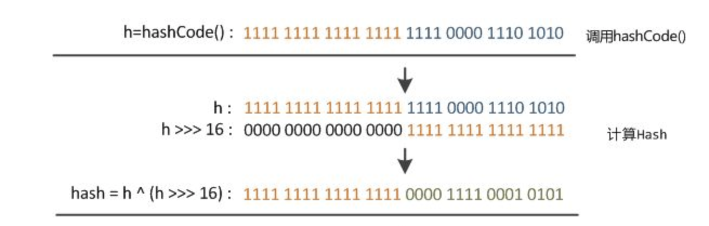
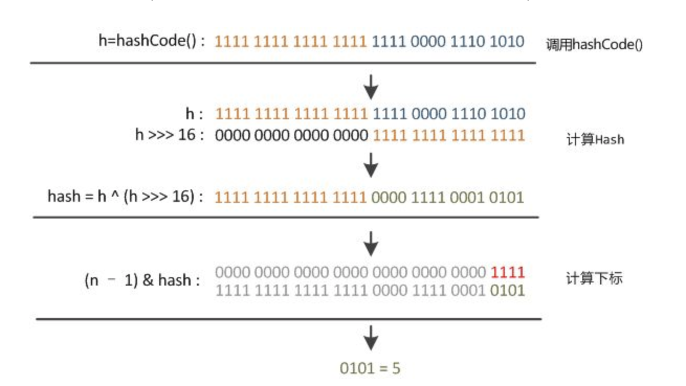
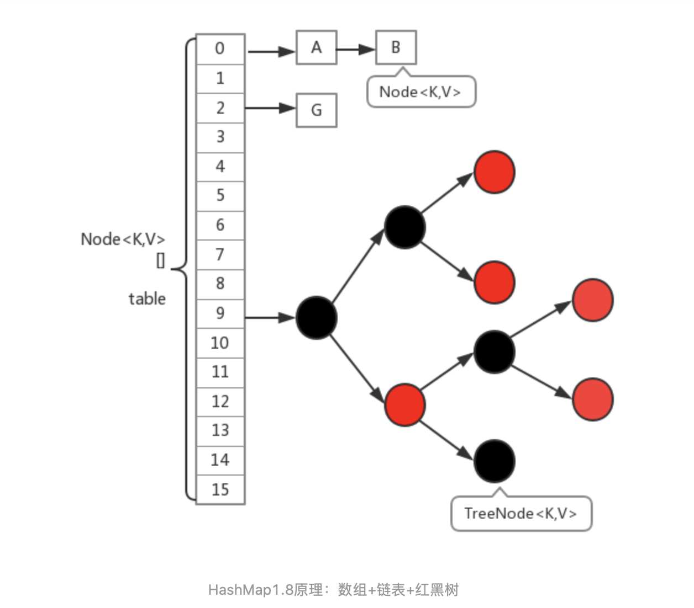
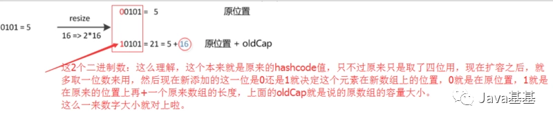

# HashMap 1.7

使用数组加链表实现hashmap。

hashmap初始容量为16，装载因子为0.75，hashmap里面的元素达到阈值(阈值=容量 * 装载因子)时，就会进行扩容，每次扩容2倍。


## put方法

```java
    public V put(K key, V value) {
        // 当第一次往里面放元素时才真正地申请空间
        if (table == EMPTY_TABLE) {
            inflateTable(threshold);
        }
        if (key == null)
            return putForNullKey(value);
        // 计算hash值
        int hash = hash(key);
        // 计算索引值，大小为0到table.length - 1
        int i = indexFor(hash, table.length);
        // 如果已经存在这个key，则更新value值
        for (Entry<K,V> e = table[i]; e != null; e = e.next) {
            Object k;
            if (e.hash == hash && ((k = e.key) == key || key.equals(k))) {
                V oldValue = e.value;
                e.value = value;
                e.recordAccess(this);
                return oldValue;
            }
        }
		
        modCount++;
        // 不存在这个key,就新增
        addEntry(hash, key, value, i);
        return null;
    }
```

### inflateTable

为数组申请空间

```java
    private void inflateTable(int toSize) {
        // Find a power of 2 >= toSize
        int capacity = roundUpToPowerOf2(toSize);

        threshold = (int) Math.min(capacity * loadFactor, MAXIMUM_CAPACITY + 1);
        table = new Entry[capacity];
        // initHashSeedAsNeeded方法判断是否需要rehash
        initHashSeedAsNeeded(capacity);
    }
```

### roundUpToPowerOf2

每次最接近number的数，而且是2的幂次方的数。如number=8就返回8，number=9就返回15

```java
private static int roundUpToPowerOf2(int number) {
    // assert number >= 0 : "number must be non-negative";
    return number >= MAXIMUM_CAPACITY
            ? MAXIMUM_CAPACITY
            : (number > 1) ? Integer.highestOneBit((number - 1) << 1) : 1;
}
```

### putForNullKey

如果已经存在null键则更新其value，否则将null键添加到数组中

```java
    private V putForNullKey(V value) {
        for (Entry<K,V> e = table[0]; e != null; e = e.next) {
            if (e.key == null) {
                V oldValue = e.value;
                e.value = value;
                e.recordAccess(this);
                return oldValue;
            }
        }
        modCount++;
        addEntry(0, null, value, 0);
        return null;
    }
```

### hash方法

将hashcode的高位和低位混合求hash值，减少冲突

```java
    final int hash(Object k) {
        int h = hashSeed;
        if (0 != h && k instanceof String) {
            return sun.misc.Hashing.stringHash32((String) k);
        }

        h ^= k.hashCode();

        // This function ensures that hashCodes that differ only by
        // constant multiples at each bit position have a bounded
        // number of collisions (approximately 8 at default load factor).
        h ^= (h >>> 20) ^ (h >>> 12);
        return h ^ (h >>> 7) ^ (h >>> 4);
    }
```

### indexFor方法

hash & (length -1)可以将所有hash值映射到0到length-1范围内，这也解释了为什么hashmap的容量必须是2的倍数。

```java
    static int indexFor(int h, int length) {
        // assert Integer.bitCount(length) == 1 : "length must be a non-zero power of 2";
        return h & (length-1);
    }
```

### addEntry方法

```java
    void addEntry(int hash, K key, V value, int bucketIndex) {
        // 扩容
        if ((size >= threshold) && (null != table[bucketIndex])) {
            resize(2 * table.length);
            // 重新hash值
            hash = (null != key) ? hash(key) : 0;
            // 重新计算索引位置
            bucketIndex = indexFor(hash, table.length);
        }
		// 添加新元素
        createEntry(hash, key, value, bucketIndex);
    }
```

### resize方法——扩容

```java
    void resize(int newCapacity) {
        // 旧数组
        Entry[] oldTable = table;
        // 旧容量
        int oldCapacity = oldTable.length;
        // 如果旧容量等于最大容量，则直接返回，无法扩容
        if (oldCapacity == MAXIMUM_CAPACITY) {
            threshold = Integer.MAX_VALUE;
            return;
        }
		// 新建一个数组
        Entry[] newTable = new Entry[newCapacity];
        // 将原始table中元素复制到newTable
        transfer(newTable, initHashSeedAsNeeded(newCapacity));
        table = newTable;
        threshold = (int)Math.min(newCapacity * loadFactor, MAXIMUM_CAPACITY + 1);
    }
```

### initHashSeedAsNeeded方法

initHashSeedAsNeeded方法判断是否需要rehash

```java
    final boolean initHashSeedAsNeeded(int capacity) {
        // hashSeed降低hash碰撞的hash种子，初始值为0
        boolean currentAltHashing = hashSeed != 0;
        //ALTERNATIVE_HASHING_THRESHOLD： 当map的capacity容量大于这个值的时候并满足其他条件时候进行重新hash
        boolean useAltHashing = sun.misc.VM.isBooted() && (capacity >= Holder.ALTERNATIVE_HASHING_THRESHOLD);
        //TODO 异或操作，二者满足一个条件即可rehash
        boolean switching = currentAltHashing ^ useAltHashing;
        if (switching) {
            // 更新hashseed的值
            hashSeed = useAltHashing ? sun.misc.Hashing.randomHashSeed(this) : 0;
        }
        return switching;
    }
```

### transfer方法

将原始table中元素复制到newTable

如果多线程并发扩容时会形成循环链表，线程A执行完`Entry<K,V> next = e.next;`，如果让给线程B执行，线程B执行完扩容后，线程A还会继续扩容，这种情况下就会形成循环链表。采用尾插法可以解决这个问题，所以jdk1.8就采用尾插法了。

```java
    void transfer(Entry[] newTable, boolean rehash) {
        int newCapacity = newTable.length;
        for (Entry<K,V> e : table) {
            while(null != e) {
                Entry<K,V> next = e.next;
                // 如果需要重新hash就重新hash
                if (rehash) {
                    e.hash = null == e.key ? 0 : hash(e.key);
                }
                // 计算索引位置
                int i = indexFor(e.hash, newCapacity);
                // 头插法
                e.next = newTable[i];
                newTable[i] = e;
                e = next;
            }
        }
    }
```

### createEntry方法

如果没有超过阈值，则直接存入table

```java
    void createEntry(int hash, K key, V value, int bucketIndex) {
        Entry<K,V> e = table[bucketIndex];
        // 头插法
        table[bucketIndex] = new Entry<>(hash, key, value, e);
        size++;
    }
```

### Entry

```java
        Entry(int h, K k, V v, Entry<K,V> n) {
            value = v;
            next = n;
            key = k;
            hash = h;
        }
```

## get方法

```java
    public V get(Object key) {
        if (key == null)
            return getForNullKey();
        // 调用getEntry方法
        Entry<K,V> entry = getEntry(key);

        return null == entry ? null : entry.getValue();
    }
```

### getForNullKey方法

key = null映射为索引0，查找table[0]中有没有key=null的结点

```java
    private V getForNullKey() {
        if (size == 0) {
            return null;
        }
        for (Entry<K,V> e = table[0]; e != null; e = e.next) {
            if (e.key == null)
                return e.value;
        }
        return null;
    }
```

### getEntry方法

```java
    final Entry<K,V> getEntry(Object key) {
        if (size == 0) {
            return null;
        }

        int hash = (key == null) ? 0 : hash(key);
        // 先找到在那个table[i]，然后遍历链表找到这个key
        for (Entry<K,V> e = table[indexFor(hash, table.length)];
             e != null;
             e = e.next) {
            Object k;
            if (e.hash == hash &&
                ((k = e.key) == key || (key != null && key.equals(k))))
                return e;
        }
        return null;
    }
```

# HashMap 1.8

`HashMap`结构图：


HashMap：它根据键的hashCode值存储数据，大多数情况下可以直接定位到它的值，因而具有很快的访问速度，但遍历顺序却是不确定的。 HashMap最多只允许一条记录的键为null，允许多条记录的值为null。HashMap非线程安全，即任一时刻可以有多个线程同时写HashMap，可能会导致数据的不一致。如果需要满足线程安全，可以用 Collections的synchronizedMap方法使HashMap具有线程安全的能力，或者使用ConcurrentHashMap。

默认的初始容量是16
默认的负载因子0.75
当桶上的结点数大于等于8会转成红黑树
当桶上的结点数小于6红黑树转链表
Node<k,v>[] table //存储元素的哈希桶数组，总是2的幂次倍

## 源码

```java
public class HashMap<K,V> extends AbstractMap<K,V>
    implements Map<K,V>, Cloneable, Serializable {

    private static final long serialVersionUID = 362498820763181265L;

    /**
     * The default initial capacity - MUST be a power of two.
     * 默认容量
     */
    static final int DEFAULT_INITIAL_CAPACITY = 1 << 4; // aka 16

    /**
     * The maximum capacity, used if a higher value is implicitly specified
     * by either of the constructors with arguments.
     * MUST be a power of two <= 1<<30.
     * 最大容量
     */
    static final int MAXIMUM_CAPACITY = 1 << 30;

    /**
     * The load factor used when none specified in constructor.
     * 装载因子
     */
    static final float DEFAULT_LOAD_FACTOR = 0.75f;

    /**
     * The bin count threshold for using a tree rather than list for a
     * bin.  Bins are converted to trees when adding an element to a
     * bin with at least this many nodes. The value must be greater
     * than 2 and should be at least 8 to mesh with assumptions in
     * tree removal about conversion back to plain bins upon
     * shrinkage.
     * 当桶中结点达到8时，将转为红黑树
     */
    static final int TREEIFY_THRESHOLD = 8;

    /**
     * The bin count threshold for untreeifying a (split) bin during a
     * resize operation. Should be less than TREEIFY_THRESHOLD, and at
     * most 6 to mesh with shrinkage detection under removal.
     * 当桶中结点小于6时，将由红黑树转为链表
     */
    static final int UNTREEIFY_THRESHOLD = 6;

    /**
     * The smallest table capacity for which bins may be treeified.
     * (Otherwise the table is resized if too many nodes in a bin.)
     * Should be at least 4 * TREEIFY_THRESHOLD to avoid conflicts
     * between resizing and treeification thresholds.
     * 桶树化，哈希表最小的容量
     */
    static final int MIN_TREEIFY_CAPACITY = 64;

    /**
     * Basic hash bin node, used for most entries.  (See below for
     * TreeNode subclass, and in LinkedHashMap for its Entry subclass.)
     * 数组中每一个元素的类型
     */
    static class Node<K,V> implements Map.Entry<K,V> {
        final int hash;
        final K key;
        V value;
        Node<K,V> next;

        Node(int hash, K key, V value, Node<K,V> next) {
            this.hash = hash;
            this.key = key;
            this.value = value;
            this.next = next;
        }

        public final K getKey()        { return key; }
        public final V getValue()      { return value; }
        public final String toString() { return key + "=" + value; }

        public final int hashCode() {
            return Objects.hashCode(key) ^ Objects.hashCode(value);
        }

        public final V setValue(V newValue) {
            V oldValue = value;
            value = newValue;
            return oldValue;
        }

        public final boolean equals(Object o) {
            if (o == this)
                return true;
            if (o instanceof Map.Entry) {
                Map.Entry<?,?> e = (Map.Entry<?,?>)o;
                if (Objects.equals(key, e.getKey()) &&
                    Objects.equals(value, e.getValue()))
                    return true;
            }
            return false;
        }
    }

    /* ---------------- Static utilities -------------- */

    /**
     * Computes key.hashCode() and spreads (XORs) higher bits of hash
     * to lower.  Because the table uses power-of-two masking, sets of
     * hashes that vary only in bits above the current mask will
     * always collide. (Among known examples are sets of Float keys
     * holding consecutive whole numbers in small tables.)  So we
     * apply a transform that spreads the impact of higher bits
     * downward. There is a tradeoff between speed, utility, and
     * quality of bit-spreading. Because many common sets of hashes
     * are already reasonably distributed (so don't benefit from
     * spreading), and because we use trees to handle large sets of
     * collisions in bins, we just XOR some shifted bits in the
     * cheapest possible way to reduce systematic lossage, as well as
     * to incorporate impact of the highest bits that would otherwise
     * never be used in index calculations because of table bounds.
     * hash值计算方法，将key.hashCode() 与 key.hashCode()右移16位做异或运算
     */
    static final int hash(Object key) {
        int h;
        return (key == null) ? 0 : (h = key.hashCode()) ^ (h >>> 16);
    }

    /**
     * Returns x's Class if it is of the form "class C implements
     * Comparable<C>", else null.
     */
    static Class<?> comparableClassFor(Object x) {
        if (x instanceof Comparable) {
            Class<?> c; Type[] ts, as; Type t; ParameterizedType p;
            if ((c = x.getClass()) == String.class) // bypass checks
                return c;
            if ((ts = c.getGenericInterfaces()) != null) {
                for (int i = 0; i < ts.length; ++i) {
                    if (((t = ts[i]) instanceof ParameterizedType) &&
                        ((p = (ParameterizedType)t).getRawType() ==
                         Comparable.class) &&
                        (as = p.getActualTypeArguments()) != null &&
                        as.length == 1 && as[0] == c) // type arg is c
                        return c;
                }
            }
        }
        return null;
    }

    /**
     * Returns k.compareTo(x) if x matches kc (k's screened comparable
     * class), else 0.
     */
    @SuppressWarnings({"rawtypes","unchecked"}) // for cast to Comparable
    static int compareComparables(Class<?> kc, Object k, Object x) {
        return (x == null || x.getClass() != kc ? 0 :
                ((Comparable)k).compareTo(x));
    }

    /**
     * Returns a power of two size for the given target capacity.
     * 返回大于输入参数且最近的2的整数次幂的数。如cap=10,返回结果就是16
     */
    static final int tableSizeFor(int cap) {
        int n = cap - 1;
        n |= n >>> 1;
        n |= n >>> 2;
        n |= n >>> 4;
        n |= n >>> 8;
        n |= n >>> 16;
        return (n < 0) ? 1 : (n >= MAXIMUM_CAPACITY) ? MAXIMUM_CAPACITY : n + 1;
    }

    /* ---------------- Fields -------------- */

    /**
     * The table, initialized on first use, and resized as
     * necessary. When allocated, length is always a power of two.
     * (We also tolerate length zero in some operations to allow
     * bootstrapping mechanics that are currently not needed.)
     * 数组
     */
    transient Node<K,V>[] table;

    /**
     * Holds cached entrySet(). Note that AbstractMap fields are used
     * for keySet() and values().
     */
    transient Set<Map.Entry<K,V>> entrySet;

    /**
     * The number of key-value mappings contained in this map.
     * map包含的元素大小
     */
    transient int size;

    /**
     * The number of times this HashMap has been structurally modified
     * Structural modifications are those that change the number of mappings in
     * the HashMap or otherwise modify its internal structure (e.g.,
     * rehash).  This field is used to make iterators on Collection-views of
     * the HashMap fail-fast.  (See ConcurrentModificationException).
     * 修改次数
     */
    transient int modCount;

    /**
     * The next size value at which to resize (capacity * load factor).
     *
     * @serial
     */
    // (The javadoc description is true upon serialization.
    // Additionally, if the table array has not been allocated, this
    // field holds the initial array capacity, or zero signifying
    // DEFAULT_INITIAL_CAPACITY.)
    // 阈值就是容量*装载因子
    int threshold;

    /**
     * The load factor for the hash table.
     *
     * @serial
     */
    final float loadFactor;

    /* ---------------- Public operations -------------- */

    /**
     * Constructs an empty <tt>HashMap</tt> with the specified initial
     * capacity and load factor.
     *
     * @param  initialCapacity the initial capacity
     * @param  loadFactor      the load factor
     * @throws IllegalArgumentException if the initial capacity is negative
     *         or the load factor is nonpositive
     */
    public HashMap(int initialCapacity, float loadFactor) {
        if (initialCapacity < 0)
            throw new IllegalArgumentException("Illegal initial capacity: " +
                                               initialCapacity);
        if (initialCapacity > MAXIMUM_CAPACITY)
            initialCapacity = MAXIMUM_CAPACITY;
        if (loadFactor <= 0 || Float.isNaN(loadFactor))
            throw new IllegalArgumentException("Illegal load factor: " +
                                               loadFactor);
        this.loadFactor = loadFactor;
        // 找到最接近initialCapacity的，且是2的幂次方的数
        this.threshold = tableSizeFor(initialCapacity);
    }

    /**
     * Constructs an empty <tt>HashMap</tt> with the specified initial
     * capacity and the default load factor (0.75).
     *
     * @param  initialCapacity the initial capacity.
     * @throws IllegalArgumentException if the initial capacity is negative.
     */
    public HashMap(int initialCapacity) {
        this(initialCapacity, DEFAULT_LOAD_FACTOR);
    }

    /**
     * Constructs an empty <tt>HashMap</tt> with the default initial capacity
     * (16) and the default load factor (0.75).
     */
    public HashMap() {
        this.loadFactor = DEFAULT_LOAD_FACTOR; // all other fields defaulted
    }

    /**
     * Constructs a new <tt>HashMap</tt> with the same mappings as the
     * specified <tt>Map</tt>.  The <tt>HashMap</tt> is created with
     * default load factor (0.75) and an initial capacity sufficient to
     * hold the mappings in the specified <tt>Map</tt>.
     *
     * @param   m the map whose mappings are to be placed in this map
     * @throws  NullPointerException if the specified map is null
     */
    public HashMap(Map<? extends K, ? extends V> m) {
        this.loadFactor = DEFAULT_LOAD_FACTOR;
        putMapEntries(m, false);
    }

    /**
     * Implements Map.putAll and Map constructor
     *
     * @param m the map
     * @param evict false when initially constructing this map, else
     * true (relayed to method afterNodeInsertion).
     * putMapEntries调用了putVal, putVal已详细注释
     */
    final void putMapEntries(Map<? extends K, ? extends V> m, boolean evict) {
        int s = m.size();
        if (s > 0) {
            if (table == null) { // pre-size
                float ft = ((float)s / loadFactor) + 1.0F;
                int t = ((ft < (float)MAXIMUM_CAPACITY) ?
                         (int)ft : MAXIMUM_CAPACITY);
                if (t > threshold)
                    threshold = tableSizeFor(t);
            }
            else if (s > threshold)
                // 扩容
                resize();
            for (Map.Entry<? extends K, ? extends V> e : m.entrySet()) {
                K key = e.getKey();
                V value = e.getValue();
                putVal(hash(key), key, value, false, evict);
            }
        }
    }

    /**
     * Returns the number of key-value mappings in this map.
     *
     * @return the number of key-value mappings in this map
     */
    public int size() {
        return size;
    }

    /**
     * Returns <tt>true</tt> if this map contains no key-value mappings.
     *
     * @return <tt>true</tt> if this map contains no key-value mappings
     */
    public boolean isEmpty() {
        return size == 0;
    }

    /**
     * Returns the value to which the specified key is mapped,
     * or {@code null} if this map contains no mapping for the key.
     *
     * <p>More formally, if this map contains a mapping from a key
     * {@code k} to a value {@code v} such that {@code (key==null ? k==null :
     * key.equals(k))}, then this method returns {@code v}; otherwise
     * it returns {@code null}.  (There can be at most one such mapping.)
     *
     * <p>A return value of {@code null} does not <i>necessarily</i>
     * indicate that the map contains no mapping for the key; it's also
     * possible that the map explicitly maps the key to {@code null}.
     * The {@link #containsKey containsKey} operation may be used to
     * distinguish these two cases.
     *
     * @see #put(Object, Object)
     */
    public V get(Object key) {
        Node<K,V> e;
        return (e = getNode(hash(key), key)) == null ? null : e.value;
    }

    /**
     * Implements Map.get and related methods
     *
     * @param hash hash for key
     * @param key the key
     * @return the node, or null if none
     */
    final Node<K,V> getNode(int hash, Object key) {
        Node<K,V>[] tab; Node<K,V> first, e; int n; K k;
        // table != null, 数组不为空，tab[(n - 1) & hash])存在才查找，否则返回null
        if ((tab = table) != null && (n = tab.length) > 0 &&
            (first = tab[(n - 1) & hash]) != null) {
            // 检查第一个结点是不是就是需要查找的key
            if (first.hash == hash && // always check first node
                ((k = first.key) == key || (key != null && key.equals(k))))
                return first;
            // 如果第一个结点不是，就继续往下查找，一种是红黑树的情况，一种是链表的情况
            if ((e = first.next) != null) {
                if (first instanceof TreeNode)
                    return ((TreeNode<K,V>)first).getTreeNode(hash, key);
                // 遍历链表
                do {
                    if (e.hash == hash &&
                        ((k = e.key) == key || (key != null && key.equals(k))))
                        return e;
                } while ((e = e.next) != null);
            }
        }
        return null;
    }

    /**
     * Returns <tt>true</tt> if this map contains a mapping for the
     * specified key.
     *
     * @param   key   The key whose presence in this map is to be tested
     * @return <tt>true</tt> if this map contains a mapping for the specified
     * key.
     * 获取不到这个key，就是不存在
     */
    public boolean containsKey(Object key) {
        return getNode(hash(key), key) != null;
    }

    /**
     * Associates the specified value with the specified key in this map.
     * If the map previously contained a mapping for the key, the old
     * value is replaced.
     *
     * @param key key with which the specified value is to be associated
     * @param value value to be associated with the specified key
     * @return the previous value associated with <tt>key</tt>, or
     *         <tt>null</tt> if there was no mapping for <tt>key</tt>.
     *         (A <tt>null</tt> return can also indicate that the map
     *         previously associated <tt>null</tt> with <tt>key</tt>.)
     */
    public V put(K key, V value) {
        return putVal(hash(key), key, value, false, true);
    }

    /**
     * Implements Map.put and related methods
     *
     * @param hash hash for key
     * @param key the key
     * @param value the value to put
     * @param onlyIfAbsent if true, don't change existing value
     * @param evict if false, the table is in creation mode.
     * @return previous value, or null if none
     * 核心方法之一，存入key、value
     */
    final V putVal(int hash, K key, V value, boolean onlyIfAbsent,
                   boolean evict) {
        Node<K,V>[] tab; Node<K,V> p; int n, i;
        // 如果table=null或者tab.length=0，就进行扩容
        if ((tab = table) == null || (n = tab.length) == 0)
            n = (tab = resize()).length;
        // 此处对应没有产生hash冲突的情况，直接使tab[i]等于一个新创建的Node结点
        if ((p = tab[i = (n - 1) & hash]) == null)
            tab[i] = newNode(hash, key, value, null);
        else {  // 产生hash冲突
            Node<K,V> e; K k;
            // 第一个结点就是要找的结点
            if (p.hash == hash &&
                ((k = p.key) == key || (key != null && key.equals(k))))
                e = p;
            else if (p instanceof TreeNode)
                // 到红黑树中查找
                e = ((TreeNode<K,V>)p).putTreeVal(this, tab, hash, key, value);
            else {
                for (int binCount = 0; ; ++binCount) {
                    if ((e = p.next) == null) {
                        // p.next = null表示没有找到，直接插入一个新结点
                        p.next = newNode(hash, key, value, null);
                        // 如果binCount大于等于7，就转化为红黑树
                        if (binCount >= TREEIFY_THRESHOLD - 1) // -1 for 1st
                            treeifyBin(tab, hash);
                        break;
                    }
                    if (e.hash == hash &&
                        ((k = e.key) == key || (key != null && key.equals(k))))
                        break;
                    p = e;
                }
            }
            // 更新结点值
            if (e != null) { // existing mapping for key
                V oldValue = e.value;
                if (!onlyIfAbsent || oldValue == null)
                    e.value = value;
                afterNodeAccess(e);
                return oldValue;
            }
        }
        ++modCount;
        // 如果大于阈值，就进行扩容
        if (++size > threshold)
            resize();
        afterNodeInsertion(evict);
        return null;
    }

    /**
     * Initializes or doubles table size.  If null, allocates in
     * accord with initial capacity target held in field threshold.
     * Otherwise, because we are using power-of-two expansion, the
     * elements from each bin must either stay at same index, or move
     * with a power of two offset in the new table.
     *
     * @return the table
     * 扩容，返回一个新数组
     */
    final Node<K,V>[] resize() {
        // 旧数组
        Node<K,V>[] oldTab = table;
        // 旧容量
        int oldCap = (oldTab == null) ? 0 : oldTab.length;
        // 旧阈值
        int oldThr = threshold;
        // 新容量，新阈值
        int newCap, newThr = 0;
        if (oldCap > 0) {
            // 旧容量大于等于最大容量，则阈值直接等于int最大值，返回原数组，无法进行扩容了
            if (oldCap >= MAXIMUM_CAPACITY) {
                threshold = Integer.MAX_VALUE;
                return oldTab;
            }
            // 新容量设置为旧容量的2倍，新阈值也设置为旧阈值的2倍
            else if ((newCap = oldCap << 1) < MAXIMUM_CAPACITY &&
                     oldCap >= DEFAULT_INITIAL_CAPACITY)
                newThr = oldThr << 1; // double threshold
        }
        else if (oldThr > 0) // initial capacity was placed in threshold
            // 新容量设置为旧阈值
            newCap = oldThr;
        else {               // zero initial threshold signifies using defaults
            // 旧容量等于0的情况，说明刚进行插入，使用默认容量
            newCap = DEFAULT_INITIAL_CAPACITY;
            newThr = (int)(DEFAULT_LOAD_FACTOR * DEFAULT_INITIAL_CAPACITY);
        }
        // 设置新容量的值
        if (newThr == 0) {
            float ft = (float)newCap * loadFactor;
            newThr = (newCap < MAXIMUM_CAPACITY && ft < (float)MAXIMUM_CAPACITY ?
                      (int)ft : Integer.MAX_VALUE);
        }
        threshold = newThr;
        // 扩容就是新建一个数组，把原数组里面的数据存入新数组
        @SuppressWarnings({"rawtypes","unchecked"})
            Node<K,V>[] newTab = (Node<K,V>[])new Node[newCap];
        table = newTab;
        if (oldTab != null) {
            // 下面这个循环，就是将原数组中的数据存到新数组
            for (int j = 0; j < oldCap; ++j) {
                Node<K,V> e;
                if ((e = oldTab[j]) != null) {
                    oldTab[j] = null;
                    // 数组j的位置只有一个元素
                    if (e.next == null)
                        newTab[e.hash & (newCap - 1)] = e;
                    else if (e instanceof TreeNode)
                    // 对应红黑树的情况
                        ((TreeNode<K,V>)e).split(this, newTab, j, oldCap);
                    else { // preserve order
                    // 链表
                        // loHead和loTail用于记录oldTab[j]中结点，扩容后索引位置不变的情况
                        Node<K,V> loHead = null, loTail = null;
                        // hiHead和hiTail用于记录oldTab[j]中结点，扩容后索引位置等于原位置+原容量的情况
                        Node<K,V> hiHead = null, hiTail = null;
                        Node<K,V> next;
                        do {
                            next = e.next;
                            // 这个if成立，说明e结点扩容后还是在j位置
                            if ((e.hash & oldCap) == 0) {
                                // 尾插法
                                if (loTail == null)
                                    loHead = e;
                                else
                                    loTail.next = e;
                                loTail = e;
                            }
                            else {
                                // 这个if成立，说明e结点扩容后，存储在j+oldCap位置，也是尾插法
                                if (hiTail == null)
                                    hiHead = e;
                                else
                                    hiTail.next = e;
                                hiTail = e;
                            }
                        } while ((e = next) != null);
                        // loHead链表扩容后还在j位置
                        if (loTail != null) {
                            loTail.next = null;
                            newTab[j] = loHead;
                        }
                        // hiHead链表对应新数组的位置就是，j + oldCap，这里也就是为什么数组大小一定要是2的倍数
                        // 注意到，这里不需要重新hash，可以节省hash时间，其实就算就行重新hash，rehash的值也
                        // 是j + oldCap，这就是hashmap非常巧妙的地方。
                        if (hiTail != null) {
                            hiTail.next = null;
                            newTab[j + oldCap] = hiHead;
                        }
                    }
                }
            }
        }
        return newTab;
    }

    /**
     * Replaces all linked nodes in bin at index for given hash unless
     * table is too small, in which case resizes instead.
     * 红黑树太复杂，具体操作就不看了，把其他内容掌握就可以了
     */
    final void treeifyBin(Node<K,V>[] tab, int hash) {
        int n, index; Node<K,V> e;
        if (tab == null || (n = tab.length) < MIN_TREEIFY_CAPACITY)
            resize();
        else if ((e = tab[index = (n - 1) & hash]) != null) {
            TreeNode<K,V> hd = null, tl = null;
            do {
                TreeNode<K,V> p = replacementTreeNode(e, null);
                if (tl == null)
                    hd = p;
                else {
                    p.prev = tl;
                    tl.next = p;
                }
                tl = p;
            } while ((e = e.next) != null);
            if ((tab[index] = hd) != null)
                hd.treeify(tab);
        }
    }

    /**
     * Copies all of the mappings from the specified map to this map.
     * These mappings will replace any mappings that this map had for
     * any of the keys currently in the specified map.
     *
     * @param m mappings to be stored in this map
     * @throws NullPointerException if the specified map is null
     */
    public void putAll(Map<? extends K, ? extends V> m) {
        putMapEntries(m, true);
    }

    /**
     * Removes the mapping for the specified key from this map if present.
     *
     * @param  key key whose mapping is to be removed from the map
     * @return the previous value associated with <tt>key</tt>, or
     *         <tt>null</tt> if there was no mapping for <tt>key</tt>.
     *         (A <tt>null</tt> return can also indicate that the map
     *         previously associated <tt>null</tt> with <tt>key</tt>.)
     */
    public V remove(Object key) {
        Node<K,V> e;
        return (e = removeNode(hash(key), key, null, false, true)) == null ?
            null : e.value;
    }

    /**
     * Implements Map.remove and related methods
     *
     * @param hash hash for key
     * @param key the key
     * @param value the value to match if matchValue, else ignored
     * @param matchValue if true only remove if value is equal
     * @param movable if false do not move other nodes while removing
     * @return the node, or null if none
     * 删除结点
     */
    final Node<K,V> removeNode(int hash, Object key, Object value,
                               boolean matchValue, boolean movable) {
        Node<K,V>[] tab; Node<K,V> p; int n, index;
        if ((tab = table) != null && (n = tab.length) > 0 &&
            (p = tab[index = (n - 1) & hash]) != null) {
            Node<K,V> node = null, e; K k; V v;
            // 第一个结点就是要删除的结点，用node记录下来
            if (p.hash == hash &&
                ((k = p.key) == key || (key != null && key.equals(k))))
                node = p;
            else if ((e = p.next) != null) {
                // 到红黑树中查找
                if (p instanceof TreeNode)
                    node = ((TreeNode<K,V>)p).getTreeNode(hash, key);
                // 在链表中查找
                else {
                    do {
                        if (e.hash == hash &&
                            ((k = e.key) == key ||
                             (key != null && key.equals(k)))) {
                            node = e;
                            break;
                        }
                        p = e;
                    } while ((e = e.next) != null);
                }
            }
            // 删除node结点
            if (node != null && (!matchValue || (v = node.value) == value ||
                                 (value != null && value.equals(v)))) {
                // 红黑树情况，
                if (node instanceof TreeNode)
                    ((TreeNode<K,V>)node).removeTreeNode(this, tab, movable);
                // node=p，第一个结点就是要删除的结点，直接tab[index] = node.next;
                else if (node == p)
                    tab[index] = node.next;
                else
                    p.next = node.next;
                ++modCount;
                --size;
                // 这个方法是一个空方法，留给子类覆写，如LinkedHashMap就覆写了这个方法
                afterNodeRemoval(node);
                return node;
            }
        }
        return null;
    }

    /**
     * Removes all of the mappings from this map.
     * The map will be empty after this call returns.
     * 将tab置null
     */
    public void clear() {
        Node<K,V>[] tab;
        modCount++;
        if ((tab = table) != null && size > 0) {
            size = 0;
            for (int i = 0; i < tab.length; ++i)
                tab[i] = null;
        }
    }

    /**
     * Returns <tt>true</tt> if this map maps one or more keys to the
     * specified value.
     *
     * @param value value whose presence in this map is to be tested
     * @return <tt>true</tt> if this map maps one or more keys to the
     *         specified value
     * 挨个遍历判断
     */
    public boolean containsValue(Object value) {
        Node<K,V>[] tab; V v;
        if ((tab = table) != null && size > 0) {
            for (int i = 0; i < tab.length; ++i) {
                for (Node<K,V> e = tab[i]; e != null; e = e.next) {
                    if ((v = e.value) == value ||
                        (value != null && value.equals(v)))
                        return true;
                }
            }
        }
        return false;
    }
}
```

## tableSizeFor

```java
    /**
     * Returns a power of two size for the given target capacity.
     * 返回大于输入参数且最近的2的整数次幂的数。如cap=10,返回结果就是16
     */
    static final int tableSizeFor(int cap) {
        int n = cap - 1;
        n |= n >>> 1;
        n |= n >>> 2;
        n |= n >>> 4;
        n |= n >>> 8;
        n |= n >>> 16;
        return (n < 0) ? 1 : (n >= MAXIMUM_CAPACITY) ? MAXIMUM_CAPACITY : n + 1;
    }
```

先来分析有关n位操作部分：先来假设n的二进制为01xxx...xxx。接着

对n右移1位：001xx...xxx，再位或：011xx...xxx

对n右移2为：00011...xxx，再位或：01111...xxx

此时前面已经有四个1了，再右移4位且位或可得8个1

同理，有8个1，右移8位肯定会让后八位也为1。

综上可得，该算法让最高位的1后面的位全变为1。

最后再让结果n+1，即得到了2的整数次幂的值了。

现在回来看看第一条语句：

```java
int n = cap - 1;
```

　　让cap-1再赋值给n的目的是另找到的目标值大于或**等于**原值。例如二进制1000，十进制数值为8。如果不对它减1而直接操作，将得到答案10000，即16。显然不是结果。减1后二进制为111，再进行操作则会得到原来的数值1000，即8。

## 为什么哈希数组table的大小必须是2的倍数（合数）？

1. 当数组长度为2的幂次方时，可以使用位运算来计算元素在数组中的下标
2. 增加hash值的随机性，减少hash冲突

看一下hashmap的源码：

```java
//计算hash值
static final int hash(Object key) {
    int h;
    return (key == null) ? 0 : (h = key.hashCode()) ^ (h >>> 16);
}
```

`h >>> 16`表示无符号右移16位，低位挤走，高位补0；^ 为按位异或，即转成二进制后，相异为1，相同为0；由此可发现，当传入的值小于 2的16次方-1 时，调用这个方法返回的值，都是自身的值。

右位移16位，正好是32bit的一半，自己的高半区和低半区做异或，就是为了混合原始哈希码的高位和低位，以此来加大低位的随机性。而且混合后的低位掺杂了高位的部分特征，这样高位的信息也被变相保留下来。
假如没有进行高位运算，那最后参与运算的永远只是取模运算的最后几位，相似性会比较大。

[JDK 源码中 HashMap 的 hash 方法原理](https://link.jianshu.com/?t=https%3A%2F%2Fwww.zhihu.com%2Fquestion%2F20733617%2Fanswer%2F111577937)



*hash函数的主要作用就是：增大随机性，减少碰撞。*

hashmap中put的源码:

```java
    public V put(K key, V value) {
        return putVal(hash(key), key, value, false, true);
    }

    /**
     * Implements Map.put and related methods
     *
     * @param hash hash for key
     * @param key the key
     * @param value the value to put
     * @param onlyIfAbsent if true, don't change existing value
     * @param evict if false, the table is in creation mode.
     * @return previous value, or null if none
     * 核心方法之一，存入key、value
     */
    final V putVal(int hash, K key, V value, boolean onlyIfAbsent,
                   boolean evict) {
        Node<K,V>[] tab; Node<K,V> p; int n, i;
        // 如果table=null或者tab.length=0，就进行扩容
        if ((tab = table) == null || (n = tab.length) == 0)
            n = (tab = resize()).length;
        // 此处对应没有产生hash冲突的情况，直接使tab[i]等于一个新创建的Node结点
        if ((p = tab[i = (n - 1) & hash]) == null)
            tab[i] = newNode(hash, key, value, null);
        else {  // 产生hash冲突
            Node<K,V> e; K k;
            // 第一个结点就是要找的结点
            if (p.hash == hash &&
                ((k = p.key) == key || (key != null && key.equals(k))))
                e = p;
            else if (p instanceof TreeNode)
                // 到红黑树中查找
                e = ((TreeNode<K,V>)p).putTreeVal(this, tab, hash, key, value);
            else {
                for (int binCount = 0; ; ++binCount) {
                    if ((e = p.next) == null) {
                        // p.next = null表示没有找到，直接插入一个新结点
                        p.next = newNode(hash, key, value, null);
                        // 如果binCount大于等于7，就转化为红黑树
                        if (binCount >= TREEIFY_THRESHOLD - 1) // -1 for 1st
                            treeifyBin(tab, hash);
                        break;
                    }
                    if (e.hash == hash &&
                        ((k = e.key) == key || (key != null && key.equals(k))))
                        break;
                    p = e;
                }
            }
            // 更新结点值
            if (e != null) { // existing mapping for key
                V oldValue = e.value;
                if (!onlyIfAbsent || oldValue == null)
                    e.value = value;
                afterNodeAccess(e);
                return oldValue;
            }
        }
        ++modCount;
        // 如果大于阈值，就进行扩容
        if (++size > threshold)
            resize();
        afterNodeInsertion(evict);
        return null;
    }
```

里面非常巧妙的代码是`p = tab[i = (n - 1) & hash]`，tab是hashmap存放存放元素的数组，`(n - 1) & hash`也解释了为什么table的大小要是2的倍数。

如果n是默认大小16，没有扩容，`(n - 1) & hash`的计算结果就是hash值本身；见下图：



如果n扩容，扩容大小是原大小*2，为什么n一定要是2的倍数？举个例子：

```java
设：oldCap=16 二进制为：0001 0000  // oldCap是扩容之前的table大小
oldCap-1=15 二进制为：0000 1111   // 如果oldCap是2的倍数，低位就全部是1，与hash进行&运算，hash值不变
e1.hash=10 二进制为：0000 1010
e2.hash=26 二进制为：0101 1010
e1在扩容前的位置为：e1.hash & oldCap-1  结果为：0000 1010 
e2在扩容前的位置为：e2.hash & oldCap-1  结果为：0000 1010 
结果相同，所以e1和e2在扩容前在同一个链表上，这是扩容之前的状态。
        
现在扩容后，需要重新计算元素的位置，在扩容前的链表中计算地址的方式为e.hash & oldCap-1
那么在扩容后应该也这么计算呀，扩容后的容量为oldCap*2=32 0010 0000 newCap=32，新的计算
方式应该为
e1.hash & newCap-1 
即：0000 1010 & 0001 1111 
结果为0000 1010与扩容前的位置完全一样。
e2.hash & newCap-1 
即：0101 1010 & 0001 1111 
结果为0001 1010,为扩容前位置+oldCap。
```

由此可见，扩容后的hashmap本来存储的元素，元素的hash值比原容量小，扩容后位置不变，元素的hash值比原容量大，扩容后的位置就是扩容前位置+原容量，直接可以计算出扩容后的位置，减少了一次求hash值的次数(不需要像JDK1.7的实现那样重新计算hash)；而且将有冲突的数据均匀的分散到新的空间上；而且&运算比%取模运算要快；

当桶上的结点数大于8会转成红黑树：



红黑树的查找速度更快，查找速度优化为O(logn)。

红黑树知识可以查看我的另一篇教程，[红黑树](https://wardseptember.github.io/notes/#/docs/红黑树)。或者下面的教程

- [30张图带你彻底理解红黑树](https://www.jianshu.com/p/e136ec79235c)
- [关于红黑树(R-B tree)原理，看这篇如何](https://www.cnblogs.com/LiaHon/p/11203229.html)
- [可视化动态生成红黑树](https://www.cs.usfca.edu/~galles/visualization/RedBlack.html)

## 如何扩容

HashMap每次扩容都是建立一个新的table数组，长度和容量阈值都变为原来的两倍，然后把原数组元素重新映射到新数组上，具体步骤如下：

1. 首先会判断table数组长度，如果大于0说明已被初始化过，那么`按当前table数组长度的2倍进行扩容，阈值也变为原来的2倍`
2. 若table数组未被初始化过，且threshold(阈值)大于0说明调用了`HashMap(initialCapacity, loadFactor)`构造方法，那么就把数组大小设为threshold
3. 若table数组未被初始化，且threshold为0说明调用`HashMap()`构造方法，那么就把数组大小设为`16`，threshold设为`16*0.75`
4. 接着需要判断如果不是第一次初始化，那么扩容之后，要重新计算键值对的位置，并把它们移动到合适的位置上去，如果节点是红黑树类型的话则需要进行红黑树的拆分。

这里有一个需要注意的点就是在JDK1.8 HashMap扩容阶段重新映射元素时不需要像1.7版本那样重新去一个个计算元素的hash值，而是**通过`hash & oldCap`的值来判断，若为0则索引位置不变，不为0则新索引=原索引+旧数组长度**，为什么呢？具体原因如下：

**因为我们使用的是2次幂的扩展(指长度扩为原来2倍)，所以，元素的位置要么是在原位置，要么是在原位置再移动2次幂的位置。因此，我们在扩充HashMap的时候，不需要像JDK1.7的实现那样重新计算hash，只需要看看原来的hash值新增的那个bit是1还是0就好了，是0的话索引没变，是1的话索引变成“原索引+oldCap**



为什么用hash & oldCap做判断，假设oldCap=16，二进制是10000，15的二进制是1111，hash & (length - 1)用了四位二进制可以得到所在的索引，如果需要扩容，就是原容量*2，也就是取5位二进制与hash做与算法，这里用hash & oldCap这种非常巧妙的方法，判断hash的倒数第五位二进制是不是1，如果是1，说明应该索引变成“原索引+oldCap”，为什么不用重新hash?因为重新hash的结果也是原索引+oldCap，无非就是用五位二进制算一下，通过hash & oldCap这种方式已经判断了；如果是hash & oldCap= 0，说明原位置不用动。这里非常巧妙，如果还不懂，我也没办法了，你们仔细想想。

扩容代码：

```java
    final Node<K,V>[] resize() {
        // 旧数组
        Node<K,V>[] oldTab = table;
        // 旧容量
        int oldCap = (oldTab == null) ? 0 : oldTab.length;
        // 旧阈值
        int oldThr = threshold;
        // 新容量，新阈值
        int newCap, newThr = 0;
        if (oldCap > 0) {
            // 旧容量大于等于最大容量，则阈值直接等于int最大值，返回原数组，无法进行扩容了
            if (oldCap >= MAXIMUM_CAPACITY) {
                threshold = Integer.MAX_VALUE;
                return oldTab;
            }
            // 新容量设置为旧容量的2倍，新阈值也设置为旧阈值的2倍
            else if ((newCap = oldCap << 1) < MAXIMUM_CAPACITY &&
                     oldCap >= DEFAULT_INITIAL_CAPACITY)
                newThr = oldThr << 1; // double threshold
        }
        else if (oldThr > 0) // initial capacity was placed in threshold
            // 新容量设置为旧阈值
            newCap = oldThr;
        else {               // zero initial threshold signifies using defaults
            // 旧容量等于0的情况，说明刚进行插入，使用默认容量
            newCap = DEFAULT_INITIAL_CAPACITY;
            newThr = (int)(DEFAULT_LOAD_FACTOR * DEFAULT_INITIAL_CAPACITY);
        }
        // 设置新容量的值
        if (newThr == 0) {
            float ft = (float)newCap * loadFactor;
            newThr = (newCap < MAXIMUM_CAPACITY && ft < (float)MAXIMUM_CAPACITY ?
                      (int)ft : Integer.MAX_VALUE);
        }
        threshold = newThr;
        // 扩容就是新建一个数组，把原数组里面的数据存入新数组
        @SuppressWarnings({"rawtypes","unchecked"})
            Node<K,V>[] newTab = (Node<K,V>[])new Node[newCap];
        table = newTab;
        if (oldTab != null) {
            // 下面这个循环，就是将原数组中的数据存到新数组
            for (int j = 0; j < oldCap; ++j) {
                Node<K,V> e;
                if ((e = oldTab[j]) != null) {
                    oldTab[j] = null;
                    // 数组j的位置只有一个元素
                    if (e.next == null)
                        newTab[e.hash & (newCap - 1)] = e;
                    else if (e instanceof TreeNode)
                    // 对应红黑树的情况
                        ((TreeNode<K,V>)e).split(this, newTab, j, oldCap);
                    else { // preserve order
                    // 链表
                        // loHead和loTail用于记录oldTab[j]中结点，扩容后索引位置不变的情况
                        Node<K,V> loHead = null, loTail = null;
                        // hiHead和hiTail用于记录oldTab[j]中结点，扩容后索引位置等于原位置+原容量的情况
                        Node<K,V> hiHead = null, hiTail = null;
                        Node<K,V> next;
                        do {
                            next = e.next;
                            // 这个if成立，说明e结点扩容后还是在j位置
                            if ((e.hash & oldCap) == 0) {
                                // 尾插法
                                if (loTail == null)
                                    loHead = e;
                                else
                                    loTail.next = e;
                                loTail = e;
                            }
                            else {
                                // 这个if成立，说明e结点扩容后，存储在j+oldCap位置，也是尾插法
                                if (hiTail == null)
                                    hiHead = e;
                                else
                                    hiTail.next = e;
                                hiTail = e;
                            }
                        } while ((e = next) != null);
                        // loHead链表扩容后还在j位置
                        if (loTail != null) {
                            loTail.next = null;
                            newTab[j] = loHead;
                        }
                        // hiHead链表对应新数组的位置就是，j + oldCap，这里也就是为什么数组大小一定要是2的倍数
                        // 注意到，这里不需要重新索引位置，在原容量 & hash=1的情况下，如果重新计算(原容量*2 - 1) & hash，
                        // 其计算结果也是j + oldCap, 这就是hashmap非常巧妙的地方。
                        if (hiTail != null) {
                            hiTail.next = null;
                            newTab[j + oldCap] = hiHead;
                        }
                    }
                }
            }
        }
        return newTab;
    }
```

## 为什么链表长度大于8才变为红黑树

因为容器中节点分布在hash桶中的频率遵循lambda=0.5的泊松分布，桶的长度超过8的概率非常非常小，约0.00000006。所以一般情况下都不会转为红黑树，如果你自己写的类当做hashmap的key，实现了hashcode和equals方法，hashcode写的太烂，就有可能导致hash桶中元素超过8，避免查找、删除效率太低，所以要转为红黑树。

## 为什么不直接使用红黑树，而是链表长度大于8才专为红黑树

因为红黑树占用空间是链表的两倍，而且当链表长度短时，红黑树不一定比链表快。

## 多线程环境下，HashMap 1.8依然会出现死循环的情况

多线程环境下，HashMap 1.8依然会出现死循环的情况，发生在向红黑树添加节点中。多跑几遍下面代码可以跑出死循环。

```java

import java.util.HashMap;
import java.util.Map;
import java.util.concurrent.atomic.AtomicInteger;

/**
 * jdk7 扩容时都可能导致死锁
 * jdk8 在PutTreeValue时可能死循环   死循环在hashMap的1816行或2229行， java version "1.8.0_111"
 * jstack发现可能卡在 at java.util.HashMap$TreeNode.balanceInsertion(HashMap.java:2229)
 * 也有可能卡在  at java.util.HashMap$TreeNode.root(HashMap.java:1816)
 *
 * @since 2019-02-23
 */
public class HashMap1 {

    public static void main(String[] args) {
        HashMap<Integer, Integer> map = new HashMap<Integer, Integer>(1);
        for (int i = 0; i < 200; i++) {
            new HashMapThread(map).start();
        }
    }
}

class HashMapThread extends Thread {
    private static AtomicInteger ai = new AtomicInteger(0);
    private HashMap<Integer, Integer> map;

    HashMapThread(HashMap<Integer, Integer> map) {
        this.map = map;
    }

    @Override
    public void run() {
        while (ai.get() < 100000) {
            map.put(ai.get(), ai.get());
            ai.incrementAndGet();
        }
        System.out.println(Thread.currentThread().getName() + "执行结束完");
    }
}
```

### 参考链接

- https://www.jianshu.com/p/dc13f825b71f
- https://www.cnblogs.com/duodushuduokanbao/p/9492952.html
- https://blog.csdn.net/qq_37113604/article/details/81353626
- https://www.zhihu.com/question/20733617/answer/111577937

---
**欢迎关注我的公众号呦，率先更新内容，并且后续还有一些源码级的免费教程推出。**

<div align="center">  </div><br>