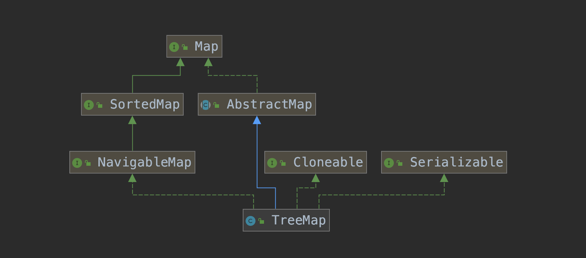

# 简介

与HashMap相比，TreeMap是一个能比较元素大小的Map集合，会对传入的key进行了大小排序。其中，可以使用元素的自然顺序，也可以使用集合中自定义的比较器来进行排序；

TreeMap底层通过红黑树实现排序。

TreeMap具有如下特点：

- 不允许出现重复的key；
- 可以插入null键，null值；
- 可以对元素进行排序；
- 无序集合（插入和遍历顺序不一致）；

<div align="center">  </div><br>

TreeMap继承于AbstractMap，实现了Map, Cloneable, NavigableMap, Serializable接口。

(1)TreeMap 继承于AbstractMap，而AbstractMap实现了Map接口，并实现了Map接口中定义的方法，减少了其子类继承的复杂度；

(2)TreeMap 实现了Map接口，成为Map框架中的一员，可以包含着key--value形式的元素；

(3)TreeMap 实现了NavigableMap接口，意味着拥有了更强的元素搜索能力；

(4)TreeMap 实现了Cloneable接口，实现了clone()方法，可以被克隆；

(5)TreeMap 实现了Java.io.Serializable接口，支持序列化操作，可通过Hessian协议进行传输；

## SortedMap

```java
public interface SortedMap<K,V> extends Map<K,V> {
    
    //返回元素比较器。如果是自然顺序，则返回null；
    Comparator<? super K> comparator();
    
    //返回从fromKey到toKey的集合：含头不含尾
    java.util.SortedMap<K,V> subMap(K fromKey, K toKey);

    //返回从头到toKey的集合：不包含toKey
    java.util.SortedMap<K,V> headMap(K toKey);

    //返回从fromKey到结尾的集合：包含fromKey
    java.util.SortedMap<K,V> tailMap(K fromKey);
    
    //返回集合中的第一个元素：
    K firstKey();
   
    //返回集合中的最后一个元素：
    K lastKey();
    
    //返回集合中所有key的集合：
    Set<K> keySet();
    
    //返回集合中所有value的集合：
    Collection<V> values();
    
    //返回集合中的元素映射：
    Set<Map.Entry<K, V>> entrySet();
}
```

## NavigableMap

```java
public interface NavigableMap<K,V> extends SortedMap<K,V> {

    //返回小于key的第一个元素：
    Map.Entry<K,V> lowerEntry(K key);

    //返回小于key的第一个键：
    K lowerKey(K key);

    //返回小于等于key的第一个元素：
    Map.Entry<K,V> floorEntry(K key);

    //返回小于等于key的第一个键：
    K floorKey(K key);

    //返回大于或者等于key的第一个元素：
    Map.Entry<K,V> ceilingEntry(K key);

    //返回大于或者等于key的第一个键：
    K ceilingKey(K key);

    //返回大于key的第一个元素：
    Map.Entry<K,V> higherEntry(K key);

    //返回大于key的第一个键：
    K higherKey(K key);

    //返回集合中第一个元素：
    Map.Entry<K,V> firstEntry();

    //返回集合中最后一个元素：
    Map.Entry<K,V> lastEntry();

    //返回集合中第一个元素，并从集合中删除：
    Map.Entry<K,V> pollFirstEntry();

    //返回集合中最后一个元素，并从集合中删除：
    Map.Entry<K,V> pollLastEntry();

    //返回倒序的Map集合：
    java.util.NavigableMap<K,V> descendingMap();

    NavigableSet<K> navigableKeySet();

    //返回Map集合中倒序的Key组成的Set集合：
    NavigableSet<K> descendingKeySet();

    java.util.NavigableMap<K,V> subMap(K fromKey, boolean fromInclusive,
                                       K toKey, boolean toInclusive);

    java.util.NavigableMap<K,V> headMap(K toKey, boolean inclusive);

    java.util.NavigableMap<K,V> tailMap(K fromKey, boolean inclusive);

    SortedMap<K,V> subMap(K fromKey, K toKey);

    SortedMap<K,V> headMap(K toKey);

    SortedMap<K,V> tailMap(K fromKey);
}
```

# 源码

TreeMap底层通过红黑树实现排序。红黑树的具体增删改查这里不详细说明，关于红黑树的教程可以看我写的[笔记](https://wardseptember.gitee.io/mynotes/#/docs/%E7%BA%A2%E9%BB%91%E6%A0%91)。

## 红黑树

红黑树的英文是“Red-Black Tree”，简称 R-B Tree。它是一种不严格的平衡二叉查找树。

顾名思义，红黑树中的节点，一类被标记为黑色，一类被标记为红色。除此之外，一棵红黑树还需要满足这样几个要求：

- 根节点是黑色的；
- 每个叶子节点都是黑色的空节点（NIL），也就是说，叶子节点不存储数据；
- 任何相邻的节点都不能同时为红色，也就是说，红色节点是被黑色节点隔开的；
- 每个节点，从该节点到达其可达叶子节点的所有路径，都包含相同数目的黑色节点；

红黑树的高度近似$log _{2} n$，所以它是近似平衡，插入、删除、查找操作的时间复杂度都是 O(logn)。

## 红黑树结点结构

红黑树结点继承自`Map.Entry<K,V>`，多了左右孩子、父节点和颜色属性。

```java
    static final class Entry<K,V> implements Map.Entry<K,V> {
        K key;
        V value;
        Entry<K,V> left;
        Entry<K,V> right;
        Entry<K,V> parent;
        boolean color = BLACK;

        /**
         * Make a new cell with given key, value, and parent, and with
         * {@code null} child links, and BLACK color.
         */
        Entry(K key, V value, Entry<K,V> parent) {
            this.key = key;
            this.value = value;
            this.parent = parent;
        }

        /**
         * Returns the key.
         *
         * @return the key
         */
        public K getKey() {
            return key;
        }

        /**
         * Returns the value associated with the key.
         *
         * @return the value associated with the key
         */
        public V getValue() {
            return value;
        }

        /**
         * Replaces the value currently associated with the key with the given
         * value.
         *
         * @return the value associated with the key before this method was
         *         called
         */
        public V setValue(V value) {
            V oldValue = this.value;
            this.value = value;
            return oldValue;
        }

        public boolean equals(Object o) {
            if (!(o instanceof Map.Entry))
                return false;
            Map.Entry<?,?> e = (Map.Entry<?,?>)o;

            return valEquals(key,e.getKey()) && valEquals(value,e.getValue());
        }

        public int hashCode() {
            int keyHash = (key==null ? 0 : key.hashCode());
            int valueHash = (value==null ? 0 : value.hashCode());
            return keyHash ^ valueHash;
        }

        public String toString() {
            return key + "=" + value;
        }
    }
```

## getEntry

看一些简单的代码，看懂红黑树代码意义也不大。

红黑树是二叉查找树，查找key比根结点小，就去左孩子查找；比根节点大，就去右孩子查找；如果相等，就返回结果。

```java
    final Entry<K,V> getEntry(Object key) {
        // Offload comparator-based version for sake of performance
        if (comparator != null)
            return getEntryUsingComparator(key);
        if (key == null)
            throw new NullPointerException();
        @SuppressWarnings("unchecked")
            Comparable<? super K> k = (Comparable<? super K>) key;
        Entry<K,V> p = root;
        while (p != null) {
            int cmp = k.compareTo(p.key);
            if (cmp < 0)
                p = p.left;
            else if (cmp > 0)
                p = p.right;
            else
                return p;
        }
        return null;
    }
```

其他代码你们想看就看，感觉没啥意思，都是为了应付面试。如果懂红黑树插入、删除规则，看起来还是很简单的，代码不复杂。