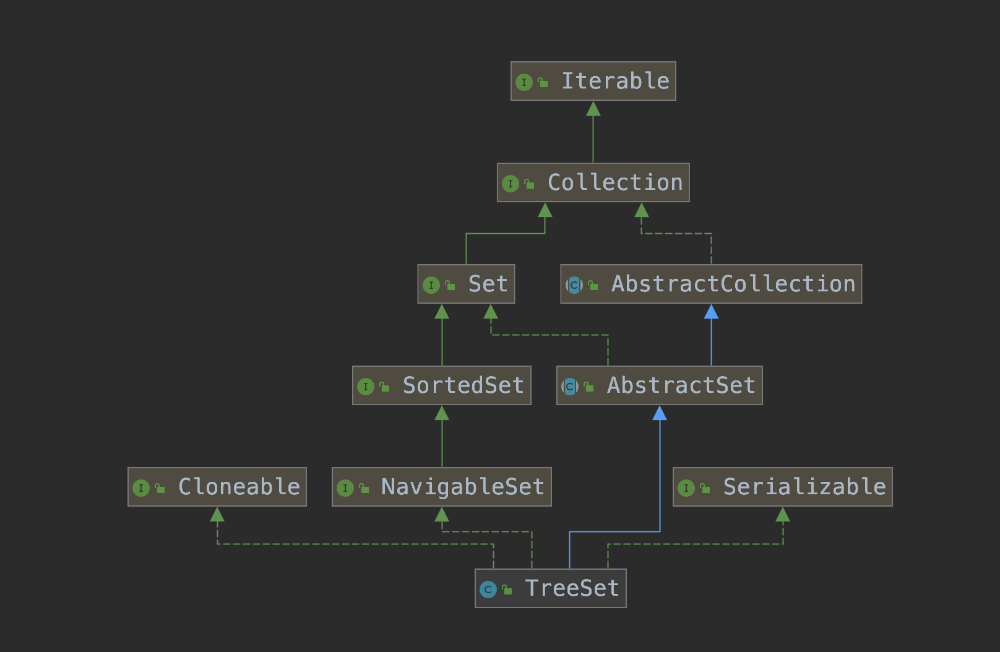

# 简介

TreeSet是一个无序、不重复的集合，无序指的是无法按照插入顺序遍历TreeSet，因为TreeSet会对插入的元素进行排序，默认是自然排序，也可以自定义排序规则。

TreeSet是通过TreeMap实现的，TreeMap的key就是TreeSet不重复的集合，TreeMap的value都指向同一个Object实例，本质上还是通过红黑树实现的。可见[TreeMap源码分析](https://wardseptember.gitee.io/mynotes/#/docs/Java%E9%9B%86%E5%90%88%E5%8C%85/TreeMap%E6%BA%90%E7%A0%81%E5%88%86%E6%9E%90)

<div align="center">  </div><br>

# 源码

源码也是比较简单

## 构造方法

```java
    private transient NavigableMap<E,Object> m;

    // Dummy value to associate with an Object in the backing Map
    private static final Object PRESENT = new Object();

    /**
     * Constructs a set backed by the specified navigable map.
     */
    TreeSet(NavigableMap<E,Object> m) {
        this.m = m;
    }
    public TreeSet() {
        this(new TreeMap<E,Object>());
    }
    public TreeSet(Comparator<? super E> comparator) {
        this(new TreeMap<>(comparator));
    }
    public TreeSet(Collection<? extends E> c) {
        this();
        addAll(c);
    }
    public TreeSet(SortedSet<E> s) {
        this(s.comparator());
        addAll(s);
    }
```

NavigableMap是一个接口，TreeMap实现了它，具有更强的搜索能力。

```java
    public TreeSet(Collection<? extends E> c) {
        this();
        addAll(c);
    }

    public TreeSet(SortedSet<E> s) {
        this(s.comparator());
        addAll(s);
    }
    public  boolean addAll(Collection<? extends E> c) {
        // Use linear-time version if applicable
        // c不为空，是SortedSet类型，
        if (m.size()==0 && c.size() > 0 &&
                c instanceof SortedSet &&
                m instanceof TreeMap) {
            SortedSet<? extends E> set = (SortedSet<? extends E>) c;
            TreeMap<E,Object> map = (TreeMap<E, Object>) m;
            Comparator<?> cc = set.comparator();
            Comparator<? super E> mc = map.comparator();
            // 将c插入到红黑树中
            if (cc==mc || (cc != null && cc.equals(mc))) {
                map.addAllForTreeSet(set, PRESENT);
                return true;
            }
        }
        return super.addAll(c);
    }
```

## add方法

基本上所有的功能都是调用TreeMap的方法，所以也没啥说的。

```java
    public boolean add(E e) {
        return m.put(e, PRESENT)==null;
    }
```

