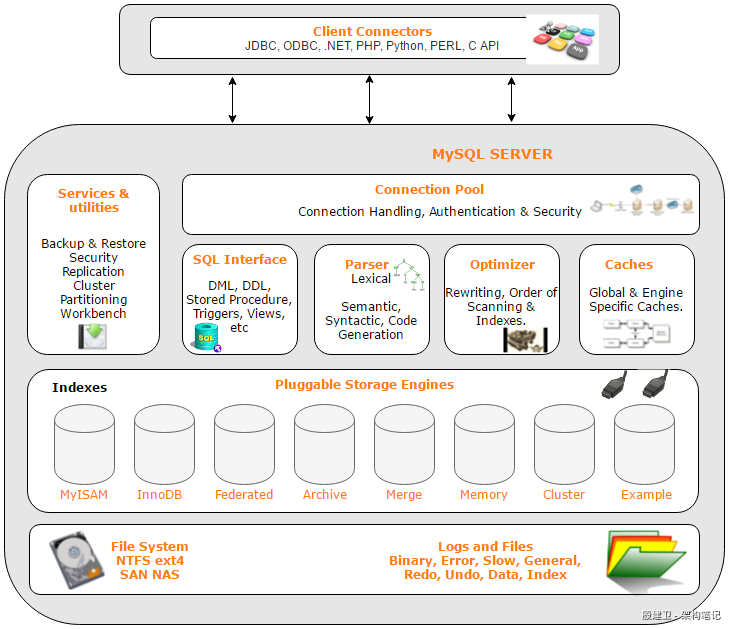
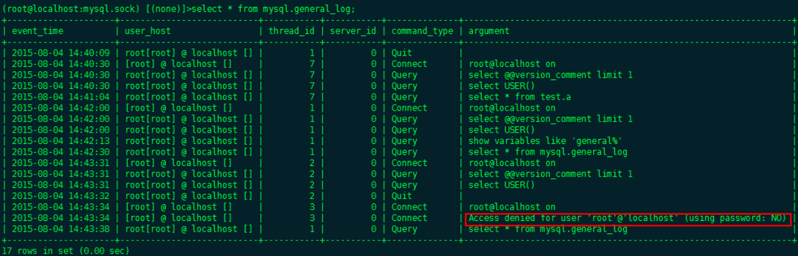
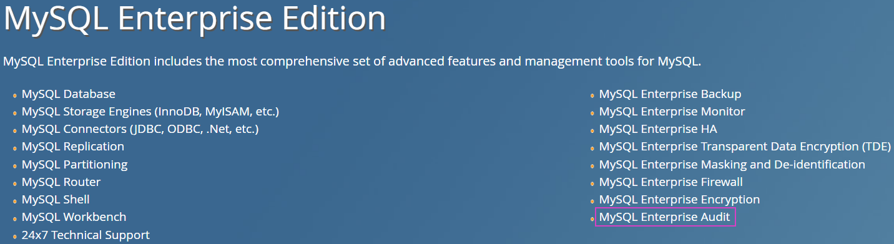

# Mysql简介

## Mysql体系结构——概述



MySQL 从概念上分为四层，这四层自顶向下分别是网络连接层，服务层（核心层），存储引擎层，系统文件层。我们自顶向下开始讲解。

### 网络连接层（Client Connectors）

主要负责连接管理、授权认证、安全等等。每个客户端连接都对应着服务器上的一个线程。服务器上维护了一个线程池，避免为每个连接都创建销毁一个线程。当客户端连接到 MySQL 服务器时，服务器对其进行认证。可以通过用户名与密码认证，也可以通过 SSL 证书进行认证。登录认证后，服务器还会验证客户端是否有执行某个查询的操作权限。这一层并不是 MySQL 所特有的技术。

### 服务层（MySQL SERVER）

第二层服务层是 MySQL 的核心，MySQL 的核心服务层都在这一层，查询解析，SQL 执行计划分析，SQL 执行计划优化，查询缓存。以及跨存储引擎的功能都在这一层实现：存储过程，触发器，视图等。

- **连接池（**Connection Pool**）**：管理、缓冲用户的连接，线程处理等需要缓存的需求。
- **管理服务和工具组件（**Services & utilities**）**：系统管理和控制工具，例如备份恢复、MySQL 复制、集群等。
- **SQL 接口**（**SQL Interface**）：接受用户的 SQL 命令，并且返回用户需要查询的结果。
- **查询解析器**（**Parser**）：SQL 命令传递到解析器的时候会被解析器验证和解析（权限、语法结构）。
- **查询优化器**（**Optimizer**）：SQL 语句在查询之前会使用查询优化器对查询进行优化。
- **缓存**（**Caches**）：如果查询缓存有命中的查询结果，查询语句就可以直接去查询缓存中取数据。

#### 存储引擎层（Pluggable Storage Engines）

负责 MySQL 中数据的存储与提取。 服务器中的查询执行引擎通过 API 与存储引擎进行通信，通过接口屏蔽了不同存储引擎之间的差异。MySQL 采用插件式的存储引擎。MySQL 为我们提供了许多存储引擎，每种存储引擎有不同的特点。我们可以根据不同的业务特点，选择最适合的存储引擎。如果对于存储引擎的性能不满意，可以通过修改源码来得到自己想要达到的性能。

**MySQL 存储引擎的特点：**

- MySQL 采用插件式的存储引擎。
- 存储引擎是针对于表的而不是针对库的（一个库中不同表可以使用不同的存储引擎），服务器通过 API 与存储引擎进行通信，用来屏蔽不同存储引擎之间的差异。
- 不管表采用什么样的存储引擎，都会在数据区，产生对应的一个 frm 文件（表结构定义描述文件）。

#### 系统文件层（File System NTFS ext4 SAN NAS）

系统文件层包含数据、索引、redo 日志、undo 日志、错误日志、查询记录、慢查询等，后文会有详细的介绍。

比如该层将数据库的数据存储在文件系统之上，并完成与存储引擎的交互。

## Mysql体系结构——主要文件

接下来我们介绍一些 MySQL 的主要文件，文件分类如下：

- 配置文件
- 日志文件
- 表结构定义文件 & 数据文件

除了上面的文件，MySQL 的物理文件还包括 pid 文件、socket 文件，下面会逐一介绍。

### 配置文件

Linux 系统中，MySQL 默认的配置文件名是 my.cnf，一般存放在 /etc/my.cnf，/etc/mysql/my.cnf 目录中，MySQL 的常用的配置信息都存放在该文件中。

#### 加载顺序

启动 MySQL 时，如果没有指定配置文件地址，则会按照默认顺序加载配置文件。通过如下命令查看 MySQL 默认加载配置文件的顺序。

```
mysql --help | grep my.cnf

#输出
order of preference, my.cnf, $MYSQL_TCP_PORT,
/etc/my.cnf /etc/mysql/my.cnf /usr/local/etc/my.cnf ~/.my.cnf
```

默认加载顺序：/etc/my.cnf -> /etc/mysql/my.cnf -> /usr/local/etc/my.cnf -> ~/.my.cnf，如果多个配置文件中存在相同的参数，则后面配置文件中的参数会覆盖前面配置文件中的参数。

#### 分组

MySQL 配置文件提供分组的功能，比如在 my.cnf 文件中经常可以看到 [client]、[mysqld] 等分组项。

```
[client]
port=3306
socket=/tmp/mysql.sock

[mysqld]
port=3306
socket=/tmp/mysql.sock
key_buffer_size=16M
max_allowed_packet=128M

[mysqldump]
quick
```

由于 MySQL 不同版本之间的配置参数存在一定的差异，如果我们要安装多个 MySQL 版本，就需要提供不同版本的 MySQL 配置文件，如何才能只使用一套配置文件呢？

MySQL 官方提供了如下方式来实现共用配置文件：https://dev.mysql.com/doc/refman/5.7/en/option-files.html

```
[mysqld-5.6]
......
[mysqld-5.7]
......
```

在定义 [mysqld] 分组时，加上 MySQL 的版本号即可，MySQL 启动时会根据版本号加载配置项。

#### 引用

MySQL 配置文件还可以通过 `!include /home/mydir/myopt.cnf` 命令引用其他配置文件中的参数。

```
!include /home/mydir/myopt.cnf
......
```

### 通过命令设置变量

在不修改配置文件的情况下，MySQL 还可以通过命令来设置变量。

比如可以使用 GLOBAL 关键字设置全局变量，`SET GLOBAL slow_query_log = 1;`，设置慢查询开启，需要注意的是该设置仅对于新开启的会话才有效，对已经开启的会话不生效。

比如可以使用 SESSION 关键字设置会话变量，`SET SESSION slow_query_log = 1;`，设置当前会话慢查询开启，需要注意的是该设置只对当前会话有效，对其他会话无效。

设置好的变量，我们可以通过 SHOW 命令查看：`SHOW VARIABLES LIKE '%slow%';`

### 日志文件

MySQL 日志文件的官方介绍：https://dev.mysql.com/doc/refman/5.7/en/server-logs.html

| **Log Type**           | **Information Written to Log**                               |
| ---------------------- | ------------------------------------------------------------ |
| Error log              | Problems encountered starting, running, or stopping [**mysqld**](https://dev.mysql.com/doc/refman/5.7/en/mysqld.html) |
| General query log      | Established client connections and statements received from clients |
| Binary log             | Statements that change data (also used for replication)      |
| Relay log              | Data changes received from a replication master server       |
| Slow query log         | Queries that took more than [`long_query_time`](https://dev.mysql.com/doc/refman/5.7/en/server-system-variables.html#sysvar_long_query_time) seconds to execute |
| DDL log (metadata log) | Metadata operations performed by DDL statements              |

#### 错误日志（Error log）

MySQL 错误日志记录 MySQL 运行过程中较为严重的警告和错误信息，以及 MySQL 每次启动和关闭的详细信息。MySQL 错误日志默认是开启的。

MySQL 错误日志在 my.cnf 配置文件中的参数是 log_error，默认名是：机器名.err，建议统一修改成一个固定的名称，例如 mysql.err。

```
[mysqld]
log_error = mysql.err
```

通过如下命令查看错误日志的配置信息。

```
show variables like '%log_err%';
```

另外，我们还可以将 MySQL 的错误日志配置到系统日志文件中。这种配置方式意义不大，了解一下吧。

```
[mysqld_safe]
syslog
# 加一个tag，日志文件以mysqld_开头
syslog_tag = stock#mysqld_stock
```

#### 慢查询日志（Slow query log）

将运行超过某个时间阈值的 SQL 语句记录到文件，默认文件名是：机器名-slow.log。默认情况下，MySQL 是不开启慢查询日志的。

官方文档：https://dev.mysql.com/doc/refman/8.0/en/slow-query-log.html

- MySQL 5.1 开始可以以毫秒为单位记录运行的 SQL 语句。
- MySQL 5.5 开始可以将慢查询保存到表。
- MySQL 5.6 开始可以更细粒度的记录慢查询。
- MySQL 5.7 将时区信息写入到慢查询日志。

**慢查询日志的参数：**

| **参数**                               | **说明**                                  | **版本**     |
| -------------------------------------- | ----------------------------------------- | ------------ |
| slow_query_log                         | 是否开启慢查询日志                        |              |
| slow_query_log_file                    | 慢查询日志文件名                          |              |
| long_query_time                        | 指定慢查询阈值（单位是秒）                | 5.5 毫秒支持 |
| min_examined_row_limit                 | 扫描记录少于该值的 SQL 不记录到慢查询日志 |              |
| log_queries_not_using_indexes          | 将没有使用索引的 SQL 记录到慢查询日志     |              |
| log_throttle_queries_not_using_indexes | 限制每分钟记录没有使用索引 SQL 语句的个数 | 5.6          |
| log_slow_admin_statements              | 记录管理操作，如 ALTER/ANALYZE TABLE      |              |
| log_output                             | 慢查询日志的格式，{FILE\|TABLE\|NONE}     | 5.5          |
| log_slow_slave_statements              | 在从服务器上开启慢查询日志                |              |
| log_timestamps                         | 写入时区信息                              | 5.7          |

- long_query_time：假设我们设置为1秒钟，正好执行时间是1秒的 SQL 会被记录为慢查询么？不会被记录，MySQL 记录的是执行时间大于 long_query_time 的SQL。
- log_queries_not_using_indexes：将没有使用索引的 SQL 也记录到慢查询日志，防止一些新增的表前期数据量比较小，SQL 查询没有超过阈值，后面随着数据量增加后，SQL 执行变慢，防患于未来。
- log_throttle_queries_not_using_indexes：如果应用中有些 SQL 没有使用索引，那么这些查询会不断的记录到慢查询日志中，慢查询日志会变得越来越大，通过该参数可以限制每分钟记录没有使用索引 SQL 语句的个数。
- min_examined_row_limit：有些表只是一些字典表，数据量也不大，不需要使用索引，如果没有设置这个值，那么根据 log_queries_not_using_indexes 参数，会不断的把该条 SQL 记录到慢查询日志中，所以需要设置 min_examined_row_limit 参数，进一步控制慢查询日志记录的内容。
- log_slow_admin_statements：会把一些执行很长时间的 DDL 操作记录到慢查询日志中，如果没有设置该值，就没有办法根据慢查询日志定位一些执行很长时间的 DDL 操作。比如某一天发现数据库执行时间突然变慢了，一些平时执行正常的 SQL 也进入到慢查询日志中了，这个时候就要注意是否存在 DDL 操作了，这个操作是会锁表的。
- log_output：可以设置慢查询日志存放到表中，比如这里设置为 TABLE，如果要使用表来存储慢查询的话，需要注意的是，这个慢查询表是 CSV 存储引擎，需要手动将表改成 MyISAM 存储引擎（`ALTER TABLE slow_log ENGINE = MYISAM;`），改之前需要先将 MySQL 的慢查询日志功能关闭（`SET GLOBAL slow_query_log = 0;`）。

生产环境中 slow.log 的量是比较大的，通过 Linux 命令 vi 查看该日志文件是非常不方便的，MySQL 提供了 mysqldumpslow 的工具格式化显示 slow.log 日志内容。

### 通用查询日志（General query log）

可以记录数据库所有相关操作，比如客户端连接信息，执行语句的信息等，默认文件名是：机器名.log，因为通用查询日志功能是同步记录的，开启后性能明显下降。

那么，通过查询日志一般用来做什么呢？通用查询日志一般用来做审计用的，用于记录 MySQL 的所有操作，可以追踪用户的登录信息、操作信息等。比如公司有一个财务工资库，只有一个人有权限，这个时候就需要使用审计功能了。



开启通用查询日志后，MySQL 性能损耗太大，MySQL 官方企业版提供了 MySQL Enterprise Audit 插件，这个是需要收费的。Audit 插件是异步记录日志的，所以性能比较高，不会像通用查询日志这样性能损耗比较大。



MariaDB 官方提供了 Audit 插件，是免费的，可以兼容 MySQL。参考地址：

- https://mariadb.com/kb/en/mariadb-audit-plugin-log-settings/ 
- http://www.geoffmontee.com/using-the-mariadb-audit-plugin-with-mysql/

### 二进制日志（Binary log）

MySQL 的二进制日志（binary log）是一个二进制文件，主要用于记录修改数据或有可能引起数据变更的 MySQL 语句。二进制日志（binary log）中记录了对 MySQL 数据库执行更改的所有操作，并且记录了语句发生时间、执行时长、操作数据等其它额外信息，但是它不记录 SELECT、SHOW 等那些不修改数据的 SQL 语句。二进制日志（binary log）主要用于数据库恢复和主从复制。

```
/*删除所有二进制文件：*/
reset master

/*删除部分二进制文件：*/
purge master logs

/*查看是否启用二进制日志：*/
show variables like '%log_bin%';

/*查看所有的二进制参数*/
show variables like '%binlog%';

/*查看文件的位置*/
show variables like '%datadir%';

/*查看当前服务器所有的二进制日志文件*/
show binary logs;
show master logs;
```

### 表结构定义文件 & 数据文件

MySQL 的配置文件 my.cnf 中有一个参数 datadir，配置了 MySQL 数据文件的存放位置，如下图所示。


比如我们要看 engine 数据库的文件内容，如下图所示。


ibdata1 文件是系统表空间（数据文件）undo 段，文件存放在 datadir 目录下。

ib_logfile0、ib_logfile1 文件是 redlog 文件，文件存放在 datadir 目录下。

#### 表结构定义文件

以 frm 结尾的文件就是表结构定义文件，每张表对应一个表结构定义文件，表结构定义文件是二进制文件。

#### 数据文件

db.opt 文件记录这个库的默认使用的字符集和校验规，文件存放在所属数据库的目录下。

#### MyISAM

MYD 文件是 MyISAM  存储引擎专用，MYD 文件存放 MyISAM 表的数据（data)。每一张 MyISAM 表都会有一个 .MYD 文件，文件存放在所属数据库的目录下。

MYI 文件也是 MyISAM 存储引擎专用，存放 MyISAM 表的索引相关信息。每一张 MyISAM 表对应一个 .MYI 文件，文件存放在所属数据库的目录下。

#### InnoDB

IBD 文件和 IBDATA 文件存放 InnoDB 的数据文件（包括索引）。InnoDB 存储引擎有两种表空间方式：独享表空间和共享表空间。

- 独享表空间：使用 .ibd 文件来存放数据，且每一张 InnoDB 表对应一个 .ibd 文件，文件存放在所属数据库的目录下。
- 共享表空间：使用 .ibdata 文件，所有表共同使用一个（或多个，自行配置）.ibdata 文件。

### 其他

#### pid 文件

pid 文件是 mysqld 应用程序在 Unix/Linux 环境下的一个进程文件，和许多其他 Unix/Linux 服务端程序一样，它存放着自己的进程 id。

#### socket 文件

socket 文件也是在 Unix/Linux 环境下才有的，用户在 Unix/Linux 环境下客户端连接可以不通过 TCP/IP 网络而直接使用 Unix Socket 来连接 MySQL。

## **MySQL 体系结构-存储引擎**

### MyISAM 存储引擎

MySQL5.5 版本之前的默认存储引擎，较多的系统表也还是使用这个存储引擎，系统临时表也会用到 MyISAM 存储引擎。

**特点：**

- 堆表数据结构。
- 表锁设计，不适合高并发操作。
- 支持数据静态压缩。
- 不支持事务、外键。
- 数据容易丢失。
- 只缓存索引，不缓存真实数据。
- 索引容易损坏，不保证数据文件和索引文件同步更新，所以数据库一些异常宕机、磁盘满了等情况都可能造成数据文件和索引文件数据不一致。
- select count(*) from table 无需进行数据的扫描。
- 数据（MYD）和索引（MYI）分开存储。
- 唯一的优点是：数据文件可以直接拷贝到另一台服务器上使用。

**应用场景：**

- 在排序、分组等操作中，当数量超过一定大小之后，由查询优化器建立的临时表就是 MyISAM 类型，后面这些表都会转为 InnoDB。
- MySQL 一些系统表在 5.6 5.7 版本中还是使用的 MyISAM 存储引擎，历史原因，后面些表都会转为 InnoDB
- 报表，数据仓库。

### InnoDB 存储引擎

MySQL 5.5 及以后版本的默认存储引擎。

**特点：**

- 事务 ACID。
- 行级锁，适合高并发。
- 聚集索引（主键索引）方式进行数据存储。
- 支持外键关系保证数据完整性。
- 不仅要缓存索引还要缓存真实数据，对内存要求较高，而且内存大小对性能有决定性影响。

## 参考链接

* https://www.yuque.com/yinjianwei/vyrvkf/bq2ib3
* https://www.bilibili.com/video/BV1KW411u7vy    视频教程

# 重要Sql语句练习

建表

```sql
CREATE TABLE `t_dept` (
`id` INT(11) NOT NULL AUTO_INCREMENT, `deptName` VARCHAR(30) DEFAULT NULL, `address` VARCHAR(40) DEFAULT NULL, PRIMARY KEY (`id`)
) ENGINE=INNODB AUTO_INCREMENT=1 DEFAULT CHARSET=utf8; 

CREATE TABLE `t_emp` (
`id` INT(11) NOT NULL AUTO_INCREMENT, `name` VARCHAR(20) DEFAULT NULL,
`age` INT(3) DEFAULT NULL, `deptId` INT(11) DEFAULT NULL,
empno int not null,
PRIMARY KEY (`id`),
KEY `idx_dept_id` (`deptId`)
#CONSTRAINT `fk_dept_id` FOREIGN KEY (`deptId`) REFERENCES `t_dept` (`id`)
) ENGINE=INNODB AUTO_INCREMENT=1 DEFAULT CHARSET=utf8;

INSERT INTO t_dept(deptName,address) VALUES('华山','华山'); INSERT INTO t_dept(deptName,address) VALUES('丐帮','洛阳'); INSERT INTO t_dept(deptName,address) VALUES('峨眉','峨眉山'); INSERT INTO t_dept(deptName,address) VALUES('武当','武当山'); INSERT INTO t_dept(deptName,address) VALUES('明教','光明顶');
INSERT INTO t_dept(deptName,address) VALUES('少林','少林寺');
INSERT INTO t_emp(NAME,age,deptId,empno) VALUES('风清扬',90,1,100001);
INSERT INTO t_emp(NAME,age,deptId,empno) VALUES('岳不群',50,1,100002); INSERT INTO t_emp(NAME,age,deptId,empno) VALUES('令狐冲',24,1,100003);
INSERT INTO t_emp(NAME,age,deptId,empno) VALUES('洪七公',70,2,100004); INSERT INTO t_emp(NAME,age,deptId,empno) VALUES('乔峰',35,2,100005); INSERT INTO t_emp(NAME,age,deptId,empno) VALUES('灭绝师太',70,3,100006); INSERT INTO t_emp(NAME,age,deptId,empno) VALUES('周芷若',20,3,100007); INSERT INTO t_emp(NAME,age,deptId,empno) VALUES('张三丰',100,4,100008); INSERT INTO t_emp(NAME,age,deptId,empno) VALUES('张无忌',25,5,100009); INSERT INTO t_emp(NAME,age,deptId,empno) VALUES('韦小宝',18,null,100010);  
```

所有有门派人员的信息(要求显示门派名称)

```sql
select e.name,d.deptName from t_emp e inner join t_dept d on e.deptId=d.id;
```

列出所有人员及其门派信息

```sql
select e.name, d.deptName from t_emp e left join t_dept d on e.deptId=d.id
```

所有无人门派

```sql
select d.* from t_dept d left join t_emp e on d.id=e.deptId where e.deptId is null;
```

所有人员和门派的对应关系

```sql
select * from t_emp e left join t_dept d on e.deptId=d.id
UNION
select * from t_emp e right join t_dept d on e.deptId=d.id;
```

所有没有入门派的人员和没人入的门派

```sql
select * from t_emp e left join t_dept d on e.deptId=d.id where e.deptId is null
UNION
select * from t_emp e right join t_dept d on e.deptId=d.id where e.deptId is NULL;
```

# 索引

MySQL 官方对索引的定义为:索引(Index)是帮助 MySQL 高效获取数据的数据结构。可以得到索引的本质: 索引是数据结构。可以简单理解为排好序的快速查找数据结构。

## 聚簇索引

聚簇索引就是按照每张表的主键构造一颗B+树，同时叶子节点中存放的即为整张表的行记录数据。innodb使用聚簇索引，.frm存放的是表结构，.ibd存放数据文件和索引文件。

## 非聚簇索引

数据文件和索引文件分开存放的模式叫做非聚簇索引。.frm存放表结构，.MYI存放索引数据，.MYD存放实际数据。

## 优缺点

优势:

- 提高数据检索的效率，降低数据库的IO成本。
- 通过索引列对数据进行排序，降低数据排序的成本，降低了CPU的消耗。

劣势:

- 虽然索引大大提高了查询速度，同时却会降低更新表的速度，如对表进行INSERT、UPDATE和DELETE。因为更新表时，MySQL不仅要保存数据，还要保存一下索引文件每次更新添加了索引列的字段，都会调整因为更新所带来的键值变化后的索引信息。
- 实际上索引也是一张表，该表保存了主键与索引字段，并指向实体表的记录，所以索引列也是要占用空间 的。

## 分类

### 单值索引

一个索引只包含单个列，一个表可以有多个单列索引

### 唯一索引

索引列的值必须唯一，但允许有空值

### 主键索引

设定为主键后数据库会自动建立索引，innodb为聚簇索引

### 复合索引

即一个索引包含多个列

## 索引创建时机

### 适合创建索引的情况

* 主键自动建立唯一索引;
* 频繁作为查询条件的字段应该创建索引
* 查询中与其它表关联的字段，外键关系建立索引
* 单键/组合索引的选择问题， 组合索引性价比更高
* 查询中排序的字段，排序字段若通过索引去访问将大大提高排序速度
* 查询中统计或者分组字段

### 不适合创建索引的情况

* 表记录太少
* 经常增删改的表或者字段
* Where条件里用不到的字段不创建索引
* 过滤性不好的不适合建索引

## 索引优化

### 全值匹配

查询的字段按照顺序在索引中都可以匹配到

### 最佳左前缀法则

查询字段与索引字段顺序的不同会导致，索引无法充分使用，甚至索引失效! 

原因: 使用复合索引，需要遵循最佳左前缀法则，即如果索引了多列，要遵守最左前缀法则。指的是查询从索引的最左前列开始并且不跳过索引中的列。 

结论: 过滤条件要使用索引必须按照索引建立时的顺序，依次满足，一旦跳过某个字段，索引后面的字段都无法被使用。

### 不要在索引列上做任何计算

不在索引列上做任何操作(计算、函数、(自动 or 手动)类型转换)，会导致索引失效而转向全表扫描。

> 字符串不加单引号，则会在该列上做一次转换，导致索引失效，从而全表扫描

### 索引列上不能有范围查询

将可能做范围查询的字段的索引顺序放在最后

### 尽量使用覆盖索引

覆盖索引指的是查询的字段，都在索引上，即查询列要被所使用的索引覆盖。

### 使用不等于**(!=** 或者**<>)**的时候

mysql 在使用不等于(!= 或者<>)时，有时会无法使用索引会导致全表扫描。

### 不使用 **is not null** 和 **is null**

is not null导致索引失效，is null对索引的使用也会有影响

### like 的前后模糊匹配

索引失效

```
like '%xxx'
like '%xxx%'
```

索引不失效

```
like 'xxx%'
```

### 减少使用or

使用union all 或者union来代替

### 重要！！！

> 索引失效将导致行锁变表锁

### 间隙锁

当我们用范围条件而不是相等条件检索数据，并请求共享或者排他锁时，innodb会给符合条件的已有数据记录的索引项加锁；对于键值在条件范围内但并不存在的记录，叫做“间隙”。

innodb也会对这个间隙加锁，这种锁机制就是所谓的间隙锁(Next-Key锁)。

因为Query执行过程中通过范围查找的话，他会锁定整个范围内所有的索引键值，即使这个键值并不存在。

间隙锁有一个比较致命的弱点，就是当锁定一个范围键值之后，即使某些不存在的键值也会被无辜的锁定，而造成在锁定的时候无法插入锁定键值范围内的任何数据。在某些场景下这可能会对性能造成很大的危害。

### 口诀

全职匹配我最爱，最左前缀要遵守; 

带头大哥不能死，中间兄弟不能断; 

索引列上少计算，范围之后全失效;

LIKE 百分写最右，覆盖索引不写*; 

不等空值还有 OR，索引影响要注意; 

VAR 引号不可丢，SQL 优化有诀窍。


# 详细资料下载

* [MySQL高级——思维导图.pdf](https://gitee.com/wardseptember/mynotes/tree/master/docs/Mysql)
* [Mysql高级.mmap](https://gitee.com/wardseptember/mynotes/tree/master/docs/Mysql)
* [Mysql高级详细.pdf](https://gitee.com/wardseptember/mynotes/tree/master/docs/Mysql)

* [Mysql调优视频教程]()

