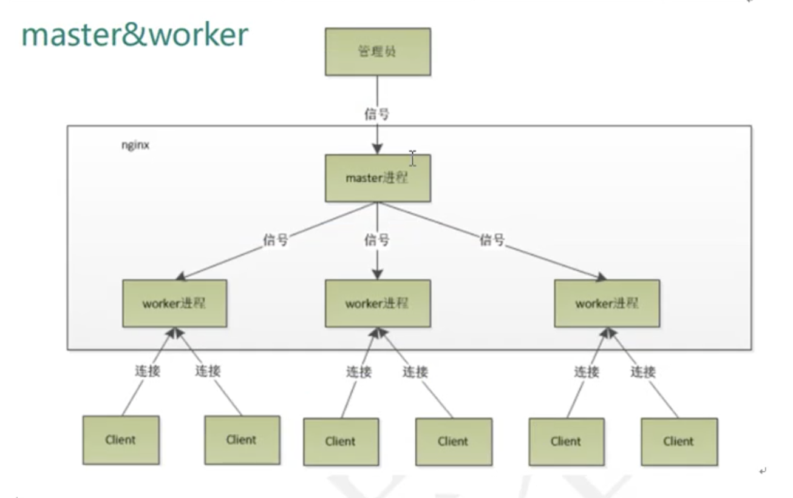
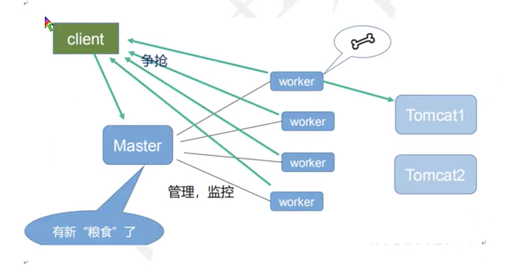

# Nginx基础概念

## nginx是什么

Nginx是一款轻量级的Web服务器/反向代理服务器及电子邮件(IMAP/POP3）代理服务器，其特点是占用内存少，并发能力强。

## 反向代理

### 正向代理

在客户端配置代理服务器，通过代理服务器访问互联网。

### 反向代理

客户端只需要将请求发送到反向代理服务器，由反向代理服务器选择目标服务器获取数据后，再返回给客户端，此时反向代理服务器和目标服务器对外就是一个服务器，暴露的是代理服务器地址，隐藏了真实服务器IP地址。

## 负载均衡

单个服务器解决不了太多并发请求，我们通过增加服务器的数量，然后将请求分发到各个服务器上的过程就是负载均衡。

## 动静分离

为了加快网站的解析速度，可以把动态页面和静态页面的请求分发到不同的服务器来解析，降低原来单个服务器的压力。

# Nginx使用

## 常用命令

先将nginx/sbin加到系统环境中。

### 查看端口号

```
nginx -v
```

### 启动

```
nginx
```


### 关闭

```
nginx -s stop
```

### 重加载

```
nginx -s reload
```

## nginx配置文件

配置文件在nginx/conf文件下。

### nginx配置文件组成

#### 全局块

配置整体运行的指令

```
# nginx最大并发数
worker_processes 1;
```

#### events块

events块涉及的指令主要影响nginx服务器与用户之间的网络连接。

```
# 配置最大连接数
worker_connectons 1024;
```

#### http块

http块包括http全局块和server块。

# Nginx配置实例

## 配置反向代理

任务：打开浏览器，在浏览器地址栏输入www.123.com1，然后跳转到tomcat启动页面。

* 安装tomcat
* 配置host

```
server {
    listen       80;
    server_name  localhost;
    #charset koi8-r;
    #access_log  /var/log/nginx/host.access.log  main;
    location / {
        root   /usr/share/nginx/html;
        # 反向代理地址
        proxy_pass   http://127.0.0.1:8080;
        index  index.html index.htm;
    }
    #error_page  404              /404.html;
    # redirect server error pages to the static page /50x.html
    #
    error_page   500 502 503 504  /50x.html;
    location = /50x.html {
        root   /usr/share/nginx/html;
    }
    # proxy the PHP scripts to Apache listening on 127.0.0.1:80
    #
    #location ~ \.php$ {
    #    proxy_pass   http://127.0.0.1;
    #}
    # pass the PHP scripts to FastCGI server listening on 127.0.0.1:9000
    #
    #location ~ \.php$ {
    #    root           html;
    #    fastcgi_pass   127.0.0.1:9000;
    #    fastcgi_index  index.php;
    #    fastcgi_param  SCRIPT_FILENAME  /scripts$fastcgi_script_name;
    #    include        fastcgi_params;
    #}
    # deny access to .htaccess files, if Apache's document root
    # concurs with nginx's one
    #location ~ /\.ht {
    #    deny  all;
    #}
}
```

任务：根据不同的访问路径跳转到不同的端口服务中。

nginx监听端口为9001，访问http://127.0.0.1:9001/edu 直接跳转到localhost:8080，访问http://127.0.0.1:9001/vod 直接跳转到localhost:8081。

```
server {
    listen       80;
    server_name  localhost;
    #charset koi8-r;
    #access_log  /var/log/nginx/host.access.log  main;
    #location / {
    #    root   /usr/share/nginx/html;
    #    # 反向代理地址
    #    proxy_pass   http://127.0.0.1:8080;
    #    index  index.html index.htm;
    #}
    #error_page  404              /404.html;
    # redirect server error pages to the static page /50x.html
    #
    error_page   500 502 503 504  /50x.html;
    location = /50x.html {
        root   /usr/share/nginx/html;
    }
    # proxy the PHP scripts to Apache listening on 127.0.0.1:80
    #
    #location ~ \.php$ {
    #    proxy_pass   http://127.0.0.1;
    #}
    # pass the PHP scripts to FastCGI server listening on 127.0.0.1:9000
    #
    #location ~ \.php$ {
    #    root           html;
    #    fastcgi_pass   127.0.0.1:9000;
    #    fastcgi_index  index.php;
    #    fastcgi_param  SCRIPT_FILENAME  /scripts$fastcgi_script_name;
    #    include        fastcgi_params;
    #}
    # deny access to .htaccess files, if Apache's document root
    # concurs with nginx's one
    #location ~ /\.ht {
    #    deny  all;
    #}
}
server {
	listen 9001;
	server_name localhost;
	location ~ /edu/ {
		proxy_pass http:localhost:8080;
	}
	location ~ /vod/ {
		proxy_pass http:localhost:8081;
	}
}
```

## 配置负载均衡

任务：访问http://localhost/edu/a.html，实现负载均衡，平均地分发到8080和8081端口。

```
upstream myserver {
	server localhost:8080;
	server localhost:8081;
}
server {
    listen       80;
    server_name  localhost;
    #charset koi8-r;
    #access_log  /var/log/nginx/host.access.log  main;
    location / {
        root   /usr/share/nginx/html;
        # 反向代理地址
        proxy_pass   http://myserver;
        index  index.html index.htm;
    }
    #error_page  404              /404.html;
    # redirect server error pages to the static page /50x.html
    #
    error_page   500 502 503 504  /50x.html;
    location = /50x.html {
        root   /usr/share/nginx/html;
    }
    # proxy the PHP scripts to Apache listening on 127.0.0.1:80
    #
    #location ~ \.php$ {
    #    proxy_pass   http://127.0.0.1;
    #}
    # pass the PHP scripts to FastCGI server listening on 127.0.0.1:9000
    #
    #location ~ \.php$ {
    #    root           html;
    #    fastcgi_pass   127.0.0.1:9000;
    #    fastcgi_index  index.php;
    #    fastcgi_param  SCRIPT_FILENAME  /scripts$fastcgi_script_name;
    #    include        fastcgi_params;
    #}
    # deny access to .htaccess files, if Apache's document root
    # concurs with nginx's one
    #location ~ /\.ht {
    #    deny  all;
    #}
}
```

### 负载均衡策略

#### 轮询

每个请求按时间顺序逐一分配到不同的后端服务器，如果后端服务器出故障，自动剔除。

#### weight

weight代表权重，权重越高，分配请求越多。

```
upstream myserver {
	server localhost:8080 weight=1;
	server localhost:8081 weight=1;
}
```

#### Iphash

每个请求按访问ip的hash值分配服务器，这样每个访客固定访问一个后端服务器，可以解决session的问题。

```
upstream myserver {
	iphash;
	server localhost:8080;
	server localhost:8081;
}
```

#### fair

按后端服务器的响应时间来分配请求，响应时间短的优先分配。

```
upstream myserver {
	fair;
	server localhost:8080;
	server localhost:8081;
}
```

## 配置动静分离

为了加快网站的解析速度，可以把动态请求和静态请求分发到不同的服务器来解析，降低原来单个服务器的压力。

* 一种实现方法是把静态文件独立成单独的域名，放在独立的服务器上。主流方式
* 另一种是动态和静态混合在一起发布，通过nginx来部署。

```
upstream myserver {
	server localhost:8080;
	server localhost:8081;
}
server {
    listen       80;
    server_name  localhost;
    #charset koi8-r;
    #access_log  /var/log/nginx/host.access.log  main;
    location /www/ {
        root   /data/;
        index  index.html index.htm;
    }
    location /image/ {
        root   /data/;
        autoindex on;
    }
    #error_page  404              /404.html;
    # redirect server error pages to the static page /50x.html
    #
    error_page   500 502 503 504  /50x.html;
    location = /50x.html {
        root   /usr/share/nginx/html;
    }
    # proxy the PHP scripts to Apache listening on 127.0.0.1:80
    #
    #location ~ \.php$ {
    #    proxy_pass   http://127.0.0.1;
    #}
    # pass the PHP scripts to FastCGI server listening on 127.0.0.1:9000
    #
    #location ~ \.php$ {
    #    root           html;
    #    fastcgi_pass   127.0.0.1:9000;
    #    fastcgi_index  index.php;
    #    fastcgi_param  SCRIPT_FILENAME  /scripts$fastcgi_script_name;
    #    include        fastcgi_params;
    #}
    # deny access to .htaccess files, if Apache's document root
    # concurs with nginx's one
    #location ~ /\.ht {
    #    deny  all;
    #}
}
```

## 配置高可用


当主服务器宕机，可以通过备份服务器提供服务。

需要安装keepalived

```
yum install keepalived -y
vim /etc/keepalived/keepalived.conf
```

keepalived.conf

```
! Configuration File for keepalived
global_defs {
   notification_email {
     acassen@firewall.loc
     failover@firewall.loc
     sysadmin@firewall.loc
   }
   notification_email_from Alexandre.Cassen@firewall.loc
   smtp_server 192.168.200.1
   smtp_connect_timeout 30
   router_id LVS_DEVEL
   vrrp_skip_check_adv_addr
   vrrp_strict
   vrrp_garp_interval 0
   vrrp_gna_interval 0
}
vrrp_script chk_http_port {
	script "/usr/local/src/nginx_check.sh"
	interval 2
	weight 2
}
vrrp_instance VI_1 {
    state MASTER
    interface eth0
    virtual_router_id 51
    priority 100
    advert_int 1
    authentication {
        auth_type PASS
        auth_pass 1111
    }
    virtual_ipaddress {
        192.168.200.16
        192.168.200.17
        192.168.200.18
    }
}
virtual_server 192.168.200.100 443 {
    delay_loop 6
    lb_algo rr
    lb_kind NAT
    persistence_timeout 50
    protocol TCP
    real_server 192.168.201.100 443 {
        weight 1
        SSL_GET {
            url {
              path /
              digest ff20ad2481f97b1754ef3e12ecd3a9cc
            }
            url {
              path /mrtg/
              digest 9b3a0c85a887a256d6939da88aabd8cd
            }
            connect_timeout 3
            nb_get_retry 3
            delay_before_retry 3
        }
    }
}
virtual_server 10.10.10.2 1358 {
    delay_loop 6
    lb_algo rr
    lb_kind NAT
    persistence_timeout 50
    protocol TCP
    sorry_server 192.168.200.200 1358
    real_server 192.168.200.2 1358 {
        weight 1
        HTTP_GET {
            url {
              path /testurl/test.jsp
              digest 640205b7b0fc66c1ea91c463fac6334d
            }
            url {
              path /testurl2/test.jsp
              digest 640205b7b0fc66c1ea91c463fac6334d
            }
            url {
              path /testurl3/test.jsp
              digest 640205b7b0fc66c1ea91c463fac6334d
            }
            connect_timeout 3
            nb_get_retry 3
            delay_before_retry 3
        }
    }
    real_server 192.168.200.3 1358 {
        weight 1
        HTTP_GET {
            url {
              path /testurl/test.jsp
              digest 640205b7b0fc66c1ea91c463fac6334c
            }
            url {
              path /testurl2/test.jsp
              digest 640205b7b0fc66c1ea91c463fac6334c
            }
            connect_timeout 3
            nb_get_retry 3
            delay_before_retry 3
        }
    }
}
virtual_server 10.10.10.3 1358 {
    delay_loop 3
    lb_algo rr
    lb_kind NAT
    persistence_timeout 50
    protocol TCP
    real_server 192.168.200.4 1358 {
        weight 1
        HTTP_GET {
            url {
              path /testurl/test.jsp
              digest 640205b7b0fc66c1ea91c463fac6334d
            }
            url {
              path /testurl2/test.jsp
              digest 640205b7b0fc66c1ea91c463fac6334d
            }
            url {
              path /testurl3/test.jsp
              digest 640205b7b0fc66c1ea91c463fac6334d
            }
            connect_timeout 3
            nb_get_retry 3
            delay_before_retry 3
        }
    }
    real_server 192.168.200.5 1358 {
        weight 1
        HTTP_GET {
            url {
              path /testurl/test.jsp
              digest 640205b7b0fc66c1ea91c463fac6334d
            }
            url {
              path /testurl2/test.jsp
              digest 640205b7b0fc66c1ea91c463fac6334d
            }
            url {
              path /testurl3/test.jsp
              digest 640205b7b0fc66c1ea91c463fac6334d
            }
            connect_timeout 3
            nb_get_retry 3
            delay_before_retry 3
        }
    }
}
```

nginx_check.sh

```
#!/bin/bash
A=`ps -C nginx -no-header |wc -l`
if [ $A -eq 0 ];then
	/etc/nginx/sbin/nginx
	sleep 2
	if [`ps -C nginx -no-header |wc -l` -eq 0];then
		killall keepalived
	fi
fi
```

启动keepalived

```
systemctl start keepalived.service
```

# Nginx的原理解析





一个master和多个worker的好处:

* 可以使用nginx -s reload 热部署
* 每个worker是独立的进程，如果有其中的一个worker出现问题，其他worker不受影响，继续进行争抢，实现请求过程，不会造成服务中断。

## 面试题

1. 发送请求，占用了worker的几个连接数

    2或者4个

2. nginx有一个master，有四个worker，每个worker支持最大的连接数为1024，支持的最大并发数是多少？

* 普通的静态访问最大并发数是：worker_connections * worker_processes / 2
* 如果是http作为反向代理来说，最大并发数应该是worker_connections * worker_processes / 4.

3. worker数设置多少合适？

    worker设置为cpu核数最合适。