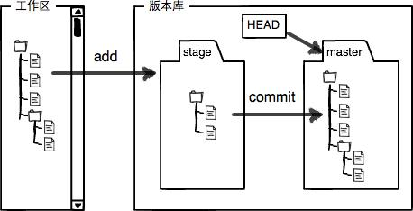
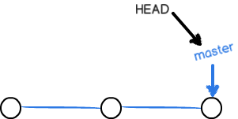
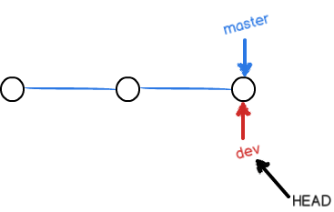
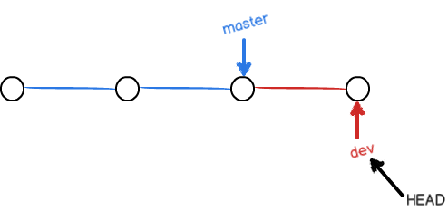
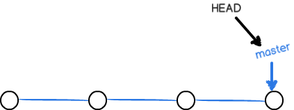
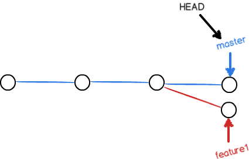
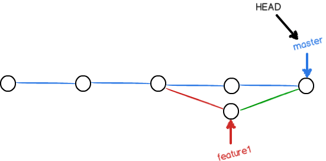
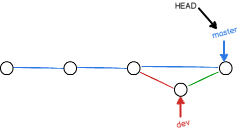

# git简介

git是一个分布式的版本控制系统。

## 集中式和分布式

先说集中式版本控制系统，版本库是集中存放在中央服务器的，而干活的时候，用的都是自己的电脑，所以要先从中央服务器取得最新的版本，然后开始干活，干完活了，再把自己的活推送给中央服务器。

集中式版本控制系统最大的毛病就是必须联网才能工作。

分布式版本控制系统根本没有“中央服务器”，每个人的电脑上都是一个完整的版本库，这样，你工作的时候，就不需要联网了，因为版本库就在你自己的电脑上。既然每个人电脑上都有一个完整的版本库，那多个人如何协作呢？比方说你在自己电脑上改了文件A，你的同事也在他的电脑上改了文件A，这时，你们俩之间只需把各自的修改推送给对方，就可以互相看到对方的修改了。

# 创建版本库

```
mkdir learngit
cd learngit
```

通过`git init`命令把这个目录变成Git可以管理的仓库：

```
git init
```

添加文件

```
# 创建一个txt, readme.txt
# 内容为：
Git is a version control system.
Git is free software.
```

```
# 添加
git add readme.txt
git commit -m "wrote a readme file"
```

# 时光机穿梭

修改readme.txt

```
# 查看git仓库状态
git status
# 查看修改内容
git diff readme.txt
# 更新修改内容
git add readme.txt
# commit
git commit -m "add distributed"
```

## 版本回退

将readme.txt修改为以下内容：

```
Git is a distributed version control system.
Git is free software distributed under the GPL.
```

提交

```
git add readme.txt
git commit -m "append GPL"
```

查看修改的历史记录

```
git log
```

在Git中，用`HEAD`表示当前版本，也就是最新的提交`1094adb...`（注意我的提交ID和你的肯定不一样），上一个版本就是`HEAD^`，上上一个版本就是`HEAD^^`，当然往上100个版本写100个`^`比较容易数不过来，所以写成`HEAD~100`。


回退到上一版本

```
git reset --hard HEAD^


git reset --hard 版本id开头几位
```

当你用`$ git reset --hard HEAD^`回退到`add distributed`版本时，再想恢复到`append GPL`，就必须找到`append GPL`的commit id。Git提供了一个命令`git reflog`用来记录你的每一次命令：

```
git reflog
```

## 工作区和暂存区

#### 工作区（Working Directory）

就是你在电脑里能看到的目录，比如我的`learngit`文件夹就是一个工作区。

#### 版本库（Repository）

工作区有一个隐藏目录`.git`，这个不算工作区，而是Git的版本库。

Git的版本库里存了很多东西，其中最重要的就是称为stage（或者叫index）的暂存区，还有Git为我们自动创建的第一个分支`master`，以及指向`master`的一个指针叫`HEAD`。



前面讲了我们把文件往Git版本库里添加的时候，是分两步执行的：

第一步是用`git add`把文件添加进去，实际上就是把文件修改添加到暂存区；

第二步是用`git commit`提交更改，实际上就是把暂存区的所有内容提交到当前分支。

## 管理修改

Git跟踪并管理的是修改，而非文件。

修改过文件后只有git add后才能commit到当前分支。

没有git add的文件不会被commit到当前分支。


## 撤销修改

自然，你是不会犯错的。不过现在是凌晨两点，你正在赶一份工作报告，你在`readme.txt`中添加了一行：

```
Git is a distributed version control system.
Git is free software distributed under the GPL.
Git has a mutable index called stage.
Git tracks changes of files.
My stupid boss still prefers SVN.
```

撤销修改：

一种是`readme.txt`自修改后还没有被放到暂存区，现在，撤销修改就回到和版本库一模一样的状态；

一种是`readme.txt`已经添加到暂存区后，又作了修改，现在，撤销修改就回到添加到暂存区后的状态。

总之，就是让这个文件回到最近一次`git commit`或`git add`时的状态

```
git checkout -- readme.txt
```

如果修改内容git add到暂存区了，撤销修改：

```
git restore --staged readme.txt
# 可以将暂存区中的内容撤销
```

然后使用：

```
git restore readme.txt
# 可以将工作区中的修改撤销
```

`git restore`和`git checkout`区别：

git checkout 是老版本git的命令，可以切换分支也可以撤销修改，不过逐渐被放弃。使用git restore代替git checkout撤销修改部分的功能，使用git switch代替git checkout 切换分支部分的功能。

## 删除文件

先添加一个新文件`test.txt`到Git并且提交：

```
git add test.txt

git commit -m "add test.txt"
```

一般情况下，你通常直接在文件管理器中把没用的文件删了，或者用`rm`命令删了：

```
rm test.txt
```

这个时候，Git知道你删除了文件，因此，工作区和版本库就不一致了。

1. 确实要删除

```
git rm test.txt
git commit -m "remove test.txt"
```

2. 误删恢复

```
git restore test.txt # 或者下面这条
# git checkout -- test.txt 
```

# 远程仓库

使用github

```
ssh-keygen -t rsa -C "youremail@example.com"
```

你需要把邮件地址换成你自己的邮件地址。

第2步：登陆GitHub，打开“Account settings”，“SSH Keys”页面：

然后，点“Add SSH Key”，填上任意Title，在Key文本框里粘贴`id_rsa.pub`文件的内容.

## 添加远程库

在github创建一个仓库learngit，然后再本地运行：

```
git remote add origin https://gitee.com/wardseptember/learngit.git
```

下一步，就可以把本地库的所有内容推送到远程库上：

```
git push -u origin master
```

由于远程库是空的，我们第一次推送`master`分支时，加上了`-u`参数，Git不但会把本地的`master`分支内容推送的远程新的`master`分支，还会把本地的`master`分支和远程的`master`分支关联起来，在以后的推送或者拉取时就可以简化命令。

从现在起，只要本地作了提交，就可以通过命令：

```
git push origin master
```

## 从远程库克隆

```
git clone git@github.com:michaelliao/gitskills.git # 或者
git clone https://github.com/michaelliao/gitskills.git
```

要克隆一个仓库，首先必须知道仓库的地址，然后使用`git clone`命令克隆。

Git支持多种协议，包括`https`，但`ssh`协议速度最快。

# 分支管理

分支在实际中有什么用呢？假设你准备开发一个新功能，但是需要两周才能完成，第一周你写了50%的代码，如果立刻提交，由于代码还没写完，不完整的代码库会导致别人不能干活了。如果等代码全部写完再一次提交，又存在丢失每天进度的巨大风险。

现在有了分支，就不用怕了。你创建了一个属于你自己的分支，别人看不到，还继续在原来的分支上正常工作，而你在自己的分支上干活，想提交就提交，直到开发完毕后，再一次性合并到原来的分支上，这样，既安全，又不影响别人工作。

## 创建与合并分支

在[版本回退](https://www.liaoxuefeng.com/wiki/896043488029600/897013573512192)里，你已经知道，每次提交，Git都把它们串成一条时间线，这条时间线就是一个分支。截止到目前，只有一条时间线，在Git里，这个分支叫主分支，即`master`分支。`HEAD`严格来说不是指向提交，而是指向`master`，`master`才是指向提交的，所以，`HEAD`指向的就是当前分支。

一开始的时候，`master`分支是一条线，Git用`master`指向最新的提交，再用`HEAD`指向`master`，就能确定当前分支，以及当前分支的提交点：



每次提交，`master`分支都会向前移动一步，这样，随着你不断提交，`master`分支的线也越来越长。

当我们创建新的分支，例如`dev`时，Git新建了一个指针叫`dev`，指向`master`相同的提交，再把`HEAD`指向`dev`，就表示当前分支在`dev`上：



你看，Git创建一个分支很快，因为除了增加一个`dev`指针，改改`HEAD`的指向，工作区的文件都没有任何变化！

不过，从现在开始，对工作区的修改和提交就是针对`dev`分支了，比如新提交一次后，`dev`指针往前移动一步，而`master`指针不变：



假如我们在`dev`上的工作完成了，就可以把`dev`合并到`master`上。Git怎么合并呢？最简单的方法，就是直接把`master`指向`dev`的当前提交，就完成了合并：


所以Git合并分支也很快！就改改指针，工作区内容也不变！

合并完分支后，甚至可以删除`dev`分支。删除`dev`分支就是把`dev`指针给删掉，删掉后，我们就剩下了一条`master`分支：



首先，我们创建`dev`分支，然后切换到`dev`分支：

```
git checkout -b dev
```

用`git branch`命令查看当前分支：

```
git branch
```

然后，我们就可以在`dev`分支上正常提交，比如对`readme.txt`做个修改，加上一行：

```
Creating a new branch is quick.
```

然后提交：

```
git add readme.txt 
git commit -m "branch test"
```

现在，`dev`分支的工作完成，我们就可以切换回`master`分支：

```
git checkout master
```

我们把`dev`分支的工作成果合并到`master`分支上：

```
git merge dev
```

合并完成后，就可以放心地删除`dev`分支了：

```
git branch -d dev
```

删除后，查看`branch`，就只剩下`master`分支了：

```
git branch
```

实际上，切换分支这个动作，用`switch`更科学。因此，最新版本的Git提供了新的`git switch`命令来切换分支：

创建并切换到新的`dev`分支，可以使用：

```
$ git switch -c dev
```

直接切换到已有的`master`分支，可以使用：

```
$ git switch master
```

## 解决冲突

人生不如意之事十之八九，合并分支往往也不是一帆风顺的。

准备新的`feature1`分支，继续我们的新分支开发：

```
$ git switch -c feature1
Switched to a new branch 'feature1'
```

修改`readme.txt`最后一行，改为：

```
Creating a new branch is quick AND simple.
```

在`feature1`分支上提交：

```
$ git add readme.txt

$ git commit -m "AND simple"
[feature1 14096d0] AND simple
 1 file changed, 1 insertion(+), 1 deletion(-)
```

切换到`master`分支：

```
$ git switch master
Switched to branch 'master'
Your branch is ahead of 'origin/master' by 1 commit.
  (use "git push" to publish your local commits)
```

Git还会自动提示我们当前`master`分支比远程的`master`分支要超前1个提交。

在`master`分支上把`readme.txt`文件的最后一行改为：

```
Creating a new branch is quick & simple.
```

提交：

```
$ git add readme.txt 
$ git commit -m "& simple"
[master 5dc6824] & simple
 1 file changed, 1 insertion(+), 1 deletion(-)
```

现在，`master`分支和`feature1`分支各自都分别有新的提交，变成了这样：



这种情况下，Git无法执行“快速合并”，只能试图把各自的修改合并起来，但这种合并就可能会有冲突，我们试试看：

```
$ git merge feature1
Auto-merging readme.txt
CONFLICT (content): Merge conflict in readme.txt
Automatic merge failed; fix conflicts and then commit the result.
```

果然冲突了！Git告诉我们，`readme.txt`文件存在冲突，必须手动解决冲突后再提交。`git status`也可以告诉我们冲突的文件：

```
$ git status
On branch master
Your branch is ahead of 'origin/master' by 2 commits.
  (use "git push" to publish your local commits)

You have unmerged paths.
  (fix conflicts and run "git commit")
  (use "git merge --abort" to abort the merge)

Unmerged paths:
  (use "git add <file>..." to mark resolution)

	both modified:   readme.txt

no changes added to commit (use "git add" and/or "git commit -a")
```

我们可以直接查看readme.txt的内容：

```
Git is a distributed version control system.
Git is free software distributed under the GPL.
Git has a mutable index called stage.
Git tracks changes of files.
<<<<<<< HEAD
Creating a new branch is quick & simple.
=======
Creating a new branch is quick AND simple.
>>>>>>> feature1
```

Git用`<<<<<<<`，`=======`，`>>>>>>>`标记出不同分支的内容，我们修改如下后保存：

```
Creating a new branch is quick and simple.
```

再提交：

```
$ git add readme.txt 
$ git commit -m "conflict fixed"
[master cf810e4] conflict fixed
```

现在，`master`分支和`feature1`分支变成了下图所示：



最后，删除`feature1`分支：

```
$ git branch -d feature1
Deleted branch feature1 (was 14096d0).
```

### 小结

当Git无法自动合并分支时，就必须首先解决冲突。解决冲突后，再提交，合并完成。

解决冲突就是把Git合并失败的文件手动编辑为我们希望的内容，再提交。

用`git log --graph`命令可以看到分支合并图。

## 分支管理策略

通常，合并分支时，如果可能，Git会用`Fast forward`模式，但这种模式下，删除分支后，会丢掉分支信息。

如果要强制禁用`Fast forward`模式，Git就会在merge时生成一个新的commit，这样，从分支历史上就可以看出分支信息。

下面我们实战一下`--no-ff`方式的`git merge`：

首先，仍然创建并切换`dev`分支：

```
$ git switch -c dev
Switched to a new branch 'dev'
```

修改readme.txt文件，并提交一个新的commit：

```
$ git add readme.txt 
$ git commit -m "add merge"
[dev f52c633] add merge
 1 file changed, 1 insertion(+)
```

现在，我们切换回`master`：

```
$ git switch master
Switched to branch 'master'
```

准备合并`dev`分支，请注意`--no-ff`参数，表示禁用`Fast forward`：

```
$ git merge --no-ff -m "merge with no-ff" dev
Merge made by the 'recursive' strategy.
 readme.txt | 1 +
 1 file changed, 1 insertion(+)
```

因为本次合并要创建一个新的commit，所以加上`-m`参数，把commit描述写进去。

合并后，我们用`git log`看看分支历史：

```
$ git log --graph --pretty=oneline --abbrev-commit
*   e1e9c68 (HEAD -> master) merge with no-ff
|\  
| * f52c633 (dev) add merge
|/  
*   cf810e4 conflict fixed
...
```

可以看到，不使用`Fast forward`模式，merge后就像这样：



## Bug分支

Git还提供了一个`stash`功能，可以把当前工作现场“储藏”起来，等以后恢复现场后继续工作：

```
$ git stash
```

另一种方式是用`git stash pop`，恢复的同时把stash内容也删了：

```
$ git stash pop
```

详细使用教程见[廖雪峰](https://www.liaoxuefeng.com/wiki/896043488029600/900388704535136)

## Feature分支

软件开发中，总有无穷无尽的新的功能要不断添加进来。

添加一个新功能时，你肯定不希望因为一些实验性质的代码，把主分支搞乱了，所以，每添加一个新功能，最好新建一个feature分支，在上面开发，完成后，合并，最后，删除该feature分支。

现在，你终于接到了一个新任务：开发代号为Vulcan的新功能，该功能计划用于下一代星际飞船。

于是准备开发：

```
$ git switch -c feature-vulcan
Switched to a new branch 'feature-vulcan'
```

5分钟后，开发完毕：

```
$ git add vulcan.py

$ git status
On branch feature-vulcan
Changes to be committed:
  (use "git reset HEAD <file>..." to unstage)

	new file:   vulcan.py

$ git commit -m "add feature vulcan"
[feature-vulcan 287773e] add feature vulcan
 1 file changed, 2 insertions(+)
 create mode 100644 vulcan.py
```

切回`dev`，准备合并：

```
$ git switch dev
```

一切顺利的话，feature分支和bug分支是类似的，合并，然后删除。

但是！

就在此时，接到上级命令，因经费不足，新功能必须取消！

虽然白干了，但是这个包含机密资料的分支还是必须就地销毁：

```
$ git branch -d feature-vulcan
error: The branch 'feature-vulcan' is not fully merged.
If you are sure you want to delete it, run 'git branch -D feature-vulcan'.
```

销毁失败。Git友情提醒，`feature-vulcan`分支还没有被合并，如果删除，将丢失掉修改，如果要强行删除，需要使用大写的`-D`参数。。

现在我们强行删除：

```
$ git branch -D feature-vulcan
Deleted branch feature-vulcan (was 287773e).
```

终于删除成功！

## 多人协作

- 查看远程库信息，使用`git remote -v`；
- 本地新建的分支如果不推送到远程，对其他人就是不可见的；
- 从本地推送分支，使用`git push origin branch-name`，如果推送失败，先用`git pull`抓取远程的新提交；
- 在本地创建和远程分支对应的分支，使用`git checkout -b branch-name origin/branch-name`，本地和远程分支的名称最好一致；
- 建立本地分支和远程分支的关联，使用`git branch --set-upstream branch-name origin/branch-name`；
- 从远程抓取分支，使用`git pull`，如果有冲突，要先处理冲突

详细教程见[廖雪峰](https://www.liaoxuefeng.com/wiki/896043488029600/900375748016320)


## Rebase

详细教程见[廖雪峰](https://www.liaoxuefeng.com/wiki/896043488029600/1216289527823648)

# 标签管理

发布一个版本时，我们通常先在版本库中打一个标签（tag），这样，就唯一确定了打标签时刻的版本。将来无论什么时候，取某个标签的版本，就是把那个打标签的时刻的历史版本取出来。所以，标签也是版本库的一个快照。

## 创建标签

在Git中打标签非常简单，首先，切换到需要打标签的分支上：

```
$ git branch
* dev
  master
$ git checkout master
Switched to branch 'master'
```

然后，敲命令`git tag <name>`就可以打一个新标签：

```
$ git tag v1.0
```

可以用命令`git tag`查看所有标签：

```
$ git tag
v1.0
```

默认标签是打在最新提交的commit上的。有时候，如果忘了打标签，比如，现在已经是周五了，但应该在周一打的标签没有打，怎么办？

方法是找到历史提交的commit id，然后打上就可以了：

```
$ git log --pretty=oneline --abbrev-commit
12a631b (HEAD -> master, tag: v1.0, origin/master) merged bug fix 101
4c805e2 fix bug 101
e1e9c68 merge with no-ff
f52c633 add merge
cf810e4 conflict fixed
5dc6824 & simple
14096d0 AND simple
b17d20e branch test
d46f35e remove test.txt
b84166e add test.txt
519219b git tracks changes
e43a48b understand how stage works
1094adb append GPL
e475afc add distributed
eaadf4e wrote a readme file
```

比方说要对`add merge`这次提交打标签，它对应的commit id是`f52c633`，敲入命令：

```
$ git tag v0.9 f52c633
```

再用命令`git tag`查看标签：

```
$ git tag
v0.9
v1.0
```

注意，标签不是按时间顺序列出，而是按字母排序的。可以用`git show <tagname>`查看标签信息：

```
$ git show v0.9
commit f52c63349bc3c1593499807e5c8e972b82c8f286 (tag: v0.9)
Author: Michael Liao <askxuefeng@gmail.com>
Date:   Fri May 18 21:56:54 2018 +0800

    add merge

diff --git a/readme.txt b/readme.txt
...
```

可以看到，`v0.9`确实打在`add merge`这次提交上。

还可以创建带有说明的标签，用`-a`指定标签名，`-m`指定说明文字：

```
$ git tag -a v0.1 -m "version 0.1 released" 1094adb
```

用命令`git show <tagname>`可以看到说明文字：

```
$ git show v0.1
tag v0.1
Tagger: Michael Liao <askxuefeng@gmail.com>
Date:   Fri May 18 22:48:43 2018 +0800

version 0.1 released

commit 1094adb7b9b3807259d8cb349e7df1d4d6477073 (tag: v0.1)
Author: Michael Liao <askxuefeng@gmail.com>
Date:   Fri May 18 21:06:15 2018 +0800

    append GPL

diff --git a/readme.txt b/readme.txt
...
```

 注意：标签总是和某个commit挂钩。如果这个commit既出现在master分支，又出现在dev分支，那么在这两个分支上都可以看到这个标签。

## 操作标签

如果标签打错了，也可以删除：

```
$ git tag -d v0.1
Deleted tag 'v0.1' (was f15b0dd)
```

因为创建的标签都只存储在本地，不会自动推送到远程。所以，打错的标签可以在本地安全删除。

如果要推送某个标签到远程，使用命令`git push origin <tagname>`：

```
$ git push origin v1.0
Total 0 (delta 0), reused 0 (delta 0)
To github.com:michaelliao/learngit.git
 * [new tag]         v1.0 -> v1.0
```

或者，一次性推送全部尚未推送到远程的本地标签：

```
$ git push origin --tags
Total 0 (delta 0), reused 0 (delta 0)
To github.com:michaelliao/learngit.git
 * [new tag]         v0.9 -> v0.9
```

如果标签已经推送到远程，要删除远程标签就麻烦一点，先从本地删除：

```
$ git tag -d v0.9
Deleted tag 'v0.9' (was f52c633)
```

然后，从远程删除。删除命令也是push，但是格式如下：

```
$ git push origin :refs/tags/v0.9
To github.com:michaelliao/learngit.git
 - [deleted]         v0.9
```

要看看是否真的从远程库删除了标签，可以登陆GitHub查看。

# 参考链接

* [廖雪峰](https://www.liaoxuefeng.com/wiki/896043488029600)
* [git官网](https://git-scm.com/)

