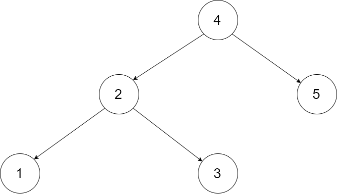

[TOC]


# 排序
## 剑指 Offer 45. 把数组排成最小的数
[剑指 Offer 45. 把数组排成最小的数](https://leetcode-cn.com/problems/ba-shu-zu-pai-cheng-zui-xiao-de-shu-lcof/)

输入一个非负整数数组，把数组里所有数字拼接起来排成一个数，打印能拼接出的所有数字中最小的一个。


```
示例 1:

输入: [10,2]
输出: "102"
示例 2:

输入: [3,30,34,5,9]
输出: "3033459"
 

提示:

0 < nums.length <= 100
说明:

输出结果可能非常大，所以你需要返回一个字符串而不是整数
拼接起来的数字可能会有前导 0，最后结果不需要去掉前导 0
```
### 快速排序

```java
class Solution {
    public String minNumber(int[] nums) {
        String[] strs = new String[nums.length];
        for (int i = 0; i < nums.length; i++) {
            strs[i] = String.valueOf(nums[i]);
        }
        fastSort(strs, 0, strs.length - 1);
        StringBuilder res = new StringBuilder();
        for(String s : strs) {
            res.append(s);
        }
        return res.toString();
    }
    private void fastSort(String[] strs, int l, int r) {
        if (l >= r) {
            return;
        }
        int i = l, j = r;
        String tmp = strs[i];
        while (i < j) {
            while ((strs[j] + strs[l]).compareTo(strs[l] + strs[j]) >= 0 && i < j) {
                j--;
            }
            while ((strs[i] + strs[l]).compareTo(strs[l] + strs[i]) <= 0 && i < j) {
                i++;
            }
            tmp = strs[i];
            strs[i] = strs[j];
            strs[j] = tmp;
        }
        strs[i] = strs[l];
        strs[l] = tmp;
        fastSort(strs, l, i - 1);
        fastSort(strs, i + 1, r);
    }
}
```
### Arrays.sort

```java
class Solution {
    public String minNumber(int[] nums) {
        String[] strs = new String[nums.length];
        for (int i = 0; i < nums.length; i++) {
            strs[i] = String.valueOf(nums[i]);
        }
        Arrays.sort(strs, (x, y) -> (x + y).compareTo(y + x));
        StringBuilder res = new StringBuilder();
        for(String s : strs) {
            res.append(s);
        }
        return res.toString();
    }
}
```
# 回溯算法
## 剑指 Offer 38. 字符串的排列
[剑指 Offer 38. 字符串的排列](https://leetcode-cn.com/problems/zi-fu-chuan-de-pai-lie-lcof/)

输入一个字符串，打印出该字符串中字符的所有排列。

 

你可以以任意顺序返回这个字符串数组，但里面不能有重复元素。


```
示例:

输入：s = "abc"
输出：["abc","acb","bac","bca","cab","cba"]
 

限制：

1 <= s 的长度 <= 8
```
### 回溯
详解见[https://leetcode-cn.com/problems/zi-fu-chuan-de-pai-lie-lcof/solution/mian-shi-ti-38-zi-fu-chuan-de-pai-lie-hui-su-fa-by/](https://leetcode-cn.com/problems/zi-fu-chuan-de-pai-lie-lcof/solution/mian-shi-ti-38-zi-fu-chuan-de-pai-lie-hui-su-fa-by/)

```java
class Solution {
    List<String> res = new LinkedList<>();
    char[] c;
    private void dfs(int x) {
        if (x == c.length -1) {
            res.add(String.valueOf(c));
            return;
        }
        HashSet<Character> set = new HashSet<>();
        for (int i = x; i < c.length; i++) {
            if (set.contains(c[i])) {
                continue;
            }
            set.add(c[i]);
            swap(i, x);
            dfs(x + 1);
            swap(i, x);
        }
    }
    private void swap(int a, int b) {
        char tmp = c[a];
        c[a] = c[b];
        c[b] = tmp;
    }
    public String[] permutation(String s) {
        c = s.toCharArray();
        dfs(0);
        return res.toArray(new String[res.size()]);
    }
}
```
# 分治算法
## 剑指 Offer 25. 合并两个排序的链表
[剑指 Offer 25. 合并两个排序的链表](https://leetcode-cn.com/problems/he-bing-liang-ge-pai-xu-de-lian-biao-lcof/)


输入两个递增排序的链表，合并这两个链表并使新链表中的节点仍然是递增排序的。
```
示例1：

输入：1->2->4, 1->3->4
输出：1->1->2->3->4->4
限制：

0 <= 链表长度 <= 1000
```
### 解法

```java
/**
 * Definition for singly-linked list.
 * public class ListNode {
 *     int val;
 *     ListNode next;
 *     ListNode(int x) { val = x; }
 * }
 */
class Solution {
    public ListNode mergeTwoLists(ListNode l1, ListNode l2) {
        ListNode res = new ListNode(-1);
        ListNode dump = res;
        while (l1 != null && l2 != null) {
            if (l1.val <= l2.val) {
                res.next = l1;
                l1 = l1.next;
            } else {
                res.next = l2;
                l2 = l2.next;
            }
            res = res.next;
        }
        if (l1 != null) {
            res.next = l1;
        }
        if (l2 != null) {
            res.next = l2;
        }
        return dump.next;
    }
}
```
### 递归1

```java
/**
 * Definition for singly-linked list.
 * public class ListNode {
 *     int val;
 *     ListNode next;
 *     ListNode() {}
 *     ListNode(int val) { this.val = val; }
 *     ListNode(int val, ListNode next) { this.val = val; this.next = next; }
 * }
 */
class Solution {
    public ListNode mergeTwoLists(ListNode l1, ListNode l2) {
        if (l1 == null) {
            return l2;
        } else if (l2 == null) {
            return l1;
        } else if (l1.val <= l2.val) {
            l1.next = mergeTwoLists(l1.next, l2);
            return l1;
        } else {
            l2.next = mergeTwoLists(l1, l2.next);
            return l2;
        }
        
    }
}
```

### 递归2

```java
/**
 * Definition for singly-linked list.
 * public class ListNode {
 *     int val;
 *     ListNode next;
 *     ListNode(int x) { val = x; }
 * }
 */
class Solution {
    public ListNode mergeTwoLists(ListNode l1, ListNode l2) {
        if (l1 == null || l2 == null) {
            return l2 == null ? l1 : l2;
        }
        ListNode first = (l2.val < l1.val) ? l2 : l1;
        first.next = mergeTwoLists(first.next, first == l1 ? l2 : l1);
        return first;
    }
}
```
## 剑指 Offer 36. 二叉搜索树与双向链表
[剑指 Offer 36. 二叉搜索树与双向链表](https://leetcode-cn.com/problems/er-cha-sou-suo-shu-yu-shuang-xiang-lian-biao-lcof/)

输入一棵二叉搜索树，将该二叉搜索树转换成一个排序的循环双向链表。要求不能创建任何新的节点，只能调整树中节点指针的指向。

 

 为了让您更好地理解问题，以下面的二叉搜索树为例：


我们希望将这个二叉搜索树转化为双向循环链表。链表中的每个节点都有一个前驱和后继指针。对于双向循环链表，第一个节点的前驱是最后一个节点，最后一个节点的后继是第一个节点。

下图展示了上面的二叉搜索树转化成的链表。“head” 表示指向链表中有最小元素的节点。


特别地，我们希望可以就地完成转换操作。当转化完成以后，树中节点的左指针需要指向前驱，树中节点的右指针需要指向后继。还需要返回链表中的第一个节点的指针。
### 解法

```java
/*
// Definition for a Node.
class Node {
    public int val;
    public Node left;
    public Node right;

    public Node() {}

    public Node(int _val) {
        val = _val;
    }

    public Node(int _val,Node _left,Node _right) {
        val = _val;
        left = _left;
        right = _right;
    }
};
*/
class Solution {
    Node head, pre;
    public Node treeToDoublyList(Node root) {
        if (root == null) {
            return null;
        }
        dfs(root);
        pre.right = head;
        head.left = pre;
        return head;
    }
    private void dfs(Node cur) {
        if (cur == null) {
            return;
        }
        dfs(cur.left);
        if (pre == null) {
            head = cur;
        } else {
            pre.right = cur;
        }
        cur.left = pre;
        pre = cur;
        dfs(cur.right);
    }
}
```

## 剑指 Offer 40. 最小的k个数
[剑指 Offer 40. 最小的k个数](https://leetcode-cn.com/problems/zui-xiao-de-kge-shu-lcof/)

输入整数数组 arr ，找出其中最小的 k 个数。例如，输入4、5、1、6、2、7、3、8这8个数字，则最小的4个数字是1、2、3、4。


```
示例 1：

输入：arr = [3,2,1], k = 2
输出：[1,2] 或者 [2,1]
示例 2：

输入：arr = [0,1,2,1], k = 1
输出：[0]
 

限制：

0 <= k <= arr.length <= 10000
0 <= arr[i] <= 10000
```
### 堆

```java
class Solution {
    public int[] getLeastNumbers(int[] arr, int k) {
        int[] res = new int[k];
        if (k == 0) {
            return res;
        }
        Queue<Integer> queue = new PriorityQueue<>((o1, o2) -> o2 - o1);
        for (int i = 0; i < k; ++i) {
            queue.offer(arr[i]);
        }
        for (int i = k; i < arr.length; ++i) {
            if (queue.peek() > arr[i]) {
                queue.poll();
                queue.offer(arr[i]);
            }
        }
        for (int i = 0; i < k; i++) {
            res[i] = queue.poll();
        }
        return res;
    }
}
```
## 剑指 Offer 42. 连续子数组的最大和
[剑指 Offer 42. 连续子数组的最大和](https://leetcode-cn.com/problems/lian-xu-zi-shu-zu-de-zui-da-he-lcof/)

输入一个整型数组，数组里有正数也有负数。数组中的一个或连续多个整数组成一个子数组。求所有子数组的和的最大值。

要求时间复杂度为O(n)。


```
示例1:

输入: nums = [-2,1,-3,4,-1,2,1,-5,4]
输出: 6
解释: 连续子数组 [4,-1,2,1] 的和最大，为 6。
 

提示：

1 <= arr.length <= 10^5
-100 <= arr[i] <= 100
```

### 解法

```java
class Solution {
    public int maxSubArray(int[] nums) {
        if (nums.length == 0) {
            return 0;
        }
        int ans = nums[0];
        int sum = 0;
        for (int num : nums) {
            if (sum > 0) {  // sum + num > num
                sum += num;
            } else {
                sum = num;
            }
            ans = Math.max(ans, sum);
        }
        return ans;
    }
}
```

---
#### 推荐阅读
- [机器学习资料汇总](https://mp.weixin.qq.com/s/3nOkk_Yt9D7Qp1WaWEjyZQ)
- [吴恩达《机器学习》视频、作业、源码](https://mp.weixin.qq.com/s/dErZNtBYbVA7ItPm7T_HIw)
- [106页《Python进阶》中文版正式发布](https://mp.weixin.qq.com/s/_WEuuxj-QgihijjLz7NJ9g)
- [李航《统计学习方法》第二版完整课件](https://mp.weixin.qq.com/s/xah47OWuu8ahAUa1aFFo4Q)
- [机器学习数学全书，1900页PDF下载](https://mp.weixin.qq.com/s/9BuyhdwuHiHH3ksVUe44ZQ)

---

