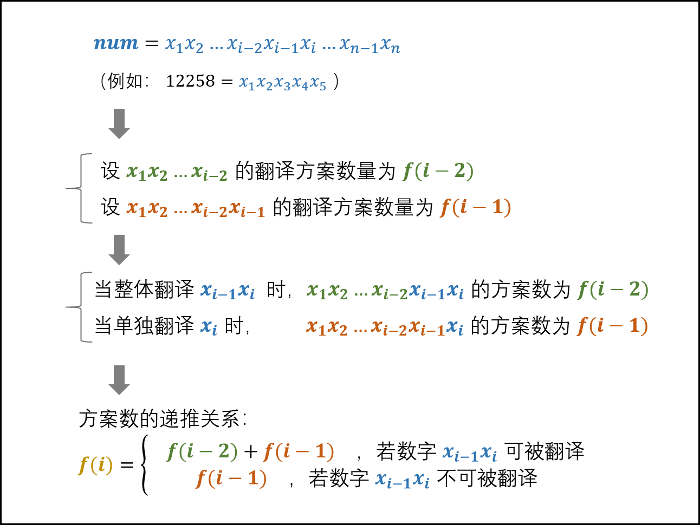

[TOC]

## 剑指 Offer 05. 替换空格

[剑指 Offer 05. 替换空格](https://leetcode-cn.com/problems/ti-huan-kong-ge-lcof/)

请实现一个函数，把字符串 s 中的每个空格替换成"%20"。


```
示例 1：

输入：s = "We are happy."
输出："We%20are%20happy."
 

限制：

0 <= s 的长度 <= 10000
```
### 解法

```java
class Solution {
    public String replaceSpace(String s) {
        int length = s.length();
        char[] array = new char[length * 3];
        int size = 0;
        for (int i = 0; i < length; i++) {
            char c = s.charAt(i);
            if (c == ' ') {
                array[size++] = '%';
                array[size++] = '2';
                array[size++] = '0';
            } else {
                array[size++] = c;
            }
        }
        String res = new String(array, 0, size);
        return res;
    }
}
```
## 剑指 Offer 13. 机器人的运动范围
[剑指 Offer 13. 机器人的运动范围](https://leetcode-cn.com/problems/ji-qi-ren-de-yun-dong-fan-wei-lcof/)

地上有一个m行n列的方格，从坐标 [0,0] 到坐标 [m-1,n-1] 。一个机器人从坐标 [0, 0] 的格子开始移动，它每次可以向左、右、上、下移动一格（不能移动到方格外），也不能进入行坐标和列坐标的数位之和大于k的格子。例如，当k为18时，机器人能够进入方格 [35, 37] ，因为3+5+3+7=18。但它不能进入方格 [35, 38]，因为3+5+3+8=19。请问该机器人能够到达多少个格子？


```
示例 1：

输入：m = 2, n = 3, k = 1
输出：3
示例 2：

输入：m = 3, n = 1, k = 0
输出：1
提示：

1 <= n,m <= 100
0 <= k <= 20
```

### BFS

```java
class Solution {
    int getSum(int x) {
        int res = 0;
        for (; x != 0; x /= 10) {
            res += x % 10;
        }
        return res;
    }
    public int movingCount(int m, int n, int k) {
        if (k == 0) {
            return 1;
        }
        Queue<Pair<Integer, Integer>> queue = new LinkedList<>();
        int[] dx = {0, 1};
        int[] dy = {1, 0};
        boolean[][] visited = new boolean[m][n];
        queue.offer(new Pair<>(0, 0));
        visited[0][0] = true;
        int ans = 1;
        while (!queue.isEmpty()) {
            Pair<Integer, Integer> pair = queue.poll();
            int x = pair.getKey();
            int y = pair.getValue();
            for (int i = 0; i < 2; i++) {
                int tx = dx[i] + x;
                int ty = dy[i] + y;
                if (tx < 0 || tx >= m || ty < 0 || ty >= n || visited[tx][ty] || getSum(tx) + getSum(ty) > k) {
                    continue;
                }
                queue.offer(new Pair<>(tx, ty));
                visited[tx][ty] = true;
                ans++;
            }
        }
        return ans;
    }
}
```
### DFS

```java
class Solution {
    int getSum(int x) {
        int res = 0;
        for (; x != 0; x /= 10) {
            res += x % 10;
        }
        return res;
    }
    public int movingCount(int m, int n, int k) {
        if (k == 0) {
            return 1;
        }
        boolean[][] visited = new boolean[m][n];
        return dfs(0, 0, m, n, k, visited);
    }
    private int dfs(int i, int j, int m, int n, int k, boolean[][] visited) {
        if (i < 0 || i >= m || j < 0 || j >= n || getSum(i) + getSum(j) > k || visited[i][j]) {
            return 0;
        }
        visited[i][j] = true;
        return 1 + dfs(i + 1, j, m, n, k, visited) + dfs(i, j + 1, m, n, k, visited);
    }
}
```
## 剑指 Offer 21. 调整数组顺序使奇数位于偶数前面
[剑指 Offer 21. 调整数组顺序使奇数位于偶数前面](https://leetcode-cn.com/problems/diao-zheng-shu-zu-shun-xu-shi-qi-shu-wei-yu-ou-shu-qian-mian-lcof/)

输入一个整数数组，实现一个函数来调整该数组中数字的顺序，使得所有奇数位于数组的前半部分，所有偶数位于数组的后半部分。


```
示例：

输入：nums = [1,2,3,4]
输出：[1,3,2,4] 
注：[3,1,2,4] 也是正确的答案之一。
 

提示：

1 <= nums.length <= 50000
1 <= nums[i] <= 10000
```
### 双指针

```java
class Solution {
    public int[] exchange(int[] nums) {
        int i = 0, j = nums.length - 1;
        int length = j;
        while (i <= j) {
            while (i <= length && nums[i] % 2 == 1) {
                i++;
            }
            while (j >= 0 && nums[j] % 2 == 0) {
                j--;
            }
            if (i >= j) {
                break;
            }
            int temp = nums[i];
            nums[i] = nums[j];
            nums[j] = temp;
        }
        return nums;
    }
}
```
## 剑指 Offer 31. 栈的压入、弹出序列
[剑指 Offer 31. 栈的压入、弹出序列](https://leetcode-cn.com/problems/zhan-de-ya-ru-dan-chu-xu-lie-lcof/)

输入两个整数序列，第一个序列表示栈的压入顺序，请判断第二个序列是否为该栈的弹出顺序。假设压入栈的所有数字均不相等。例如，序列 {1,2,3,4,5} 是某栈的压栈序列，序列 {4,5,3,2,1} 是该压栈序列对应的一个弹出序列，但 {4,3,5,1,2} 就不可能是该压栈序列的弹出序列。

```
示例 1：

输入：pushed = [1,2,3,4,5], popped = [4,5,3,2,1]
输出：true
解释：我们可以按以下顺序执行：
push(1), push(2), push(3), push(4), pop() -> 4,
push(5), pop() -> 5, pop() -> 3, pop() -> 2, pop() -> 1
示例 2：

输入：pushed = [1,2,3,4,5], popped = [4,3,5,1,2]
输出：false
解释：1 不能在 2 之前弹出。
 

提示：

0 <= pushed.length == popped.length <= 1000
0 <= pushed[i], popped[i] < 1000
pushed 是 popped 的排列。
```
### 解法
给定一个压入序列 pushed 和弹出序列 popped ，则压入 / 弹出操作的顺序（即排列）是 唯一确定 的。

* 初始化： 辅助栈 stack ，弹出序列的索引 i；

* 遍历压栈序列： 各元素记为 num ；

  元素 num 入栈；
  
  循环出栈：若 stack 的栈顶元素 == 弹出序列元素 popped[i] ，则执行出栈与 i++；
  
* 返回值： 若 stack 为空，则此弹出序列合法。

```java
class Solution {
    public boolean validateStackSequences(int[] pushed, int[] popped) {
        Deque<Integer> stack = new LinkedList<>();
        int i = 0;
        for (int num : pushed) {
            stack.offerFirst(num);
            // 循环判断与出栈
            while (!stack.isEmpty() && stack.peekFirst() == popped[i]) {
                stack.pop();
                i++;
            }
        }
        return stack.isEmpty();
    }
}
```
## 剑指 Offer 33. 二叉搜索树的后序遍历序列
[剑指 Offer 33. 二叉搜索树的后序遍历序列](https://leetcode-cn.com/problems/er-cha-sou-suo-shu-de-hou-xu-bian-li-xu-lie-lcof/)

输入一个整数数组，判断该数组是不是某二叉搜索树的后序遍历结果。如果是则返回 true，否则返回 false。假设输入的数组的任意两个数字都互不相同。


```
参考以下这颗二叉搜索树：

     5
    / \
   2   6
  / \
 1   3
示例 1：

输入: [1,6,3,2,5]
输出: false
示例 2：

输入: [1,3,2,6,5]
输出: true
 

提示：

数组长度 <= 1000
```
### 单调栈
详解见[leetcode](https://leetcode-cn.com/problems/er-cha-sou-suo-shu-de-hou-xu-bian-li-xu-lie-lcof/solution/mian-shi-ti-33-er-cha-sou-suo-shu-de-hou-xu-bian-6/)

后序遍历的倒序就是先序遍历的先访问根节点，再访问右子树，再访问左子树。

每次遍历找到root节点，如果当前结点的值小于root节点，说明就是合法的。

```java
class Solution {
    public boolean verifyPostorder(int[] postorder) {
        Deque<Integer> stack = new LinkedList<>();
        int root = Integer.MAX_VALUE;
        for (int i = postorder.length - 1; i >= 0; i--) {
            if (postorder[i] > root) {
                return false;
            }
            while (!stack.isEmpty() && stack.peekFirst() > postorder[i]) {
                root = stack.pollFirst();
            }
            stack.addFirst(postorder[i]);
        }
        return true;
    }
}
```
## 剑指 Offer 46. 把数字翻译成字符串
[剑指 Offer 46. 把数字翻译成字符串](https://leetcode-cn.com/problems/ba-shu-zi-fan-yi-cheng-zi-fu-chuan-lcof/)

给定一个数字，我们按照如下规则把它翻译为字符串：0 翻译成 “a” ，1 翻译成 “b”，……，11 翻译成 “l”，……，25 翻译成 “z”。一个数字可能有多个翻译。请编程实现一个函数，用来计算一个数字有多少种不同的翻译方法。


```
示例 1:

输入: 12258
输出: 5
解释: 12258有5种不同的翻译，分别是"bccfi", "bwfi", "bczi", "mcfi"和"mzi"
 

提示：

0 <= num < 231
```
### 动态规划

```java
class Solution {
    public int translateNum(int num) {
        String s = String.valueOf(num);
        int[] dp = new int[2];
        dp[0] = 1;
        dp[1] = 1;
        for (int i = 2; i <= s.length(); i++) {
            String tmp = s.substring(i - 2, i);
            int cur = tmp.compareTo("10") >= 0 && tmp.compareTo("25") <= 0 ? dp[0] + dp[1]: dp[0];
            dp[1] = dp[0];
            dp[0] = cur;
        }
        return dp[0];
    }
}
```

---
#### 推荐阅读
- [机器学习资料汇总](https://mp.weixin.qq.com/s/3nOkk_Yt9D7Qp1WaWEjyZQ)
- [吴恩达《机器学习》视频、作业、源码](https://mp.weixin.qq.com/s/dErZNtBYbVA7ItPm7T_HIw)
- [106页《Python进阶》中文版正式发布](https://mp.weixin.qq.com/s/_WEuuxj-QgihijjLz7NJ9g)
- [李航《统计学习方法》第二版完整课件](https://mp.weixin.qq.com/s/xah47OWuu8ahAUa1aFFo4Q)
- [机器学习数学全书，1900页PDF下载](https://mp.weixin.qq.com/s/9BuyhdwuHiHH3ksVUe44ZQ)

---

