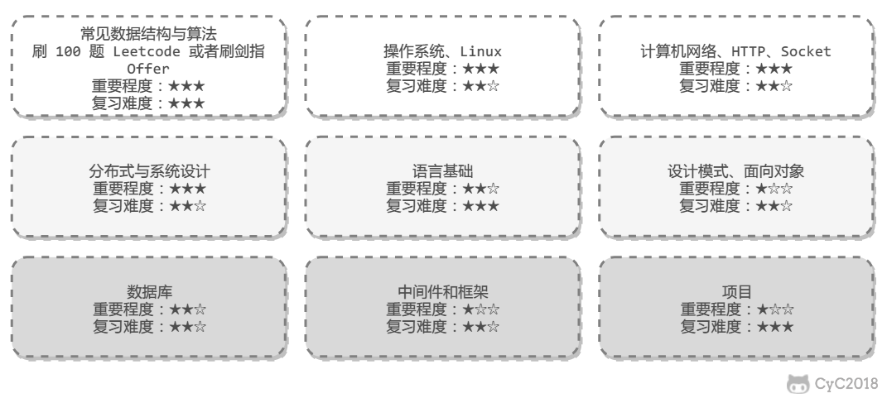

## 学习计划

    

### Java

#### 基础

#### 容器

#### 虚拟机

0717

#### 并发

0718-0719

#### I/O

0720-0721

#### web(Spring)

### 算法

#### [算法总结](<https://cyc2018.github.io/CS-Notes/#/notes/%E7%AE%97%E6%B3%95%20-%20%E7%9B%AE%E5%BD%951>)

#### [牛客网刷题](<https://cyc2018.github.io/CS-Notes/#/notes/%E5%89%91%E6%8C%87%20Offer%20%E9%A2%98%E8%A7%A3%20-%20%E7%9B%AE%E5%BD%951>)

### 计算机网络

#### 基础

0722-0725

#### HTTP

0727-0731

#### Socket

0726

### 操作系统

#### 基础

0801-0804

#### Linux

0805-0809

### 面向对象

0810-0811

#### [三大特性五大原则](<https://cyc2018.github.io/CS-Notes/#/notes/%E9%9D%A2%E5%90%91%E5%AF%B9%E8%B1%A1%E6%80%9D%E6%83%B3>)

三大特性：封装、继承、多态

五大原则

#### 

